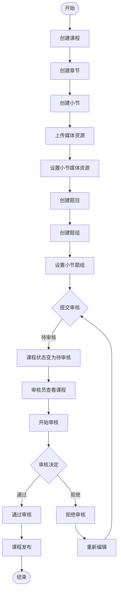
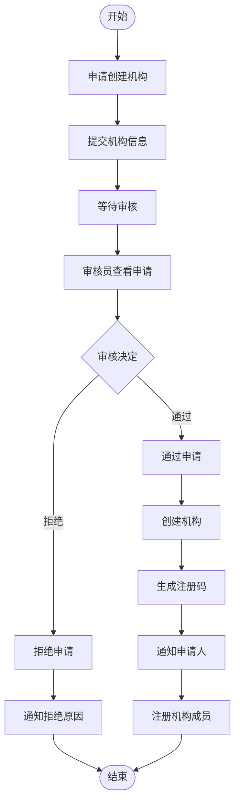
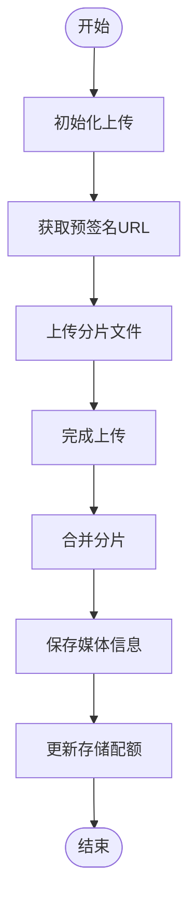
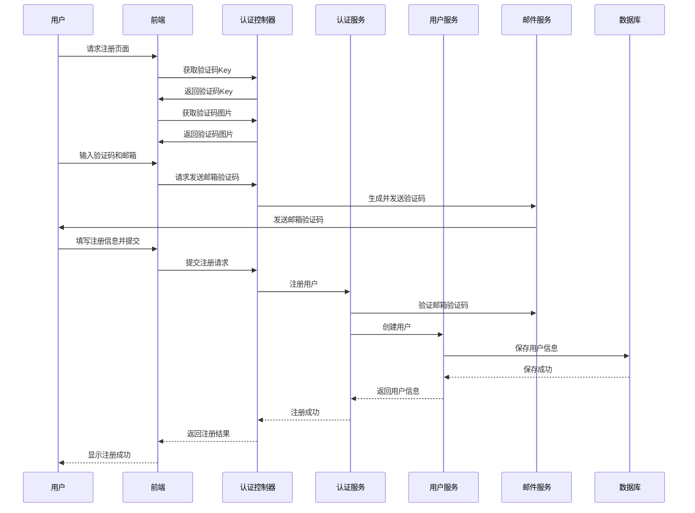
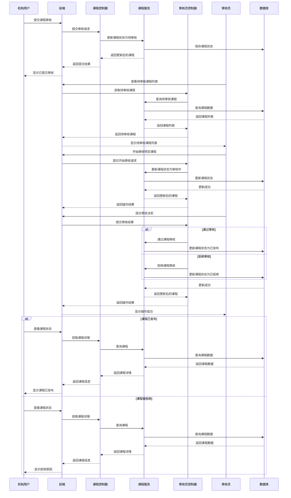
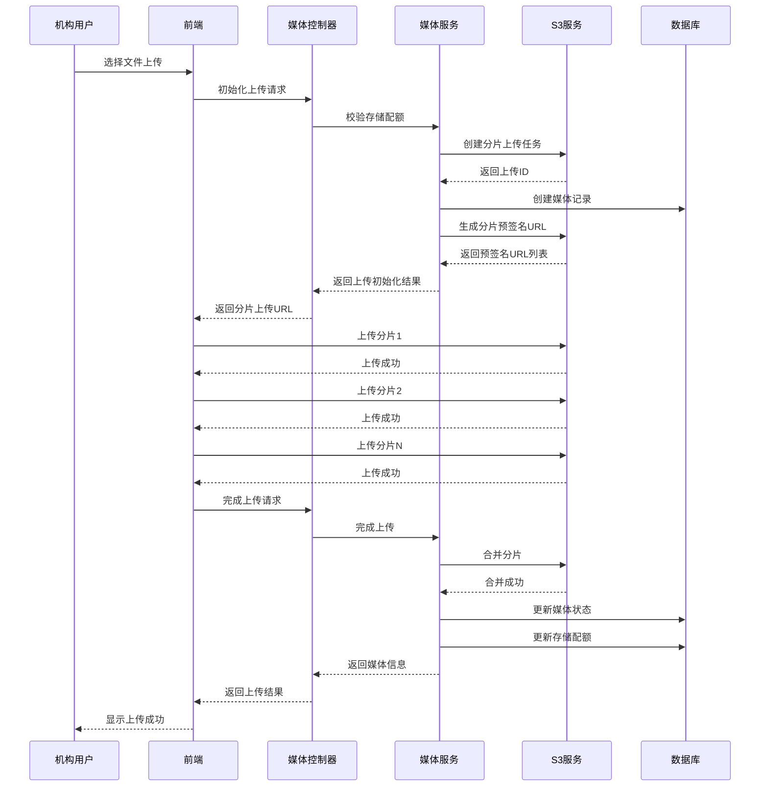

# 在线课程平台系统图表

基于已开发的代码，以下图表展示了系统的主要功能和流程。

## 一、用例图

```mermaid
flowchart TD
    %% 角色定义
    Guest([游客])
    User([普通用户])
    InstitutionUser([机构用户])
    Reviewer([审核员])
    Admin([管理员])
    
    %% 用例定义
    subgraph 用户与认证
      Register[注册账号]
      Login[登录系统]
      ResetPassword[重置密码]
      ManageProfile[管理个人信息]
      ApplyInstitution[申请创建机构]
    end
    
    subgraph 机构管理
      ManageInstitution[管理机构信息]
      ManageMembers[管理机构成员]
      CheckQuota[查看存储配额]
    end
    
    subgraph 课程管理
      CreateCourse[创建课程]
      ManageCourse[管理课程内容]
      CreateChapter[创建章节]
      CreateSection[创建小节]
      SubmitReview[提交审核]
      PublishCourse[发布课程]
    end
    
    subgraph 内容与资源
      UploadMedia[上传媒体]
      ManageMedia[管理媒体]
      CreateQuestion[创建题目]
      CreateQuestionGroup[创建题组]
    end
    
    subgraph 审核与管理
      ReviewCourse[审核课程]
      ManageCategory[管理分类]
      ManageTag[管理标签]
      ManageUser[管理用户]
      ManageRole[管理角色]
    end
    
    %% 关系连接
    Guest --> Register
    Guest --> Login
    Guest --> ApplyInstitution
    
    User --> ManageProfile
    User --> ResetPassword
    
    InstitutionUser --> ManageInstitution
    InstitutionUser --> ManageMembers
    InstitutionUser --> CheckQuota
    InstitutionUser --> CreateCourse
    InstitutionUser --> ManageCourse
    InstitutionUser --> CreateChapter
    InstitutionUser --> CreateSection
    InstitutionUser --> UploadMedia
    InstitutionUser --> ManageMedia
    InstitutionUser --> CreateQuestion
    InstitutionUser --> CreateQuestionGroup
    InstitutionUser --> SubmitReview
    
    Reviewer --> ReviewCourse
    Reviewer --> ManageCategory
    Reviewer --> ManageTag
    
    Admin --> ManageUser
    Admin --> ManageRole
    Admin --> ManageCategory
    Admin --> ManageTag
```

## 二、主要业务流程图

### 1. 课程创建与发布流程

```mermaid
flowchart TB
    Start([开始]) --> CreateCourse[创建课程]
    CreateCourse --> CreateChapter[创建章节]
    CreateChapter --> CreateSection[创建小节]
    CreateSection --> UploadMedia[上传媒体资源]
    UploadMedia --> SetMediaResource[设置小节媒体资源]
    
    SetMediaResource --> CreateQuestions[创建题目]
    CreateQuestions --> CreateQuestionGroup[创建题组]
    CreateQuestionGroup --> SetQuestionGroup[设置小节题组]
    
    SetQuestionGroup --> SubmitReview{提交审核}
    SubmitReview -->|待审核| PendingReview[课程状态变为待审核]
    PendingReview --> ReviewerCheck[审核员查看课程]
    
    ReviewerCheck --> StartReview[开始审核]
    StartReview --> ReviewDecision{审核决定}
    ReviewDecision -->|通过| ApproveProcess[通过审核]
    ReviewDecision -->|拒绝| RejectProcess[拒绝审核]
    
    ApproveProcess --> PublishCourse[课程发布]
    RejectProcess --> ReeditCourse[重新编辑]
    ReeditCourse --> SubmitReview
    
    PublishCourse --> End([结束])
```

### 2. 机构申请与审核流程

```mermaid
flowchart TB
    Start([开始]) --> ApplyInstitution[申请创建机构]
    ApplyInstitution --> SubmitInfo[提交机构信息]
    SubmitInfo --> WaitReview[等待审核]
    
    WaitReview --> ReviewerCheck[审核员查看申请]
    ReviewerCheck --> ReviewDecision{审核决定}
    
    ReviewDecision -->|通过| ApproveProcess[通过申请]
    ReviewDecision -->|拒绝| RejectProcess[拒绝申请]
    
    ApproveProcess --> CreateInstitution[创建机构]
    CreateInstitution --> GenerateCode[生成注册码]
    GenerateCode --> NotifyApplicant[通知申请人]
    
    RejectProcess --> NotifyRejection[通知拒绝原因]
    
    NotifyApplicant --> RegisterMembers[注册机构成员]
    NotifyRejection --> End([结束])
    RegisterMembers --> End
```

### 3. 媒体上传流程

```mermaid
flowchart TB
    Start([开始]) --> InitUpload[初始化上传]
    InitUpload --> GetPresignedUrls[获取预签名URL]
    GetPresignedUrls --> UploadChunks[上传分片文件]
    UploadChunks --> CompleteUpload[完成上传]
    
    CompleteUpload --> MergeChunks[合并分片]
    MergeChunks --> SaveMediaInfo[保存媒体信息]
    SaveMediaInfo --> UpdateQuota[更新存储配额]
    
    UpdateQuota --> End([结束])
```

## 三、时序图

### 1. 用户注册流程

```mermaid
sequenceDiagram
    participant 用户
    participant 前端
    participant 认证控制器
    participant 认证服务
    participant 用户服务
    participant 邮件服务
    participant 数据库
    
    用户->>前端: 请求注册页面
    前端->>认证控制器: 获取验证码Key
    认证控制器->>前端: 返回验证码Key
    前端->>认证控制器: 获取验证码图片
    认证控制器->>前端: 返回验证码图片
    
    用户->>前端: 输入验证码和邮箱
    前端->>认证控制器: 请求发送邮箱验证码
    认证控制器->>邮件服务: 生成并发送验证码
    邮件服务->>用户: 发送邮箱验证码
    
    用户->>前端: 填写注册信息并提交
    前端->>认证控制器: 提交注册请求
    认证控制器->>认证服务: 注册用户
    认证服务->>邮件服务: 验证邮箱验证码
    认证服务->>用户服务: 创建用户
    用户服务->>数据库: 保存用户信息
    数据库-->>用户服务: 保存成功
    用户服务-->>认证服务: 返回用户信息
    认证服务-->>认证控制器: 注册成功
    认证控制器-->>前端: 返回注册结果
    前端-->>用户: 显示注册成功
```

### 2. 课程审核流程

```mermaid
sequenceDiagram
    participant 机构用户
    participant 前端
    participant 课程控制器
    participant 课程服务
    participant 审核员控制器
    participant 审核员
    participant 数据库
    
    机构用户->>前端: 提交课程审核
    前端->>课程控制器: 提交审核请求
    课程控制器->>课程服务: 更新课程状态为待审核
    课程服务->>数据库: 保存课程状态
    课程服务-->>课程控制器: 返回更新后的课程
    课程控制器-->>前端: 返回提交结果
    前端-->>机构用户: 显示已提交审核
    
    审核员->>前端: 查看待审核课程列表
    前端->>审核员控制器: 获取待审核课程
    审核员控制器->>课程服务: 查询待审核课程
    课程服务->>数据库: 查询课程数据
    数据库-->>课程服务: 返回课程列表
    课程服务-->>审核员控制器: 返回课程列表
    审核员控制器-->>前端: 返回待审核课程
    前端-->>审核员: 显示待审核课程列表
    
    审核员->>前端: 开始审核特定课程
    前端->>审核员控制器: 提交开始审核请求
    审核员控制器->>课程服务: 更新课程状态为审核中
    课程服务->>数据库: 更新课程状态
    数据库-->>课程服务: 更新成功
    课程服务-->>审核员控制器: 返回更新后的课程
    审核员控制器-->>前端: 返回操作结果
    
    审核员->>前端: 提交审核决定
    前端->>审核员控制器: 提交审核结果
    alt 通过审核
        审核员控制器->>课程服务: 通过课程审核
        课程服务->>数据库: 更新课程状态为已发布
    else 拒绝审核
        审核员控制器->>课程服务: 拒绝课程审核
        课程服务->>数据库: 更新课程状态为已拒绝
    end
    数据库-->>课程服务: 更新成功
    课程服务-->>审核员控制器: 返回更新后的课程
    审核员控制器-->>前端: 返回操作结果
    前端-->>审核员: 显示操作成功
    
    alt 课程已发布
        机构用户->>前端: 查看课程状态
        前端->>课程控制器: 获取课程详情
        课程控制器->>课程服务: 查询课程
        课程服务->>数据库: 查询课程数据
        数据库-->>课程服务: 返回课程数据
        课程服务-->>课程控制器: 返回课程详情
        课程控制器-->>前端: 返回课程信息
        前端-->>机构用户: 显示课程已发布
    else 课程被拒绝
        机构用户->>前端: 查看课程状态
        前端->>课程控制器: 获取课程详情
        课程控制器->>课程服务: 查询课程
        课程服务->>数据库: 查询课程数据
        数据库-->>课程服务: 返回课程数据
        课程服务-->>课程控制器: 返回课程详情
        课程控制器-->>前端: 返回课程信息
        前端-->>机构用户: 显示拒绝原因
    end
```

### 3. 媒体上传流程

```mermaid
sequenceDiagram
    participant 机构用户
    participant 前端
    participant 媒体控制器
    participant 媒体服务
    participant S3服务
    participant 数据库
    
    机构用户->>前端: 选择文件上传
    前端->>媒体控制器: 初始化上传请求
    媒体控制器->>媒体服务: 校验存储配额
    媒体服务->>S3服务: 创建分片上传任务
    S3服务-->>媒体服务: 返回上传ID
    媒体服务->>数据库: 创建媒体记录
    媒体服务->>S3服务: 生成分片预签名URL
    S3服务-->>媒体服务: 返回预签名URL列表
    媒体服务-->>媒体控制器: 返回上传初始化结果
    媒体控制器-->>前端: 返回分片上传URL
    
    前端->>S3服务: 上传分片1
    S3服务-->>前端: 上传成功
    前端->>S3服务: 上传分片2
    S3服务-->>前端: 上传成功
    前端->>S3服务: 上传分片N
    S3服务-->>前端: 上传成功
    
    前端->>媒体控制器: 完成上传请求
    媒体控制器->>媒体服务: 完成上传
    媒体服务->>S3服务: 合并分片
    S3服务-->>媒体服务: 合并成功
    媒体服务->>数据库: 更新媒体状态
    媒体服务->>数据库: 更新存储配额
    媒体服务-->>媒体控制器: 返回媒体信息
    媒体控制器-->>前端: 返回上传结果
    前端-->>机构用户: 显示上传成功
```
