# 在线课程平台系统图表

基于已开发的代码，以下图表展示了系统的主要功能和流程。

## 一、用例图

```mermaid
flowchart TD
    %% 角色定义
    Guest([游客])
    User([普通用户])
    InstitutionUser([机构用户])
    InstitutionAdmin([机构管理员])
    Reviewer([审核员])
    Admin([系统管理员])
    
    %% 用例定义
    subgraph 用户与认证
      Register[注册账号]
      Login[登录系统]
      ResetPassword[重置密码]
      ManageProfile[管理个人信息]
      ApplyInstitution[申请创建机构]
      RegisterInstitution[使用注册码加入机构]
    end
    
    subgraph 机构管理
      ManageInstitution[管理机构信息]
      ManageMembers[管理机构成员]
      CheckQuota[查看存储配额]
      InviteMembers[邀请成员加入]
      ApproveApplication[审核机构申请]
      GenerateRegisterCode[生成注册码]
      UpdateQuota[更新存储配额]
    end
    
    subgraph 课程管理
      CreateCourse[创建课程]
      ManageCourse[管理课程内容]
      CreateChapter[创建章节]
      CreateSection[创建小节]
      SubmitReview[提交审核]
      PublishCourse[发布课程]
      UnpublishCourse[下线课程]
      RepublishCourse[重新发布]
      ReeditRejected[重新编辑被拒绝课程]
    end
    
    subgraph 内容与资源
      UploadMedia[上传媒体]
      ManageMedia[管理媒体]
      CreateQuestion[创建题目]
      CreateQuestionGroup[创建题组]
      ImportQuestions[批量导入题目]
      AddQuestionTag[添加题目标签]
    end
    
    subgraph 审核与管理
      ReviewCourse[审核课程]
      StartReviewing[开始审核]
      ApproveCourse[通过课程审核]
      RejectCourse[拒绝课程审核]
      ManageCategory[管理分类]
      ManageTag[管理标签]
      ManageUser[管理用户]
      ManageRole[管理角色]
      ManagePermission[管理权限]
    end
    
    %% 关系连接
    Guest --> Register
    Guest --> Login
    Guest --> ApplyInstitution
    
    User --> ManageProfile
    User --> ResetPassword
    User --> RegisterInstitution
    
    InstitutionUser --> ManageProfile
    InstitutionUser --> CreateCourse
    InstitutionUser --> ManageCourse
    InstitutionUser --> CreateChapter
    InstitutionUser --> CreateSection
    InstitutionUser --> UploadMedia
    InstitutionUser --> ManageMedia
    InstitutionUser --> CreateQuestion
    InstitutionUser --> CreateQuestionGroup
    InstitutionUser --> ImportQuestions
    InstitutionUser --> SubmitReview
    InstitutionUser --> ReeditRejected
    
    InstitutionAdmin --> ManageInstitution
    InstitutionAdmin --> ManageMembers
    InstitutionAdmin --> CheckQuota
    InstitutionAdmin --> InviteMembers
    
    Reviewer --> ReviewCourse
    Reviewer --> StartReviewing
    Reviewer --> ApproveCourse
    Reviewer --> RejectCourse
    Reviewer --> ManageCategory
    Reviewer --> ManageTag
    Reviewer --> ApproveApplication
    
    Admin --> ManageUser
    Admin --> ManageRole
    Admin --> ManagePermission
    Admin --> ManageCategory
    Admin --> ManageTag
    Admin --> UpdateQuota
    Admin --> GenerateRegisterCode
```

## 二、主要业务流程图

### 1. 课程创建与发布流程

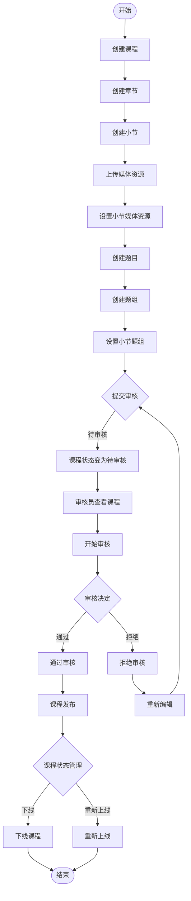

### 2. 机构入驻完整流程

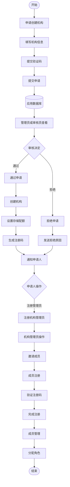

### 3. 机构成员注册流程

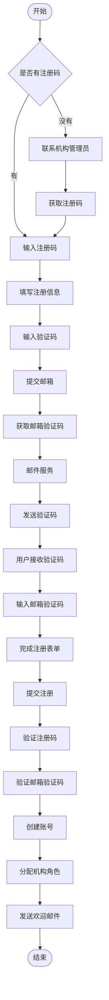

### 4. 媒体上传流程

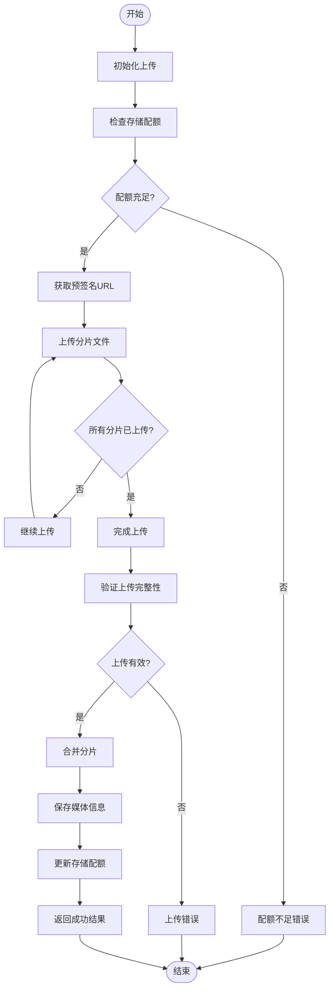

### 5. 权限与角色管理流程

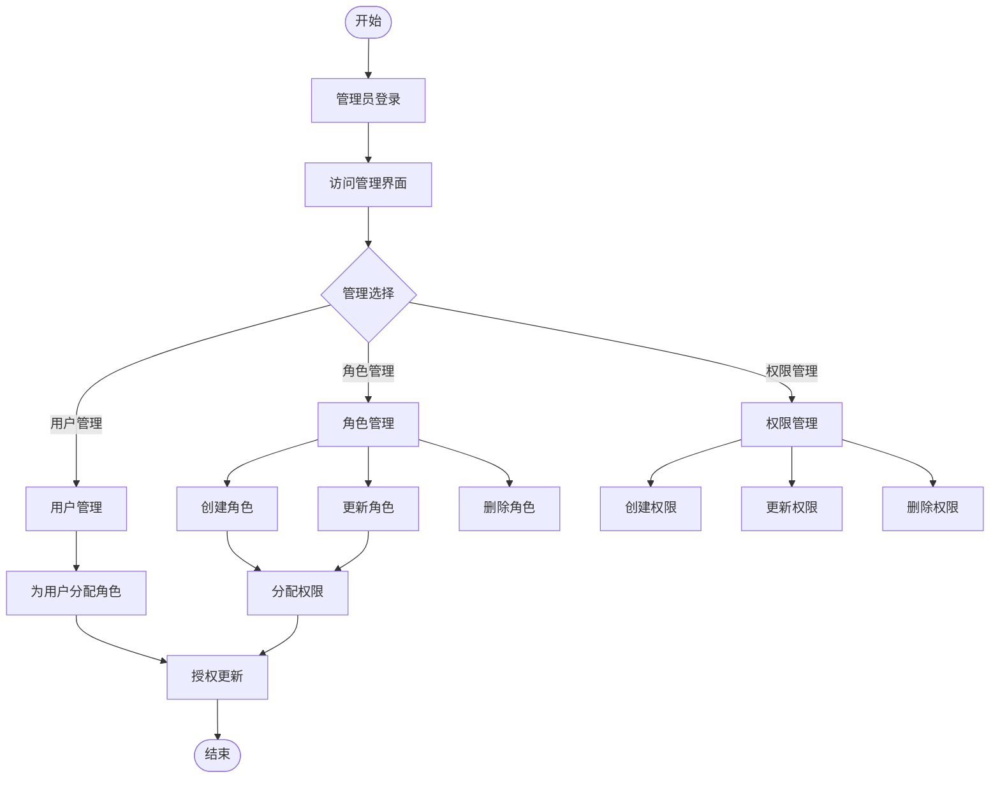

## 三、时序图

### 1. 用户注册流程

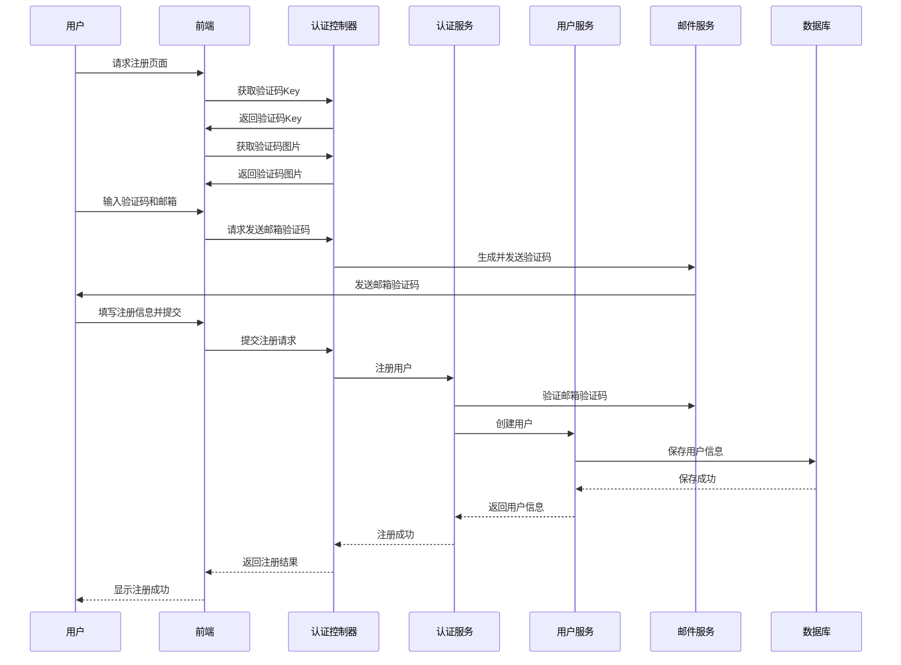

### 2. 机构入驻申请与审核时序图

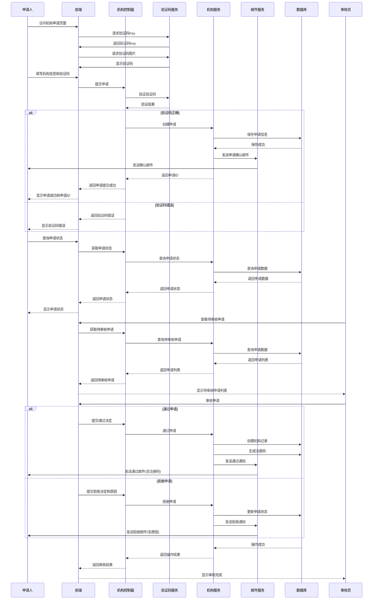

### 3. 机构成员注册时序图

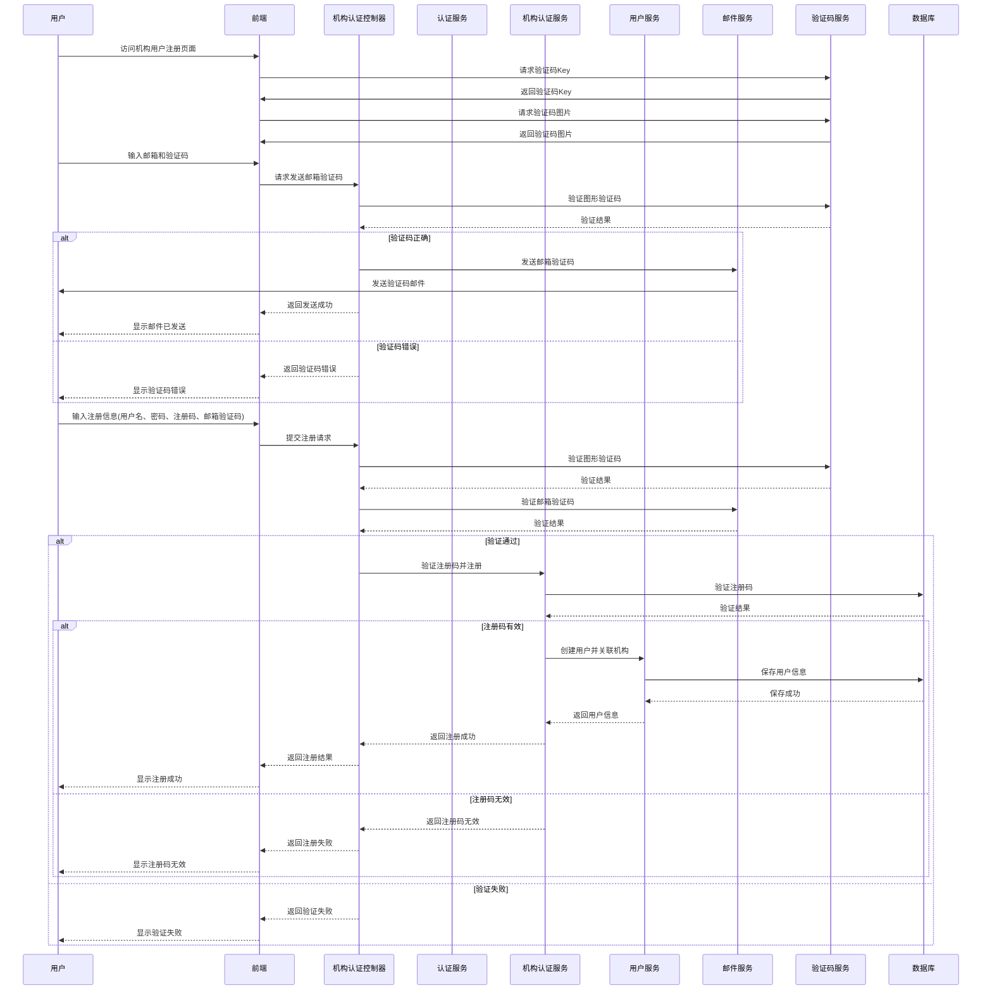

### 4. 课程审核流程

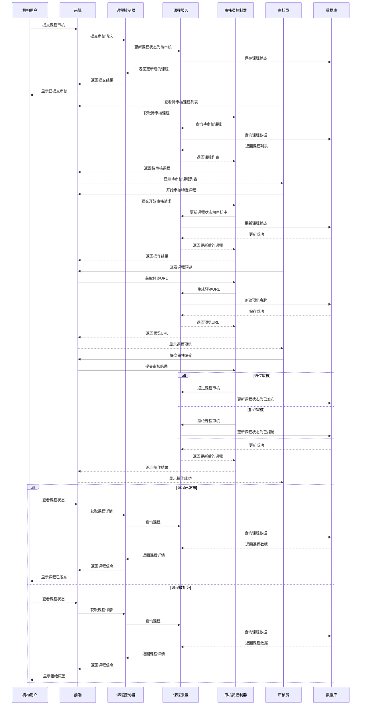

### 5. 媒体上传流程

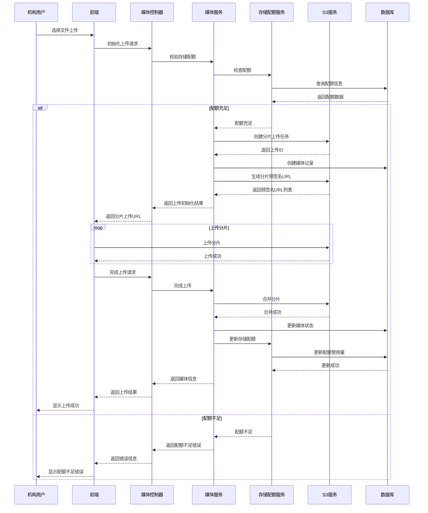
