# 后端开发文档

## 项目概述
<!-- 这里描述项目的背景、目标和主要功能 -->

## 技术栈
- **基础框架**：
  - Spring Boot 3.3.9
  - Java 17

- **Web框架**：
  - Spring Boot Web (RESTful API构建)
  - Spring Security (安全框架)

- **数据持久层**：
  - Spring Data JPA
  - MySQL
  - Redis (数据缓存)

- **文件存储**：
  - MinIO (对象存储服务)
  - AWS S3 (对象存储服务)

- **认证授权**：
  - JWT (JSON Web Token) - jjwt 0.12.5
  - Spring Security

- **API文档**：
  - SpringDoc OpenAPI (Swagger UI) 2.5.0

- **工具库**：
  - Lombok (简化代码)
  - Jackson (JSON处理)
  - Apache Commons Pool2
  - Validation (参数校验)
  - EasyExcel 3.3.3 (Excel处理)

- **安全与验证**：
  - Kaptcha 2.3.2 (验证码)

- **其他功能**：
  - Spring Boot Mail (邮件服务)
  - Thymeleaf (模板引擎)
  - 支付宝SDK (支付功能)

- **测试**：
  - Spring Boot Test
  - Spring Security Test
  - H2 Database (测试用内存数据库)

## 系统架构
<!-- 系统的整体架构设计，可以包含架构图 -->

## API接口文档
<!-- API接口的详细说明，包括路径、请求方法、参数和返回值等 -->

## 数据库设计

### 实体关系说明

本系统采用关系型数据库设计，主要实体及其关系如下：

#### 核心业务实体

1. **User (用户)**
   - 系统用户，包括普通学员、教师和管理员
   - 主要属性：用户名、密码、姓名、邮箱、手机号、头像、状态等
   - 关联关系：属于一个机构(Institution)，拥有多个角色(Role)，可收藏多个课程，可购买多个课程，可下多个订单

2. **Course (课程)**
   - 平台提供的课程
   - 主要属性：标题、描述、封面图片、状态、价格、难度级别、学习人数、评分等
   - 关联关系：属于一个机构(Institution)，包含多个章节(Chapter)，属于一个分类(Category)，有多个标签(Tag)

3. **Chapter (章节)**
   - 课程的章节结构
   - 主要属性：标题、描述、排序索引、访问类型(免费/付费)等
   - 关联关系：属于一个课程(Course)，包含多个小节(Section)

4. **Section (小节)**
   - 章节下的具体内容单元
   - 主要属性：标题、描述、排序索引、内容类型等
   - 关联关系：属于一个章节(Chapter)，可关联媒体资源(Media)或题目组(QuestionGroup)

5. **Institution (教育机构)**
   - 提供课程的机构
   - 主要属性：名称、Logo、描述、状态、联系信息等
   - 关联关系：拥有多个用户(User)、课程(Course)、订单(Order)和题库(Question)

#### 订单与支付实体

6. **Order (订单)**
   - 用户购买课程的订单记录
   - 主要属性：订单号、标题、金额、状态、支付时间等
   - 关联关系：关联用户(User)、课程(Course)和机构(Institution)，一对一关联UserCourse

7. **UserCourse (用户课程关联)**
   - 用户购买课程后的关联记录
   - 主要属性：购买时间、过期时间、学习进度、状态等
   - 关联关系：关联用户(User)和课程(Course)，一对一关联订单(Order)

#### 分类与标签实体

8. **Category (课程分类)**
   - 课程的分类体系
   - 主要属性：名称、编码、描述、层级等
   - 关联关系：可有父分类(parent)和子分类(children)，一对多关联课程(Course)

9. **Tag (标签)**
   - 课程的标签
   - 主要属性：名称、描述、使用次数等
   - 关联关系：多对多关联课程(Course)

#### 题库与测试实体

10. **Question (测试题)**
    - 系统中的测试题
    - 主要属性：标题、内容、类型、难度、分值、解析等
    - 关联关系：属于一个机构(Institution)，包含多个选项(QuestionOption)

11. **QuestionGroup (题目组)**
    - 题目的集合
    - 主要属性：名称、描述等
    - 关联关系：属于一个机构(Institution)，包含多个题目(Question)

#### 权限与角色实体

12. **Role (角色)**
    - 系统角色
    - 主要属性：名称、编码、描述等
    - 关联关系：多对多关联用户(User)和权限(Permission)

13. **Permission (权限)**
    - 系统权限
    - 主要属性：名称、编码、描述、资源路径等
    - 关联关系：多对多关联角色(Role)

#### 媒体与存储实体

14. **Media (媒体资源)**
    - 课程相关的媒体文件
    - 主要属性：标题、描述、类型、大小、存储路径等
    - 关联关系：属于一个机构(Institution)，可能被小节(Section)引用

15. **StorageQuota (存储配额)**
    - 机构的存储空间配额
    - 主要属性：配额类型、总配额、已使用配额等
    - 关联关系：属于一个机构(Institution)

### 实体关系图

以下ER图基于JPA实体类定义，展示了系统中所有实体及其关系。

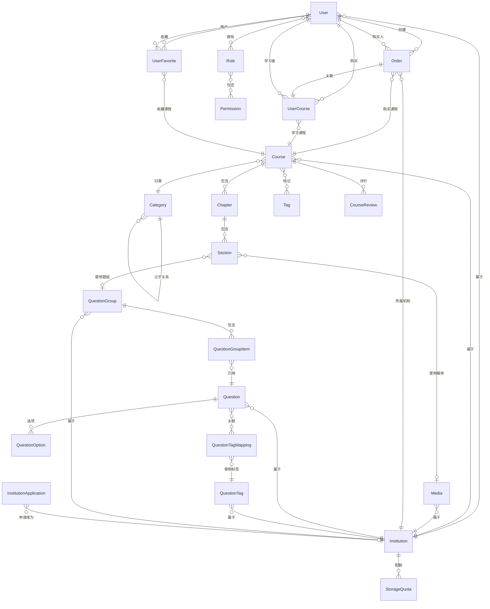

### 实体说明

1. **用户与权限管理**
   - User：系统用户，包括学生、教师和管理员
   - Role：用户角色，如学生、教师、管理员等
   - Permission：系统权限项，控制资源访问权限

2. **课程内容管理**
   - Course：课程，包含基本信息和学习资料
   - Chapter：章节，课程的一级组织单位
   - Section：小节，章节下的具体内容单元
   - Category：课程分类，支持多级分类结构
   - Tag：课程标签，用于标记和检索课程

3. **订单与购买系统**
   - Order：订单记录，包含支付状态和订单明细
   - UserCourse：用户课程关联，表示购买后的学习权限
   - UserFavorite：用户收藏，记录用户收藏的课程

4. **题库与考试系统**
   - Question：题目，包含各类题型（选择、填空等）
   - QuestionOption：题目选项，用于选择题
   - QuestionGroup：题目组，可用于组织测试或作业
   - QuestionTag：题目标签，用于分类和检索题目

5. **媒体与存储管理**
   - Media：媒体资源，如视频、音频、文档等
   - StorageQuota：存储配额，控制机构的存储空间使用

6. **机构管理**
   - Institution：教育机构，可提供课程和管理用户
   - InstitutionApplication：机构申请，处理新机构的注册请求

### 核心关系说明

- 用户(User)通过角色(Role)关联到权限(Permission)，实现基于角色的访问控制
- 课程(Course)由章节(Chapter)和小节(Section)组成，形成三级内容结构
- 小节(Section)可关联媒体资源(Media)或题目组(QuestionGroup)作为学习内容
- 用户购买课程生成订单(Order)和用户课程关联(UserCourse)，表示学习权限
- 题目(Question)可组织到题目组(QuestionGroup)中，用于测试和考核
- 所有核心资源(用户、课程、题目等)都关联到一个机构(Institution)

## 认证与授权设计

### 认证授权概述

本系统基于Spring Security和JWT实现了一套完整的认证授权机制，具有以下特点：

1. **基于JWT的无状态认证**：系统使用JWT令牌进行认证，避免了服务端存储会话信息，适合分布式部署和横向扩展。

2. **角色和权限双重控制**：虽然系统主要基于角色(ROLE)进行权限控制，但同时也支持更细粒度的权限(Permission)控制。

3. **多租户数据隔离**：在JWT令牌中嵌入机构ID，实现了优雅的多租户数据隔离机制。

4. **令牌管理机制**：
   - 双令牌设计：短期访问令牌(Access Token)和长期刷新令牌(Refresh Token)
   - 令牌黑名单：支持令牌显式失效和用户级别的令牌批量失效
   - 令牌刷新：无感知令牌续期，优化用户体验

5. **安全措施**：
   - 密码加密存储：使用BCrypt算法加密密码
   - CORS配置：防止跨站请求伪造
   - 验证码保护：登录时需要验证码校验

### 核心组件

系统的认证授权机制由以下核心组件组成：

1. **JWT令牌提供者(JwtTokenProvider)**：负责JWT令牌的生成、解析和验证。

2. **JWT认证过滤器(JwtAuthenticationFilter)**：拦截请求，提取并验证JWT令牌，设置认证信息。

3. **令牌黑名单服务(TokenBlacklistService)**：使用Redis实现令牌黑名单，支持令牌失效和用户级别的令牌批量失效。

4. **用户详情服务(UserDetailsServiceImpl)**：加载用户信息、角色和权限。

5. **安全工具类(SecurityUtil)**：提供获取当前用户信息、检查权限等便捷方法。

6. **认证服务(AuthService)**：处理用户登录、注册、令牌刷新等业务逻辑。

### 登录流程

以下是用户登录的完整流程：

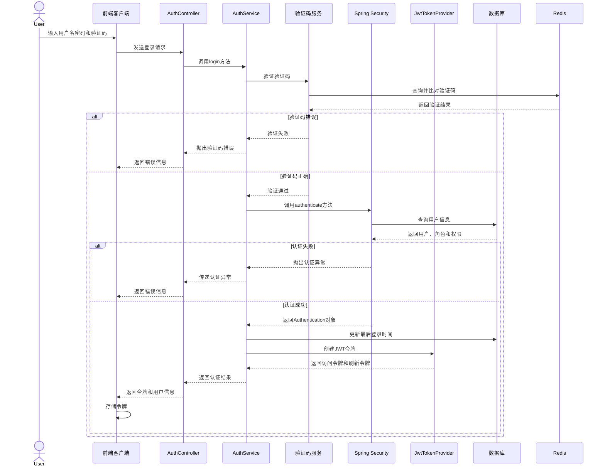

### 认证流程

当用户携带JWT令牌访问受保护资源时，系统的认证流程如下：

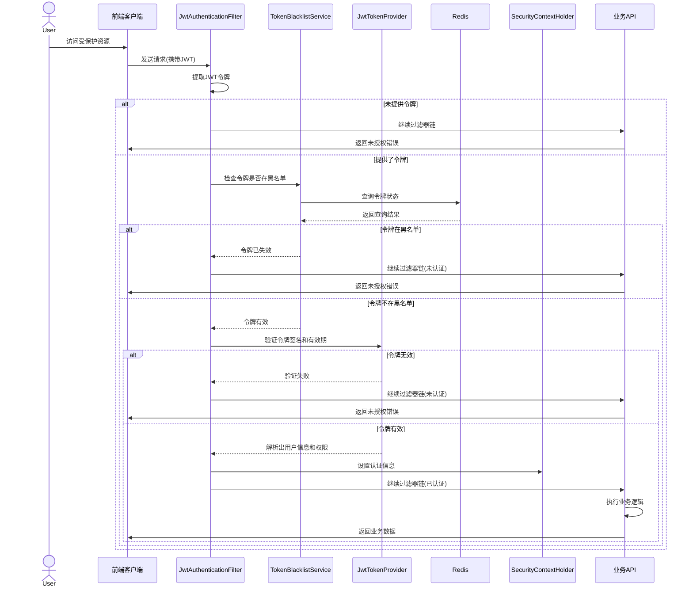

### 令牌刷新流程

访问令牌过期后，用户可以使用刷新令牌获取新的访问令牌，流程如下：

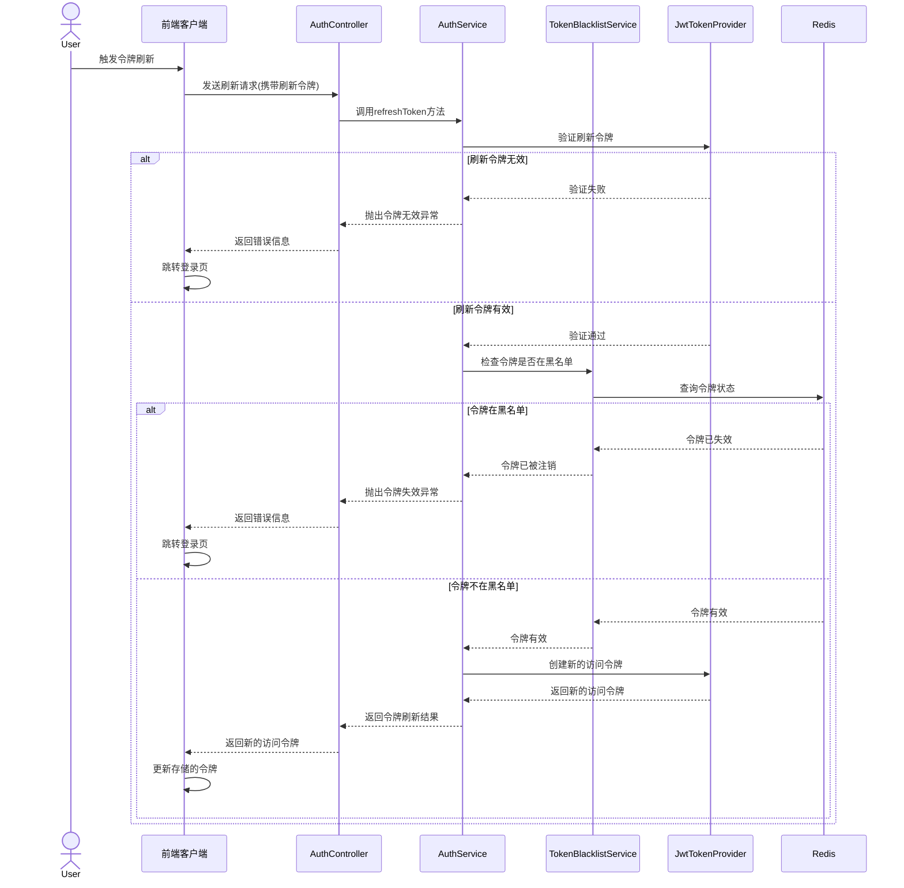

### JWT令牌结构

系统使用的JWT令牌包含以下关键信息：

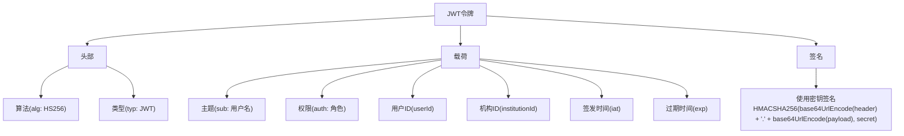

### 令牌黑名单机制

系统使用Redis实现了两级令牌黑名单机制：

1. **令牌级黑名单**：单个令牌被直接加入黑名单，用于处理注销、密码修改等场景。
2. **用户级黑名单**：记录时间戳，使该时间前颁发的所有令牌都无效，用于角色变更、批量失效等场景。

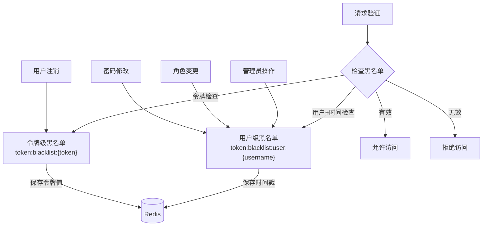

### 安全配置详解

系统的安全配置主要在`SecurityConfig`类中完成，关键配置包括：

1. **CSRF保护**：禁用CSRF保护，因为使用JWT进行无状态认证。

2. **CORS配置**：启用CORS，允许跨域请求。

3. **会话管理**：设置会话创建策略为无状态(STATELESS)。

4. **授权规则**：
   - 公开接口：登录、注册、公共API无需认证
   - Swagger文档：开发环境下无需认证
   - 其他所有请求：需要认证

5. **过滤器链**：添加JWT认证过滤器，在用户名密码认证过滤器之前执行。

### 多租户数据隔离

系统通过在JWT令牌中嵌入机构ID，实现了优雅的多租户数据隔离：

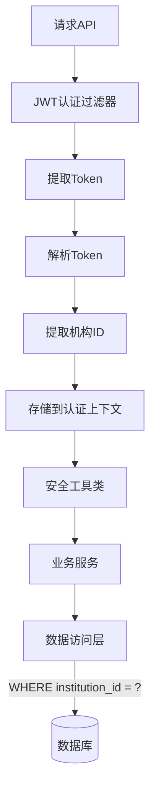

在业务代码中，通过`SecurityUtil.getCurrentInstitutionId()`方法获取当前用户的机构ID，从而在数据访问层自动过滤数据，确保用户只能访问其所属机构的数据。

## 用户与角色管理

### 用户类型与角色体系

系统支持四种主要用户类型，通过基于角色(RBAC)的权限控制模型管理其权限：

1. **管理员(ADMIN)**
   - 系统最高权限用户
   - 由系统初始化时自动创建
   - 负责平台整体管理，包括用户管理、机构审核等

2. **审核员(REVIEWER)**
   - 由管理员创建
   - 负责内容审核，如课程审核、机构申请审核等
   - 拥有有限的管理权限

3. **机构用户(INSTITUTION)**
   - 需要先申请创建机构，审核通过后获得机构注册码
   - 使用机构注册码注册成为机构用户
   - 可以创建和管理课程、题库等教学资源

4. **普通用户(USER)**
   - 通过邮箱验证注册
   - 可以浏览、购买、学习课程
   - 默认角色为普通用户

### 角色继承与权限分配

系统角色采用继承关系，权限从上至下逐层减少：

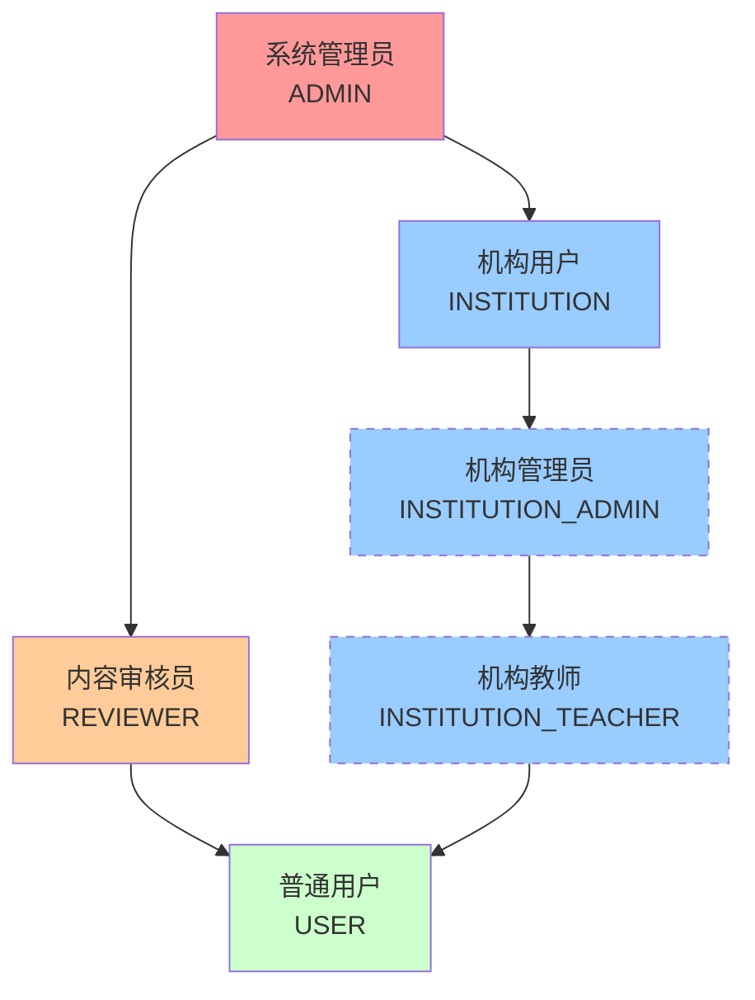

### 系统初始化

系统在首次启动时，通过`DataInitializer`组件自动初始化基础角色、权限和管理员账户：

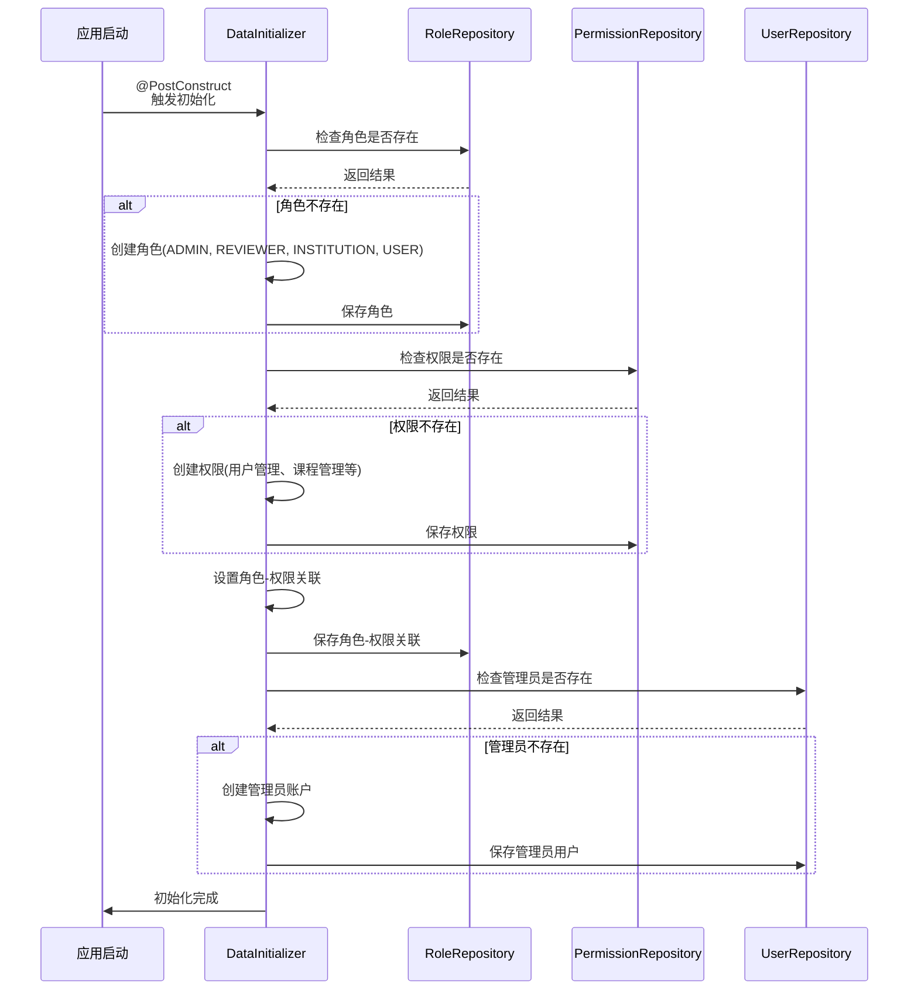

### 用户注册流程

#### 普通用户注册

普通用户通过邮箱验证方式进行注册，流程如下：

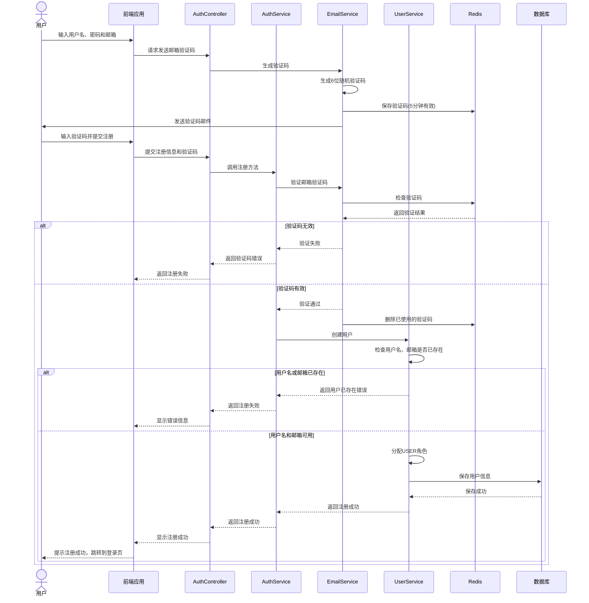

#### 机构申请流程

机构需要先提交申请，审核通过后才能注册机构用户：

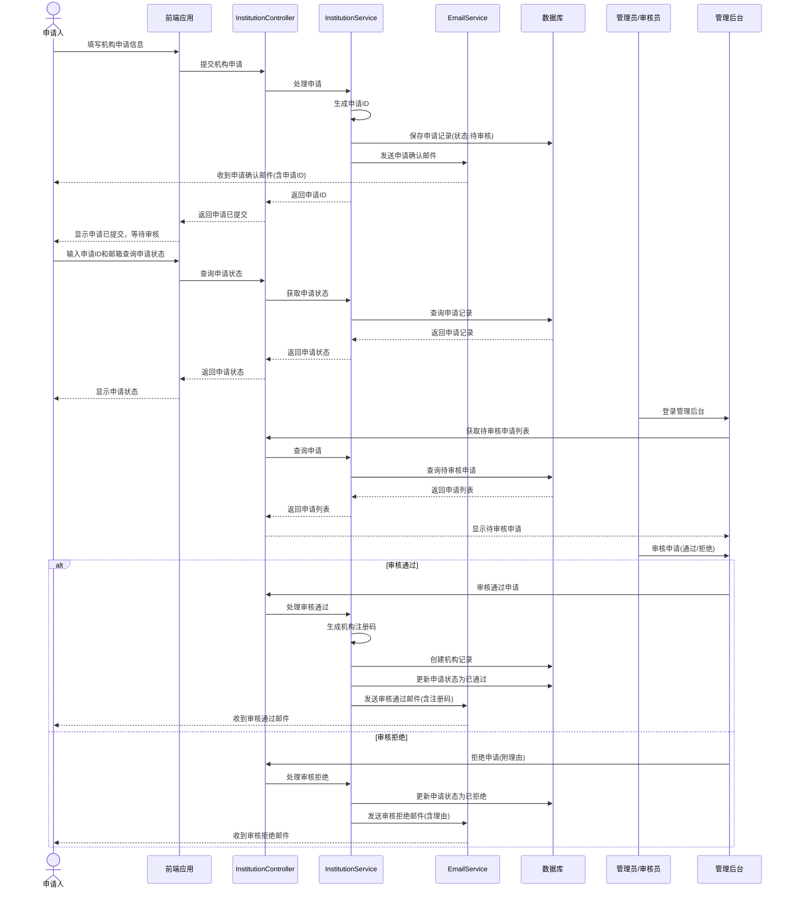

#### 机构用户注册

机构审核通过后，管理员可使用注册码注册机构用户：

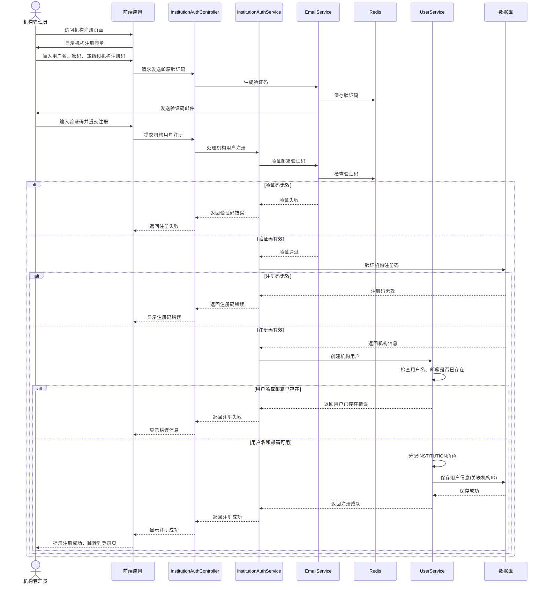

### 审核员创建流程

审核员由系统管理员创建，通过用户管理功能分配审核员角色：

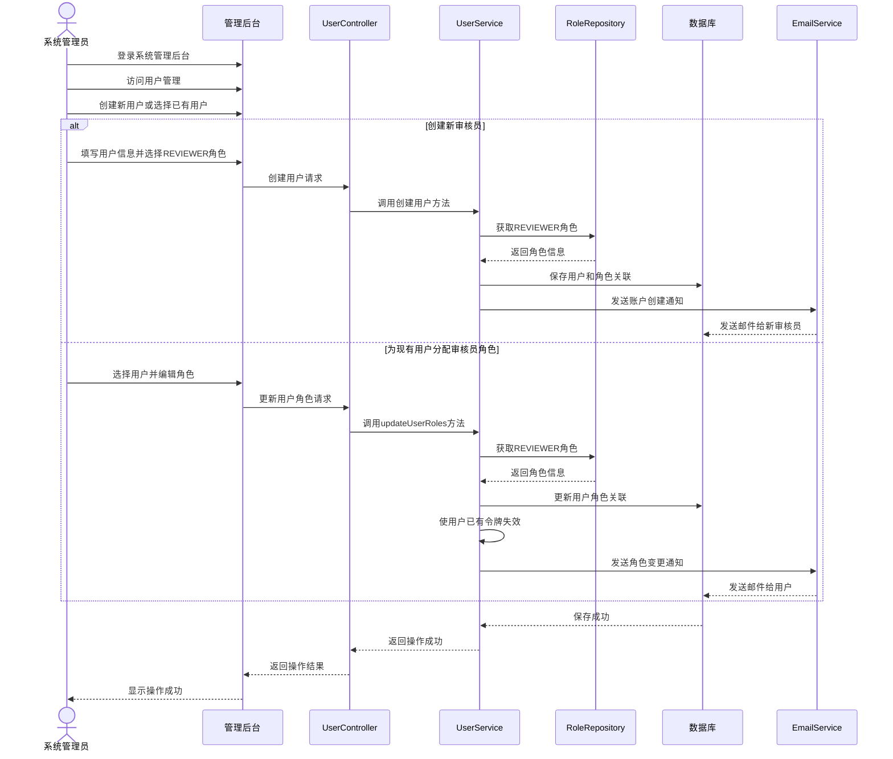

### 用户功能权限矩阵

下表展示各类用户可访问的核心功能：

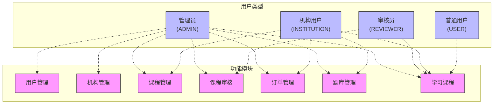

### 数据隔离原则

系统在用户权限管理中，采用以下数据隔离原则：

1. **管理员**：可访问平台所有数据
2. **审核员**：可查看所有机构的内容，但只能审核内容，不能修改
3. **机构用户**：只能访问和管理所属机构的数据
4. **普通用户**：只能访问自己的数据和公开内容

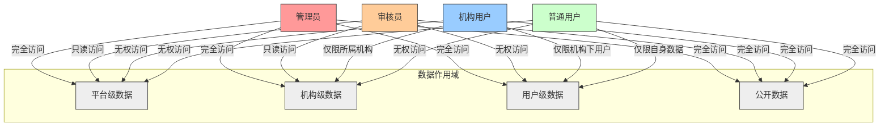

## 核心功能实现
<!-- 重要功能的实现思路和关键代码 -->

## 部署说明
<!-- 部署环境要求和部署步骤 -->

## 开发规范
<!-- 代码规范、Git使用规范等 -->

## 更新日志
<!-- 记录文档的更新历史 -->
