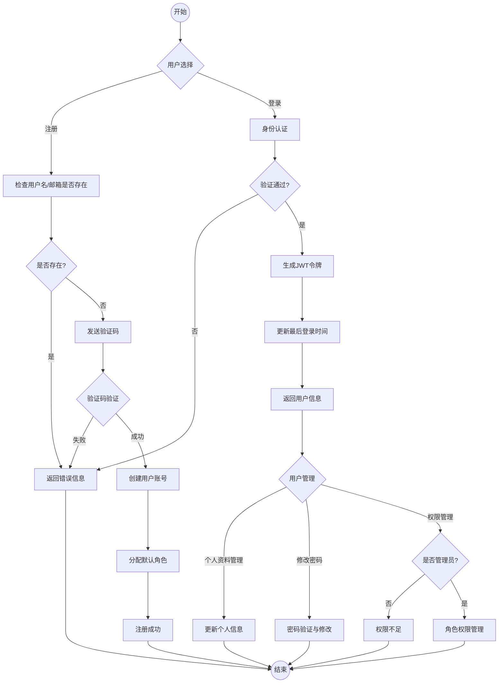
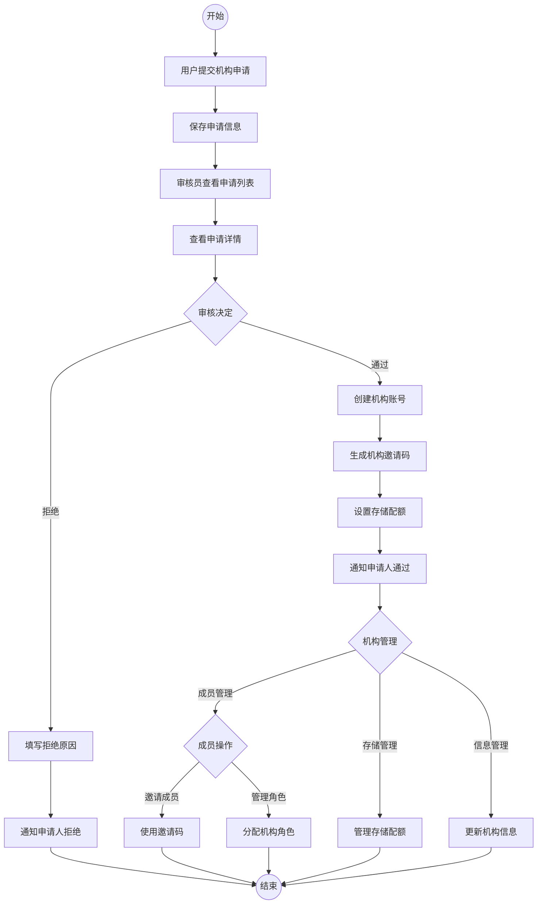
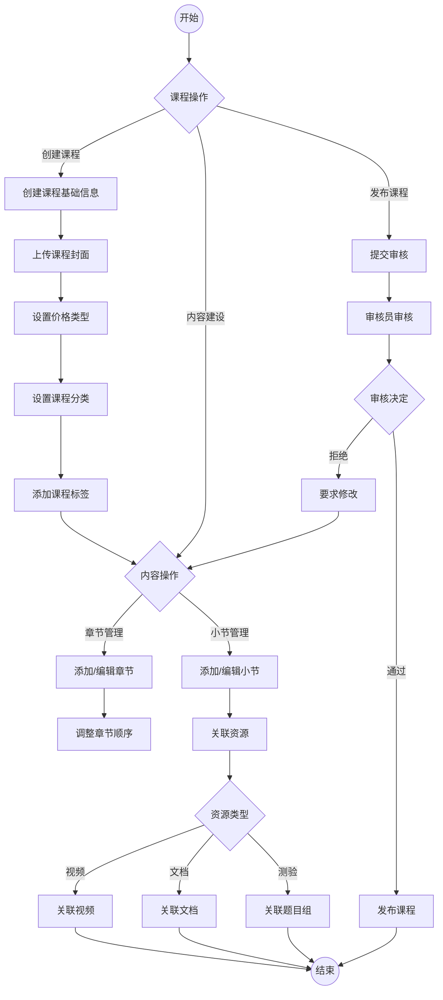
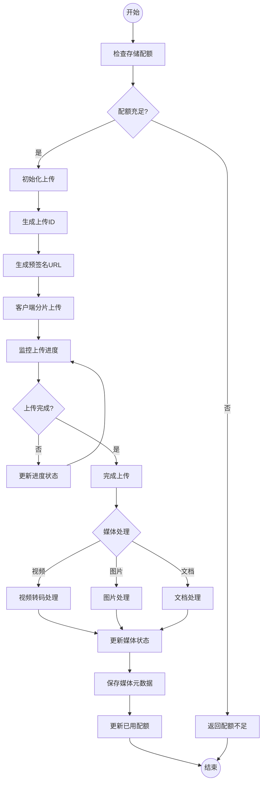
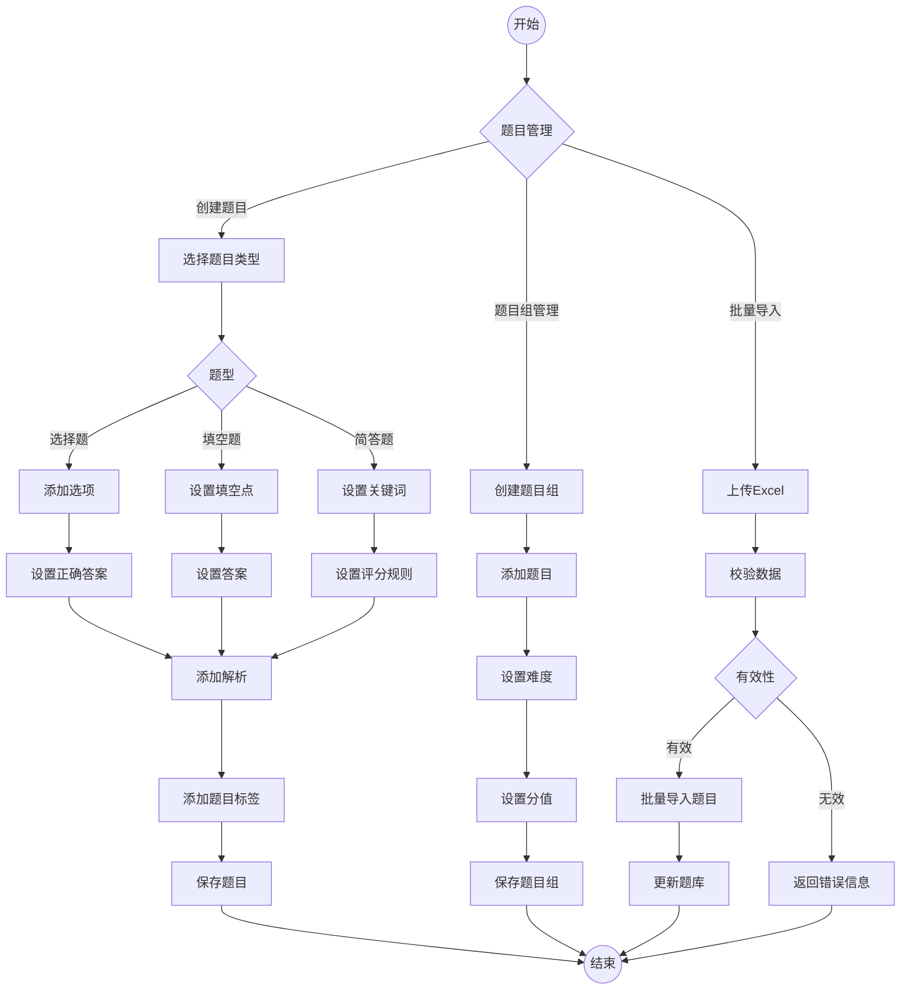
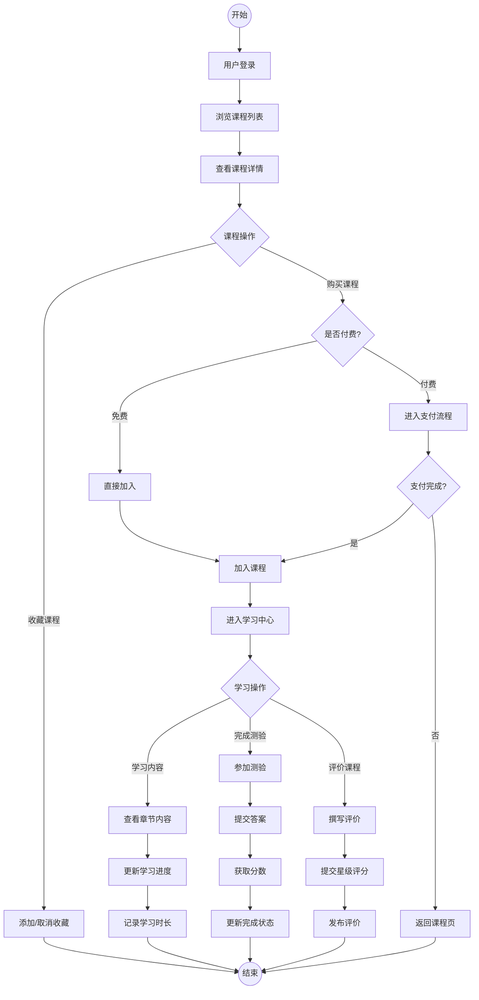
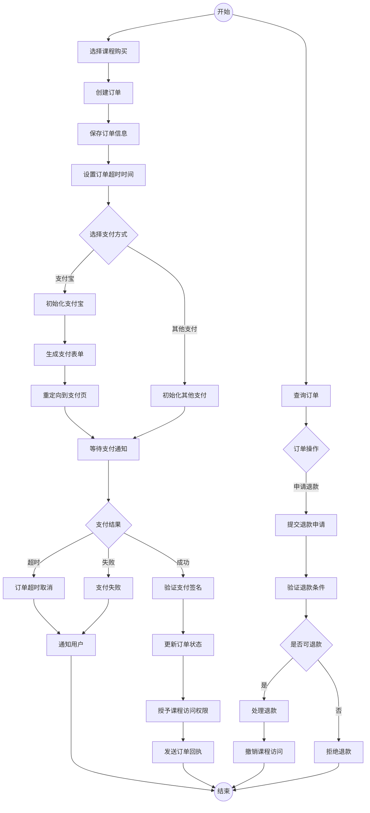

用户体系
UserController：用户管理，包括两部分功能：

管理端：用户CRUD、状态控制、角色分配（需ADMIN权限）
用户端：个人资料管理、密码修改、头像上传、邮箱更新
RoleController：角色管理，负责角色的CRUD和权限分配

PermissionController：权限管理，实现细粒度的访问控制

学习体验
UserCourseController：学习记录管理，包括：

获取已购课程列表
更新学习进度和学习时长
获取最近学习的课程
UserFavoriteController：收藏功能，实现课程收藏与取消

机构管理
InstitutionController：机构申请和管理
InstitutionMemberController：机构成员管理
ReviewerInstitutionController：机构审核功能
查询申请列表和详情
审批或拒绝申请
记录审核操作和审核人
内容管理
CourseController：课程管理

ChapterController：章节管理

SectionController：小节管理，包括：

小节CRUD
调整小节顺序
关联媒体资源和题目组
TagController：标签管理，支持热门标签、批量操作

CategoryController：分类管理

媒体资源
MediaController：媒体资源上传与管理
StorageQuotaController：存储配额管理
PreviewResourceController：资源预览功能
测评系统
QuestionController：试题管理
QuestionGroupController：题目组管理
QuestionTagController：题目标签管理
QuestionImportController：试题批量导入
交易系统
OrderController：订单管理
AlipayTestController：支付宝支付集成

1. 用户与权限管理
用户注册、登录和认证
角色与权限管理
个人资料维护
密码和邮箱管理
2. 机构管理
机构注册与申请
机构审核流程
机构成员管理
存储配额控制
3. 课程内容管理
课程创建与发布
章节与小节管理
课程分类与标签
内容审核发布流程
4. 媒体资源管理
大文件分片上传
视频处理与转码
媒体资源存储
资源预览与保护
5. 测评系统
多类型题目管理
题目组与题库
试题标签分类
批量导入导出
6. 学习体验
课程学习进度跟踪
课程收藏功能
课程评价与评分
个性化推荐
7. 交易系统
订单创建与管理
支付宝支付集成
订单超时处理
退款与售后
8. 系统管理
数据统计分析
日志记录与审计
验证码与安全控制
邮件通知















```mermaid
flowchart TD
    Start((开始)) --> AdminAction{管理操作}
    
    AdminAction -->|用户管理| UserAdmin[用户管理界面]
    UserAdmin --> UserOperation{用户操作}
    UserOperation -->|查询用户| SearchUsers[搜索筛选用户]
    UserOperation -->|编辑用户| EditUser[修改用户信息]
    UserOperation -->|禁用用户| DisableUser[更改用户状态]
    UserOperation -->|分配角色| AssignRoles[更新用户角色]
    
    AdminAction -->|机构管理| InstAdmin[机构管理界面]
    InstAdmin --> InstOperation{机构操作}
    InstOperation -->|审核机构| ReviewInst[审核机构申请]
    InstOperation -->|配额管理| QuotaManage[调整存储配额]
    InstOperation -->|查看统计| ViewStats[查看机构数据]
    
    AdminAction -->|内容管理| ContentAdmin[内容管理界面]
    ContentAdmin --> ContentOperation{内容操作}
    ContentOperation -->|课程审核| ReviewCourse[审核课程]
    ContentOperation -->|分类管理| CategoryManage[管理课程分类]
    ContentOperation -->|标签管理| TagManage[管理标签]
    
    AdminAction -->|系统设置| SysSettings[系统设置界面]
    SysSettings --> SettingOperation{设置操作}
    SettingOperation -->|安全设置| SecuritySettings[安全配置]
    SettingOperation -->|邮件设置| EmailSettings[邮件服务配置]
    SettingOperation -->|支付设置| PaymentSettings[支付接口配置]
    
    AdminAction -->|日志审计| LogAudit[日志审计界面]
    LogAudit --> LogOperation{日志操作}
    LogOperation -->|操作日志| ViewOpLogs[查看操作日志]
    LogOperation -->|登录日志| ViewLoginLogs[查看登录日志]
    LogOperation -->|导出日志| ExportLogs[导出日志数据]
    
    SearchUsers --> End((结束))
    EditUser --> End
    DisableUser --> End
    AssignRoles --> End
    
    ReviewInst --> End
    QuotaManage --> End
    ViewStats --> End
    
    ReviewCourse --> End
    CategoryManage --> End
    TagManage --> End
    
    SecuritySettings --> End
    EmailSettings --> End
    PaymentSettings --> End
    
    ViewOpLogs --> End
    ViewLoginLogs --> End
    ExportLogs --> End

1. 用户与权限管理
系统实现了一个完整的用户与权限管理模块，主要功能特点如下：

用户管理
注册流程：采用邮箱验证的安全注册流程，包括用户名/邮箱唯一性检查、邮箱验证码发送与验证、密码加密存储(BCrypt算法)。
登录认证：基于Spring Security的认证架构，使用用户名/密码认证，生成JWT令牌，支持记住我功能。
用户信息管理：用户可以更新个人资料、修改密码、上传头像。头像上传使用MinIO存储，支持图片裁剪预览。
邮箱管理：支持邮箱更新，新邮箱需要验证码验证，同时需要验证原密码确保操作安全性。
用户状态控制：包括正常、禁用、未验证等多种状态，禁用用户无法登录系统。
角色与权限
RBAC权限模型：基于角色的访问控制，一个用户可以拥有多个角色，一个角色可以包含多个权限。
系统预设角色：包括ADMIN(超级管理员)、REVIEWER(审核员)、TEACHER(教师)、STUDENT(学生)等基础角色。
机构角色：机构内部特有的角色体系，如机构管理员、机构教师等。
权限管理：细粒度的权限定义，包括用户管理、课程管理、机构管理等不同模块的操作权限。
权限检查：在控制器和服务层都实现了权限检查，确保安全访问。
安全特性
令牌管理：JWT令牌生成与验证，包括访问令牌和刷新令牌。
令牌黑名单：支持令牌失效处理，确保用户安全登出。
密码策略：强制密码复杂度要求，密码加密存储，敏感操作二次验证。
日志审计：记录用户登录历史和关键操作，便于安全审计。

机构申请与审核
申请提交：普通用户可以提交机构申请，需要填写机构名称、地址、证书信息、联系方式等基本信息，同时上传营业执照或办学许可证等证明文件。
申请验证：系统自动验证申请信息的完整性和合法性，包括证件号码格式、联系方式有效性等。
审核流程：审核员可以查看申请详情，包括下载查看上传的证明文件，进行真实性核验。
审核决策：审核员可以选择通过或拒绝申请，拒绝时需要提供明确的拒绝理由，通过时会自动创建机构账号。
审核通知：审核结果通过邮件通知申请人，包括成功或失败的详细信息。
机构账号管理
机构信息管理：创建后的机构可以更新基本信息、上传logo、设置机构简介等。
机构状态控制：机构状态包括正常、禁用等，管理员可以临时禁用违规机构。
机构注册码：每个机构有唯一的注册码，用于邀请成员加入机构。
机构统计：包括机构下的课程数量、学员数量、收入数据等统计信息。
机构成员管理
成员邀请：机构管理员可以生成邀请链接或直接分享注册码，邀请教师加入机构。
角色分配：机构内部可以设置不同角色，如管理员、教师、助教等，不同角色拥有不同权限。
成员权限：可以为不同成员分配课程管理、内容创建、数据查看等不同级别的权限。
成员移除：支持从机构中移除成员，同时处理相关资源的权限变更。
存储配额管理
配额分配：每个机构拥有限定的存储空间配额，分为视频、文档等不同类型。
配额监控：实时监控机构存储空间使用情况，接近上限时发出预警。
配额调整：管理员可以根据机构需求调整存储配额，支持临时或永久提升。
配额策略：根据机构等级或付费情况自动分配不同级别的存储配额。
机构内容管理
内容审核：机构发布的课程需要经过平台审核，确保内容质量和合规性。
数据统计：提供机构运营数据统计，包括学员活跃度、课程完成率、收入情况等。
机构首页：每个机构拥有自定义的展示页面，展示机构特色和热门课程。

3. 课程内容管理
系统实现了全面的课程内容创建和管理功能，支持结构化的课程组织。主要特点如下：

课程管理
课程创建：机构教师可以创建课程，设置课程标题、简介、封面图片、难度级别等基本信息。
价格策略：支持免费、付费、三种价格类型，付费课程可设置具体价格和优惠信息。
课程状态：课程状态包括草稿、审核中、已发布、已下架等多种状态，反映课程生命周期。
版本控制：采用工作区版本和发布版本双版本设计，确保内容编辑不影响已购买学员的学习体验。
课程统计：自动统计学习人数、完成率、平均评分等数据，用于展示和排序。
章节和小节管理
章节结构：课程内容组织为章节-小节两级结构，支持灵活的内容组织方式。
章节管理：可设置章节标题、简介、是否试学等属性，支持拖拽排序调整顺序。
访问控制：章节级别的访问控制，可以设置为免费试学、付费学习或会员专享。
小节内容：小节是实际的学习单元，可以包含视频、文档或测验等不同类型的内容。
内容关联：小节可以关联上传的视频或文档资源，或者关联测验题目组。
学习进度：系统自动记录学员在小节级别的学习进度和完成状态。
分类与标签
多级分类：支持多级课程分类树，如IT技术-编程语言-Java这样的分类结构。
分类管理：包括分类的创建、编辑、排序、启用/禁用等操作。
标签系统：灵活的标签系统支持课程的多维度描述，如"入门级"、"实战项目"等。
热门标签：系统自动统计标签使用频率，推荐热门标签供内容创建者使用。
标签搜索：支持通过标签进行课程搜索和筛选，提升内容发现效率。
课程审核与发布
提交审核：课程创建完成后，需提交审核才能发布，确保内容质量和合规性。
审核流程：审核员可查看课程全部内容，进行评估审核，可以通过或拒绝发布。
修改要求：审核拒绝时，需提供具体的修改意见和建议，便于内容创建者改进。
审核通过：审核通过后，课程状态变为已发布，对所有用户可见并可购买学习。
版本发布：发布时系统创建课程的发布版本，与工作区版本分离，便于后续更新。
课程更新与下架
内容更新：已发布课程的内容可以继续在工作区编辑，不影响学习中的学员。
更新发布：内容更新后可再次提交审核，审核通过后更新发布版本。
紧急下架：违规内容可由管理员紧急下架，同时处理退款等后续事宜。
课程归档：长期不再维护的课程可以归档，保留历史记录但不再展示给新用户。

4. 媒体资源管理
系统实现了媒体资源的上传和管理功能，主要特点如下：

分片上传机制
初始化上传：提供/initiate-upload接口，生成上传ID和预签名URL，支持大文件上传。
分片管理：将大文件分割成多个小分片单独上传，减轻服务器负担。
完成上传：通过/{id}/complete接口通知服务器所有分片已上传完成，请求合并分片。
取消上传：支持取消上传操作，通过/{id}/cancel接口清理已上传的分片。
媒体文件管理
媒体信息获取：提供/{id}接口获取指定媒体的详细信息。
访问URL生成：通过/{id}/access接口获取媒体文件的临时访问URL，可设置有效期。
媒体列表查询：支持分页获取机构的媒体文件列表。
媒体删除：提供删除媒体文件的功能，同时释放存储配额。
存储配额控制
配额查询：提供/quota接口获取机构的存储配额使用情况。
配额验证：上传前验证机构是否有足够的存储配额。
配额管理：系统跟踪媒体文件大小，更新已使用的存储空间。
安全与权限控制
机构隔离：媒体资源与机构关联，机构只能访问自己的媒体。
权限验证：所有接口需要ROLE_INSTITUTION权限，确保只有机构用户可以管理媒体。
用户追踪：记录媒体创建者的用户ID，便于权限控制和审计。
错误处理与日志
详细日志：记录媒体操作的关键信息，包括用户ID、机构ID、文件信息等。
异常处理：捕获并处理媒体操作过程中的异常情况，返回友好错误信息。

5. 测评系统
系统实现了一套完整的在线测评系统，支持多种题型、题目组织和批量管理。主要特点如下：

题目管理
多题型支持：系统支持单选题、多选题等多种题型，每种题型有独立的数据结构和验证逻辑。
题目创建：教师可以创建各类题目，设置题干、选项、正确答案和解析等。
题目筛选：支持按照类型、难度、关键词和标签等多维度筛选题目。
随机抽题：支持按照题型随机抽取指定数量的题目，用于自动组卷。
引用检测：删除题目前会检查该题目是否被题目组引用，避免数据不一致。
题目组管理
题目组织：通过题目组将多个题目组织在一起，形成测验、作业或练习。
灵活配置：可为每个题目设置分值、难度、序号等属性。
排序控制：支持调整题目组中题目的顺序，灵活组织考试结构。
批量操作：支持批量添加题目到题目组，提高工作效率。
题目关联：课程小节可以关联题目组，形成完整的学习-测评闭环。
题目标签
标签管理：创建和管理题目标签，用于题目分类和检索。
多维分类：一个题目可以关联多个标签，实现多维度分类。
标签筛选：可通过标签快速筛选题目，便于题目复用。
标签关联：支持为题目添加或移除标签，动态调整题目归类。
批量导入
模板下载：提供标准化的Excel模板，便于机构批量准备题目。
批量导入：支持通过Excel批量导入题目，提高内容创建效率。
导入验证：对导入的题目进行格式和内容验证，确保数据质量。
结果反馈：提供详细的导入结果，包括成功和失败的记录以及原因。

6. 学习体验
系统实现了一套完整的学习体验功能，支持用户课程学习记录、收藏和评价。主要特点如下：

学习进度管理
学习记录：系统自动记录用户的学习行为，包括已学习的小节、学习时长和最后学习时间。
进度统计：计算并显示课程的总体学习进度，如已完成百分比、剩余内容等。
最近学习：提供用户最近学习的课程列表，便于快速继续学习。
学习时长：记录用户在每个小节的学习时长，用于学习分析和进度评估。
课程收藏
收藏功能：用户可以收藏感兴趣的课程，方便后续查看。
收藏列表：提供用户收藏课程的分页查询接口，支持按时间排序。
取消收藏：用户可以取消已收藏的课程。
收藏状态：提供接口查询用户对特定课程的收藏状态。
课程评价
评分系统：用户可以对已学习的课程进行星级评分（1-5星）。
评价内容：用户可以撰写文字评价，分享学习体验和意见。
评价列表：课程页面展示所有用户的评价，按时间或评分排序。
统计分析：系统自动统计课程的平均评分和评价数量，用于课程排序和推荐。
课程发现
推荐系统：基于热门度、最新上线等因素推荐课程。
搜索功能：支持按关键词、分类和标签搜索课程。
课程详情：提供课程的详细信息，包括内容介绍、章节结构、评价等。
学习权限控制
付费内容保护：区分免费试学和付费内容，确保内容安全。
智能展示：根据用户是否购买课程，智能展示不同的课程内容结构。
访问验证：在访问课程内容时验证用户权限，未购买用户只能访问试学内容。

7. 交易系统
系统实现了一套完整的交易系统，支持课程购买、支付和退款流程。主要特点如下：

订单管理
订单创建：用户可以创建课程购买订单，系统自动生成订单号、设置订单状态和过期时间。
订单状态管理：订单状态包括待支付、支付成功、已取消、退款中、已退款等，支持完整的状态流转。
订单超时处理：使用Redis实现订单超时计时，超时自动取消未支付订单。
订单查询：支持根据订单ID、订单号查询订单详情，支持高级搜索功能。
支付剩余时间：提供查询支付剩余时间的接口，用于前端倒计时显示。
支付集成
支付宝集成：使用支付宝网页支付接口，支持生成支付表单、同步回调和异步通知处理。
支付表单生成：根据订单信息生成支付表单HTML，前端直接渲染即可跳转到支付页面。
签名验证：对支付回调进行签名验证，确保支付安全性。
支付结果处理：支付成功后自动更新订单状态，并为用户授予课程访问权限。
退款处理
退款申请：用户可以对已支付订单提交退款申请，需提供退款原因。
退款审核：机构管理员可以查看退款申请并进行审核，决定是否批准退款。
退款执行：批准退款后，系统自动调用支付宝退款接口，完成退款操作。
退款状态更新：退款完成后更新订单状态，并撤销用户对课程的访问权限。
订单安全
权限控制：严格的订单访问权限控制，确保用户只能访问自己的订单。
并发处理：使用事务和锁机制处理支付和退款过程中的并发问题。
幂等性设计：支付通知接口实现幂等性处理，防止重复处理同一笔支付。
数据统计
机构收入统计：提供机构总收入、总退款、净收入等统计数据接口。
销售数据查询：支持按时间段、课程类型等条件查询销售数据。
退款监控：机构管理员可以查看待处理的退款申请列表。
订单取消

8. 系统管理
系统实现了全面的后台管理功能，包括用户管理、权限配置、数据统计等。主要特点如下：

用户管理
用户查询：支持多条件复合查询，包括用户名、邮箱、电话、状态等筛选条件，支持分页和排序。
用户创建：管理员可以创建新用户，设置基本信息、密码和初始角色，支持批量操作。
用户编辑：管理员可以编辑用户信息，包括更新个人资料、重置密码、调整状态等。
状态控制：可以启用/禁用用户，禁用后用户将无法登录系统。
角色分配：管理员可以为用户分配多个角色，灵活控制用户权限。
用户删除：支持单个删除和批量删除，并处理关联数据。
角色与权限管理
角色管理：系统预设了管理员、审核员、教师、学生等基础角色，支持自定义角色。
权限设置：每个角色可以分配不同的权限，细粒度控制功能访问权限。
权限查看：可以查看系统中所有可用权限，按模块分组展示。
动态权限：系统支持动态权限验证，权限变更即时生效。
角色复制：可以基于现有角色创建新角色，提高配置效率。
审核管理
机构审核：审核员可以查看、审批或拒绝机构申请，并提供审核意见。
课程审核：对课程内容进行审核，确保内容质量和合规性。
审核流程：完整的审核流程支持，包括申请提交、审核中、审核通过/拒绝等状态。
审核记录：记录所有审核操作，包括操作人、操作时间和审核意见。
系统配置
参数配置：系统关键参数可配置，如上传文件大小限制、验证码有效期等。
支付设置：支付宝集成配置，包括应用ID、密钥、回调地址等。
存储配置：对象存储配置，支持MinIO兼容的存储服务。
邮件配置：SMTP邮件服务配置，用于系统通知和验证码发送。
安全控制
访问控制：基于Spring Security实现的细粒度访问控制。
令牌管理：JWT令牌生成、验证和刷新，支持令牌黑名单。
验证码机制：登录、注册等关键操作需要验证码验证。
密码策略：强制密码复杂度要求，密码加密存储。

. 系统整体架构图

flowchart TD
    Client[客户端] --> WebAPI[Web API层]
    
    subgraph 应用层
        WebAPI --> Controllers[控制器层]
        Controllers --> Services[服务层]
        Services --> Repositories[数据访问层]
    end
    
    subgraph 外部服务集成
        Services --> Payment[支付宝集成]
        Services --> Storage[MinIO存储]
        Services --> Email[邮件服务]
        Services --> Redis[Redis缓存]
    end
    
    subgraph 数据层
        Repositories --> Entities[实体模型]
        Entities --> Database[(数据库)]
    end
    
    subgraph 安全层
        Controllers --> Security[Spring Security]
        Security --> JWT[JWT认证]
        Security --> RBAC[RBAC权限控制]
    end

sequenceDiagram
    participant Client as 客户端
    participant API as API服务
    participant MediaService as 媒体服务
    participant QuotaService as 配额服务
    participant S3Manager as S3管理器
    participant Storage as MinIO存储
    participant Redis as Redis缓存
    
    Client->>API: 初始化上传请求
    API->>MediaService: 调用initiateUpload
    MediaService->>QuotaService: 检查存储配额
    QuotaService-->>MediaService: 配额充足
    MediaService->>MediaService: 创建Media记录
    MediaService->>S3Manager: 初始化分片上传
    S3Manager->>Storage: createMultipartUpload
    Storage-->>S3Manager: 返回uploadId
    S3Manager->>S3Manager: 生成分片预签名URL
    MediaService->>Redis: 保存上传状态
    MediaService-->>API: 返回上传ID和预签名URL
    API-->>Client: 返回初始化结果
    
    loop 上传分片
        Client->>Storage: 直接上传分片到预签名URL
        Storage-->>Client: 返回ETag
    end
    
    Client->>API: 完成上传请求(uploadId, parts)
    API->>MediaService: 调用completeUpload
    MediaService->>S3Manager: 完成分片上传
    S3Manager->>Storage: completeMultipartUpload
    Storage-->>S3Manager: 上传完成
    MediaService->>Redis: 清除上传状态
    MediaService-->>API: 返回Media信息
    API-->>Client: 返回完成结果


