# 在线教育平台系统设计文档

## 目录

1. [系统概述](#系统概述)
2. [技术栈](#技术栈)
3. [核心功能模块](#核心功能模块)
   - [用户认证与权限管理](#用户认证与权限管理)
   - [机构管理系统](#机构管理系统)
   - [课程管理](#课程管理)
   - [媒体资源管理](#媒体资源管理)
   - [学习记录与统计](#学习记录与统计)
   - [订单与支付系统](#订单与支付系统)
   - [题库与测验系统](#题库与测验系统)
4. [系统架构](#系统架构)
5. [数据模型](#数据模型)
6. [安全设计](#安全设计)
7. [性能优化](#性能优化)
8. [部署方案](#部署方案)

## 系统概述

本系统是一个功能完善的在线教育平台，支持机构入驻、课程发布、学习管理、在线支付等核心功能。系统采用前后端分离架构，后端基于Spring Boot框架，前端使用Next.js和React技术栈，数据存储采用MySQL和Redis，文件存储使用MinIO对象存储服务。

系统主要面向三类用户：
- 学习者：浏览课程、购买学习、完成测验
- 教育机构：管理课程、上传资源、查看统计
- 平台管理员：审核内容、管理用户、系统维护

## 技术栈

### 前端技术栈
- **框架**：Next.js 15.2.1, React 19
- **UI组件**：自定义UI组件库
- **状态管理**：React Hooks
- **图表可视化**：Recharts
- **HTTP客户端**：Axios

### 后端技术栈
- **框架**：Spring Boot 3.3.9
- **运行环境**：Java 17
- **安全框架**：Spring Security
- **ORM框架**：Spring Data JPA
- **API文档**：Swagger/OpenAPI

### 数据存储
- **关系型数据库**：MySQL 8.x
- **缓存**：Redis
- **对象存储**：MinIO (兼容S3 API)

## 核心功能模块

### 用户认证与权限管理

#### 认证机制
系统采用JWT (JSON Web Token) 实现无状态认证，支持令牌刷新机制。

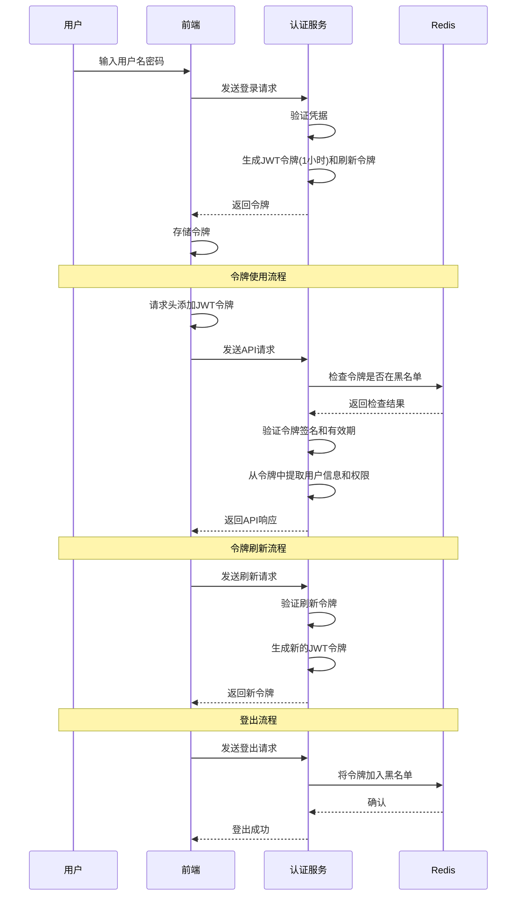
```mermaid
sequenceDiagram
    participant 用户
    participant 前端
    participant 认证服务
    participant Redis

    用户->>前端: 输入用户名密码
    前端->>认证服务: 发送登录请求
    认证服务->>认证服务: 验证凭据
    认证服务->>认证服务: 生成JWT令牌(1小时)和刷新令牌
    认证服务-->>前端: 返回令牌
    前端->>前端: 存储令牌

    Note over 用户,Redis: 令牌使用流程
    前端->>前端: 请求头添加JWT令牌
    前端->>认证服务: 发送API请求
    认证服务->>Redis: 检查令牌是否在黑名单
    Redis-->>认证服务: 返回检查结果
    认证服务->>认证服务: 验证令牌签名和有效期
    认证服务->>认证服务: 从令牌中提取用户信息和权限
    认证服务-->>前端: 返回API响应

    Note over 用户,Redis: 令牌刷新流程
    前端->>认证服务: 发送刷新请求
    认证服务->>认证服务: 验证刷新令牌
    认证服务->>认证服务: 生成新的JWT令牌
    认证服务-->>前端: 返回新令牌

    Note over 用户,Redis: 登出流程
    前端->>认证服务: 发送登出请求
    认证服务->>Redis: 将令牌加入黑名单
    Redis-->>认证服务: 确认
    认证服务-->>前端: 登出成功
```

#### 权限控制
系统基于角色的权限控制，主要角色包括：
- 普通用户(USER)
- 机构用户(INSTITUTION)
- 审核员(REVIEWER)
- 管理员(ADMIN)

虽然系统设计了完整的RBAC权限模型，但实际实现中主要使用Spring Security的`@PreAuthorize("hasRole('ROLE_NAME')")`注解进行简化的基于角色的权限控制。

#### 特殊设计：机构管理员识别
系统通过比较用户邮箱和机构联系邮箱来识别机构管理员，无需额外的角色设置。

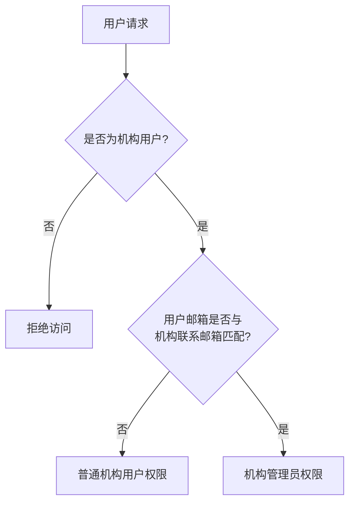
```mermaid
flowchart TD
    A[用户请求] --> B{是否为机构用户?}
    B -->|否| C[拒绝访问]
    B -->|是| D{用户邮箱是否与\n机构联系邮箱匹配?}
    D -->|否| E[普通机构用户权限]
    D -->|是| F[机构管理员权限]
```

#### 用户注册与验证
系统实现了多重验证机制，确保用户身份的真实性和安全性。

1. **图形验证码**：
   - 使用Kaptcha库生成图形验证码
   - 验证码存储在Redis中，设置5分钟过期时间
   - 验证后立即删除，防止重复使用

2. **邮箱验证码**：
   - 系统生成6位数字验证码
   - 通过Spring Mail发送验证邮件
   - 验证码存储在Redis中，设置有效期

3. **注册流程**：

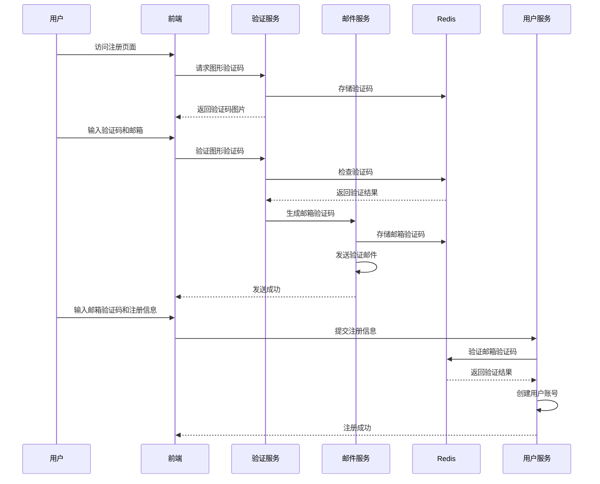
```mermaid
sequenceDiagram
    participant 用户
    participant 前端
    participant 验证服务
    participant 邮件服务
    participant Redis
    participant 用户服务

    用户->>前端: 访问注册页面
    前端->>验证服务: 请求图形验证码
    验证服务->>Redis: 存储验证码
    验证服务-->>前端: 返回验证码图片
    用户->>前端: 输入验证码和邮箱
    前端->>验证服务: 验证图形验证码
    验证服务->>Redis: 检查验证码
    Redis-->>验证服务: 返回验证结果
    验证服务->>邮件服务: 生成邮箱验证码
    邮件服务->>Redis: 存储邮箱验证码
    邮件服务->>邮件服务: 发送验证邮件
    邮件服务-->>前端: 发送成功
    用户->>前端: 输入邮箱验证码和注册信息
    前端->>用户服务: 提交注册信息
    用户服务->>Redis: 验证邮箱验证码
    Redis-->>用户服务: 返回验证结果
    用户服务->>用户服务: 创建用户账号
    用户服务-->>前端: 注册成功
```

4. **忘记密码功能**：
   - 用户提供邮箱和图形验证码
   - 系统验证邮箱是否存在
   - 生成临时密码并发送到用户邮箱
   - 用户使用临时密码登录后需要修改密码

### 机构管理系统

机构管理系统是平台的核心功能之一，支持教育机构入驻、审核、管理等全生命周期。

#### 机构申请与审核流程

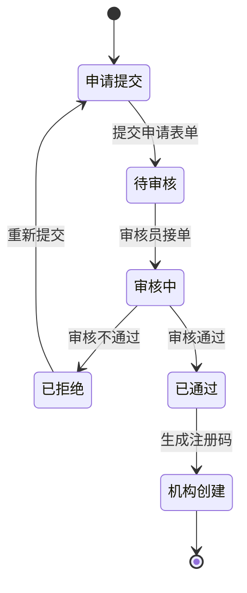
```mermaid
stateDiagram-v2
    [*] --> 申请提交
    申请提交 --> 待审核: 提交申请表单
    待审核 --> 审核中: 审核员接单
    审核中 --> 已拒绝: 审核不通过
    审核中 --> 已通过: 审核通过
    已拒绝 --> 申请提交: 重新提交
    已通过 --> 机构创建: 生成注册码
    机构创建 --> [*]
```

1. **申请提交**：
   - 申请者填写机构信息、联系方式等
   - 需要通过图形验证码验证
   - 系统生成唯一申请ID
   - 发送确认邮件到联系邮箱

2. **审核流程**：
   - 审核员查看申请详情
   - 可以通过或拒绝申请
   - 拒绝需要提供理由
   - 审核结果通过邮件通知申请者

3. **机构创建**：
   - 审核通过后自动创建机构实体
   - 生成唯一的机构注册码
   - 发送包含注册码的邮件到联系邮箱

#### 机构用户注册

机构用户注册需要提供机构注册码：

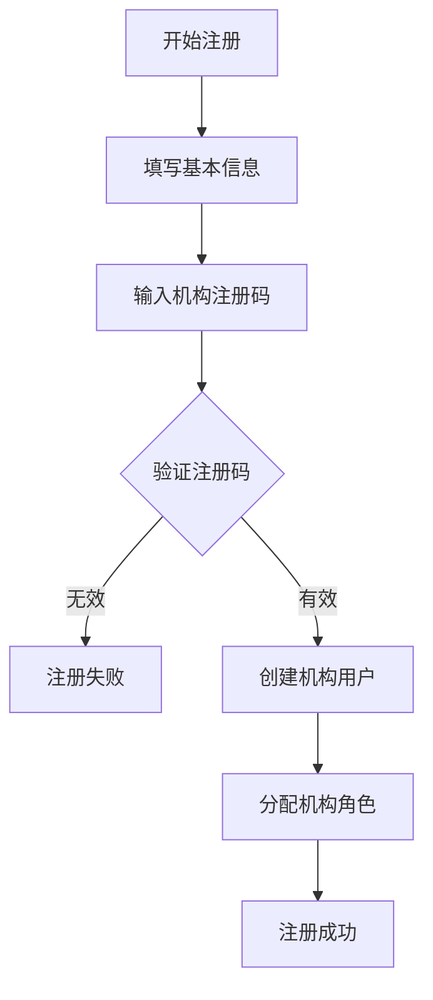
```mermaid
flowchart TD
    A[开始注册] --> B[填写基本信息]
    B --> C[输入机构注册码]
    C --> D{验证注册码}
    D -->|无效| E[注册失败]
    D -->|有效| F[创建机构用户]
    F --> G[分配机构角色]
    G --> H[注册成功]
```

1. **注册码机制**：
   - 系统生成8位随机字母数字组合作为注册码
   - 注册码在系统中唯一
   - 机构管理员可以重置注册码

2. **机构用户类型**：
   - 普通机构用户：只能访问有限功能
   - 机构管理员：可以管理机构信息、查看注册码等

#### 机构管理功能

1. **基本信息管理**：
   - 更新机构名称、Logo、描述等
   - 修改联系信息
   - 查看机构状态

2. **用户管理**：
   - 查看机构下的用户列表
   - 管理用户权限

3. **资源管理**：
   - 管理机构的存储配额
   - 查看资源使用情况

4. **课程管理**：
   - 创建和管理课程
   - 发布课程内容

### 课程管理

课程管理是系统的核心功能，支持课程的创建、编辑、审核、发布等全生命周期管理。

#### 课程结构设计

系统采用三级层级结构组织课程内容：

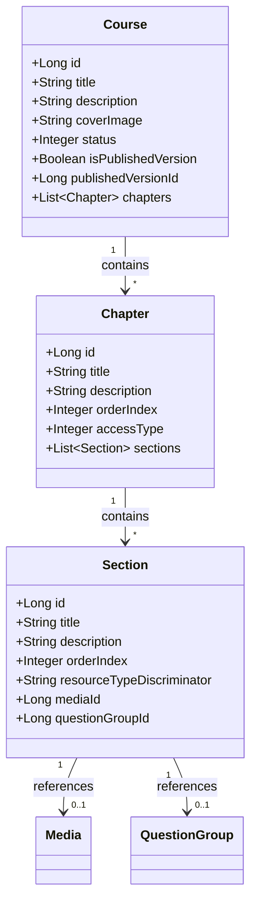
```mermaid
classDiagram
    Course "1" --> "*" Chapter : contains
    Chapter "1" --> "*" Section : contains
    Section "1" --> "0..1" Media : references
    Section "1" --> "0..1" QuestionGroup : references

    class Course {
        +Long id
        +String title
        +String description
        +String coverImage
        +Integer status
        +Boolean isPublishedVersion
        +Long publishedVersionId
        +List~Chapter~ chapters
    }

    class Chapter {
        +Long id
        +String title
        +String description
        +Integer orderIndex
        +Integer accessType
        +List~Section~ sections
    }

    class Section {
        +Long id
        +String title
        +String description
        +Integer orderIndex
        +String resourceTypeDiscriminator
        +Long mediaId
        +Long questionGroupId
    }
```

1. **课程(Course)**：
   - 最顶层的内容组织单元
   - 包含基本信息、封面、描述等
   - 关联多个章节

2. **章节(Chapter)**：
   - 课程的主要组成部分
   - 可设置为免费试看或付费内容
   - 包含多个小节

3. **小节(Section)**：
   - 最小的内容单元
   - 可关联不同类型的资源（视频、文档、测验等）
   - 通过`resourceTypeDiscriminator`字段区分资源类型

#### 课程版本管理

系统实现了一种特殊的课程版本管理机制，在同一张表中管理工作区版本和发布版本：

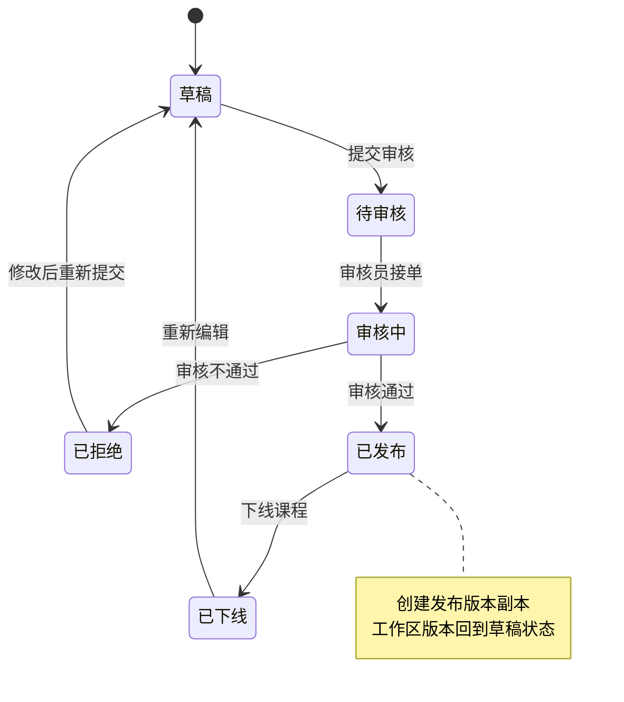
```mermaid
stateDiagram-v2
    [*] --> 草稿
    草稿 --> 待审核: 提交审核
    待审核 --> 审核中: 审核员接单
    审核中 --> 已拒绝: 审核不通过
    审核中 --> 已发布: 审核通过
    已拒绝 --> 草稿: 修改后重新提交
    已发布 --> 已下线: 下线课程
    已下线 --> 草稿: 重新编辑

    note right of 已发布
        创建发布版本副本
        工作区版本回到草稿状态
    end note
```

1. **版本类型**：
   - 草稿版本(DRAFT)：正在编辑的工作区版本
   - 审核版本(REVIEW)：提交审核的版本
   - 发布版本(PUBLISHED)：审核通过的正式版本

2. **版本关联**：
   - 工作区版本通过`publishedVersionId`字段关联到发布版本
   - 发布版本通过`isPublishedVersion=true`标识

3. **版本转换流程**：
   - 工作区版本提交审核后状态变为待审核
   - 审核通过后，系统创建工作区版本的深拷贝作为发布版本
   - 发布版本状态设为已发布，工作区版本回到草稿状态
   - 工作区版本可继续编辑，不影响已发布的内容

4. **深拷贝实现**：
   - 复制课程基本信息
   - 递归复制章节和小节结构
   - 资源引用（如媒体ID、题目组ID）只复制引用而不复制实体本身

#### 课程试看功能

系统支持课程试看功能，允许未购买的用户预览部分内容：

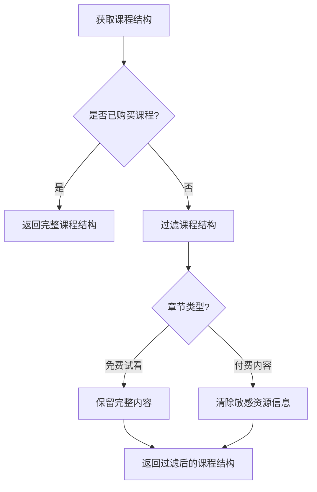
```mermaid
flowchart TD
    A[获取课程结构] --> B{是否已购买课程?}
    B -->|是| C[返回完整课程结构]
    B -->|否| D[过滤课程结构]
    D --> E{章节类型?}
    E -->|免费试看| F[保留完整内容]
    E -->|付费内容| G[清除敏感资源信息]
    F --> H[返回过滤后的课程结构]
    G --> H
```

1. **章节访问控制**：
   - 每个章节有`accessType`字段，标识是否为免费试看内容
   - 免费试看章节对所有用户可见
   - 付费章节只对已购买用户显示完整内容

2. **资源保护机制**：
   - 对于付费章节，系统会清除敏感资源信息（如媒体ID、题目组ID）
   - 前端无法获取到实际的资源链接，只能看到基本结构
   - 添加付费提示信息

3. **预览功能**：
   - 系统支持生成临时预览链接
   - 预览令牌存储在Redis中，有一定的过期时间
   - 适用于机构内部预览或分享给潜在学习者

### 媒体资源管理

媒体资源管理是系统的重要组成部分，支持各种类型媒体的上传、存储和访问控制。

#### 存储架构

系统采用MinIO作为对象存储服务，并结合S3 API实现高级功能：

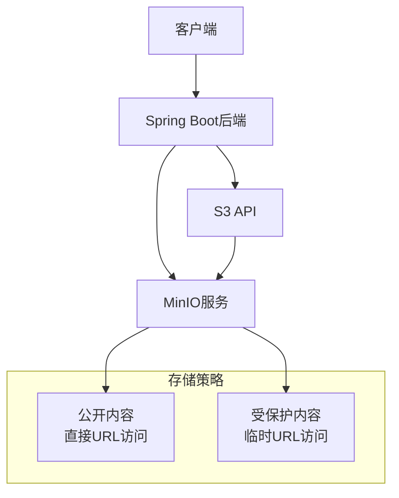
```mermaid
flowchart TD
    A[客户端] --> B[Spring Boot后端]
    B --> C[MinIO服务]
    B --> D[S3 API]
    D --> C

    subgraph 存储策略
    E[公开内容\n直接URL访问]
    F[受保护内容\n临时URL访问]
    end

    C --> E
    C --> F
```

1. **存储服务配置**：
   - 使用MinIO作为基础存储服务
   - 通过S3兼容API实现高级功能
   - 配置分离，便于管理

2. **存储策略**：
   - 公开内容（如头像、课程封面）：直接URL访问
   - 受保护内容（如课程视频）：临时URL访问

#### 分片上传实现

系统实现了基于S3 API的分片上传机制，适用于大文件上传：

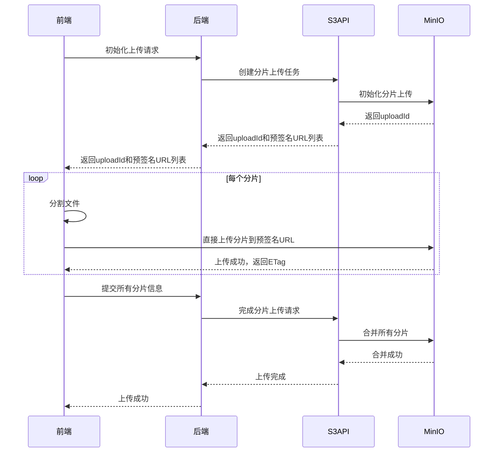
```mermaid
sequenceDiagram
    participant 前端
    participant 后端
    participant S3API
    participant MinIO

    前端->>后端: 初始化上传请求
    后端->>S3API: 创建分片上传任务
    S3API->>MinIO: 初始化分片上传
    MinIO-->>S3API: 返回uploadId
    S3API-->>后端: 返回uploadId和预签名URL列表
    后端-->>前端: 返回uploadId和预签名URL列表

    loop 每个分片
        前端->>前端: 分割文件
        前端->>MinIO: 直接上传分片到预签名URL
        MinIO-->>前端: 上传成功，返回ETag
    end

    前端->>后端: 提交所有分片信息
    后端->>S3API: 完成分片上传请求
    S3API->>MinIO: 合并所有分片
    MinIO-->>S3API: 合并成功
    S3API-->>后端: 上传完成
    后端-->>前端: 上传成功
```

1. **上传流程**：
   - 前端请求后端初始化上传
   - 后端创建Media记录并初始化S3分片上传
   - 返回uploadId和预签名URL列表
   - 前端将文件分割成多个块
   - 使用预签名URL直接上传分片到MinIO
   - 前端发送所有分片信息给后端
   - 后端调用S3 API合并分片
   - 更新Media记录状态为完成

2. **优势**：
   - 减轻应用服务器负担
   - 支持断点续传
   - 提高大文件上传的可靠性和效率

#### 访问控制机制

系统实现了基于临时URL的访问控制机制：

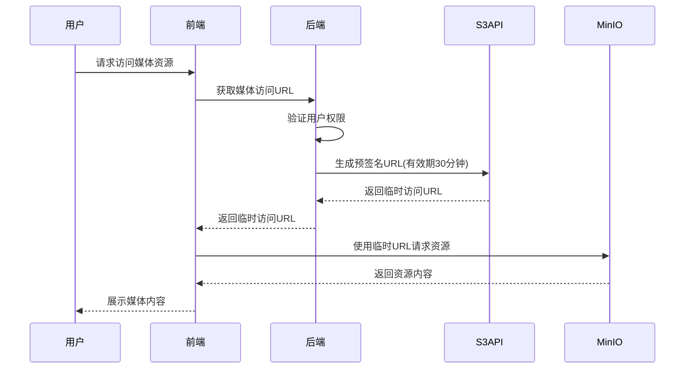
```mermaid
sequenceDiagram
    participant 用户
    participant 前端
    participant 后端
    participant S3API
    participant MinIO

    用户->>前端: 请求访问媒体资源
    前端->>后端: 获取媒体访问URL
    后端->>后端: 验证用户权限
    后端->>S3API: 生成预签名URL(有效期30分钟)
    S3API-->>后端: 返回临时访问URL
    后端-->>前端: 返回临时访问URL
    前端->>MinIO: 使用临时URL请求资源
    MinIO-->>前端: 返回资源内容
    前端-->>用户: 展示媒体内容
```

1. **公开资源**：
   - 头像、课程封面等公开资源直接通过URL访问
   - MinioService提供`getFileUrl`方法返回直接访问URL

2. **受保护资源**：
   - 课程视频等核心内容通过临时URL访问
   - 使用S3预签名URL技术，设置有效期
   - 前端需要先获取临时URL，再进行访问

3. **权限验证**：
   - 获取临时URL前进行权限验证
   - 验证用户是否有权访问该资源
   - 记录访问历史

### 学习记录与统计

学习记录与统计模块负责跟踪和分析用户的学习行为，为用户提供学习进度反馈，为机构提供数据分析支持。

#### 学习记录设计

系统采用多层次的学习记录设计，结合Redis缓存优化性能：

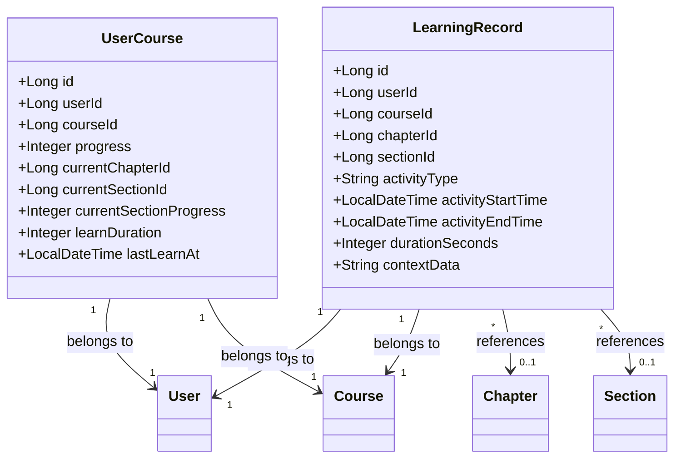
```mermaid
classDiagram
    LearningRecord "1" --> "1" User : belongs to
    LearningRecord "1" --> "1" Course : belongs to
    LearningRecord "*" --> "0..1" Chapter : references
    LearningRecord "*" --> "0..1" Section : references
    UserCourse "1" --> "1" User : belongs to
    UserCourse "1" --> "1" Course : belongs to

    class LearningRecord {
        +Long id
        +Long userId
        +Long courseId
        +Long chapterId
        +Long sectionId
        +String activityType
        +LocalDateTime activityStartTime
        +LocalDateTime activityEndTime
        +Integer durationSeconds
        +String contextData
    }

    class UserCourse {
        +Long id
        +Long userId
        +Long courseId
        +Integer progress
        +Long currentChapterId
        +Long currentSectionId
        +Integer currentSectionProgress
        +Integer learnDuration
        +LocalDateTime lastLearnAt
    }
```

1. **学习记录(LearningRecord)**：
   - 记录用户的具体学习活动
   - 包含活动类型、持续时间、开始/结束时间等详细信息
   - 每天每种活动类型一条记录

2. **用户课程关系(UserCourse)**：
   - 记录用户与课程的关联关系
   - 存储总体学习进度、当前学习位置、累计学习时长等
   - 用于快速查询用户的课程学习状态

#### 学习活动类型

系统定义了多种学习活动类型，以区分不同的学习行为：

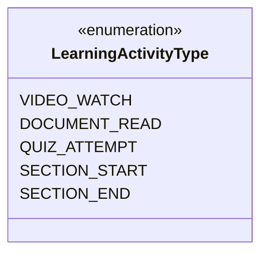
```mermaid
classDiagram
    class LearningActivityType {
        <<enumeration>>
        VIDEO_WATCH
        DOCUMENT_READ
        QUIZ_ATTEMPT
        SECTION_START
        SECTION_END
    }
```

前端根据资源类型自动选择相应的活动类型：
- 视频资源 -> VIDEO_WATCH
- 文档资源 -> DOCUMENT_READ
- 测验资源 -> QUIZ_ATTEMPT

#### Redis缓存优化

系统使用Redis作为中间缓存，减少对数据库的频繁写入：

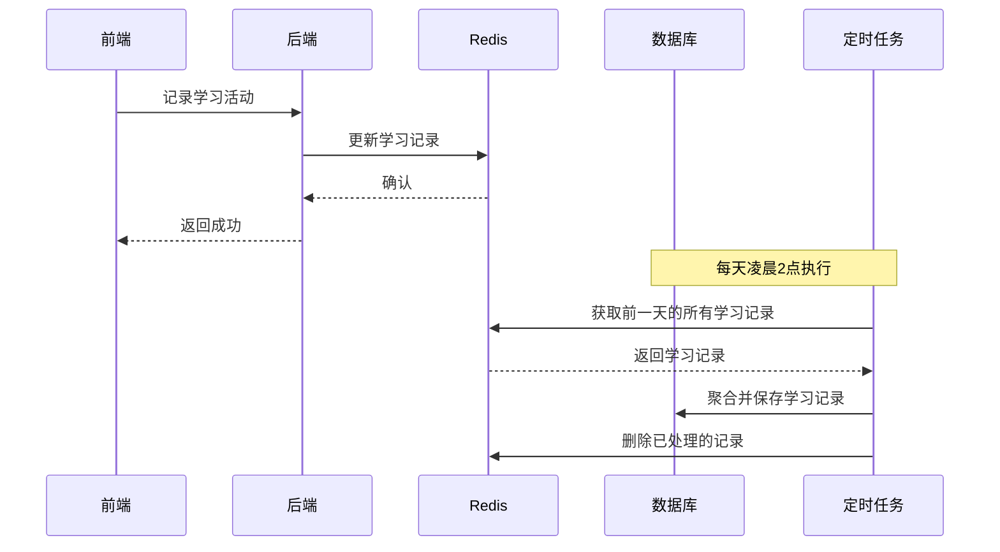
```mermaid
sequenceDiagram
    participant 前端
    participant 后端
    participant Redis
    participant 数据库
    participant 定时任务

    前端->>后端: 记录学习活动
    后端->>Redis: 更新学习记录
    Redis-->>后端: 确认
    后端-->>前端: 返回成功

    Note over 定时任务,数据库: 每天凌晨2点执行
    定时任务->>Redis: 获取前一天的所有学习记录
    Redis-->>定时任务: 返回学习记录
    定时任务->>数据库: 聚合并保存学习记录
    定时任务->>Redis: 删除已处理的记录
```

1. **Redis存储结构**：
   - 键格式：`learning:record:日期:用户ID:课程ID:活动类型`
   - 值类型：Hash结构，包含总时长、章节ID、小节ID等信息
   - 确保每天每个用户每个课程每种活动类型只有一条记录

2. **定时聚合任务**：
   - 每天凌晨2点执行
   - 获取前一天的所有学习记录
   - 聚合并保存到数据库
   - 删除Redis中的原始数据

3. **手动触发功能**：
   - 为了演示需要，系统提供了手动触发聚合的功能
   - 管理员可以通过API手动触发学习记录同步

#### 学习进度计算

系统实现了智能的学习进度计算逻辑：

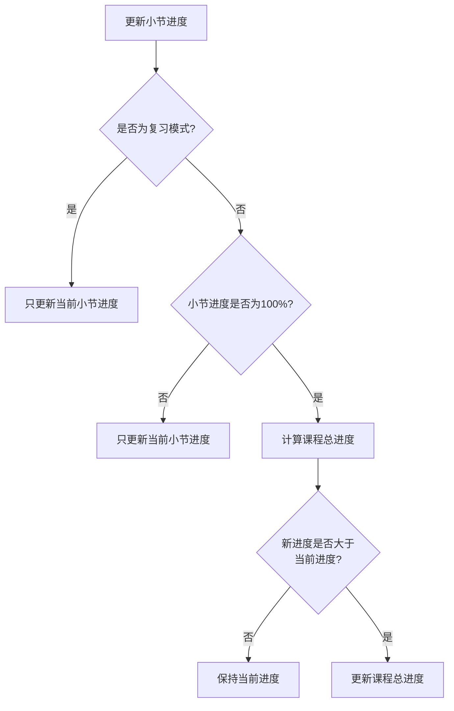
```mermaid
flowchart TD
    A[更新小节进度] --> B{是否为复习模式?}
    B -->|是| C[只更新当前小节进度]
    B -->|否| D{小节进度是否为100%?}
    D -->|否| E[只更新当前小节进度]
    D -->|是| F[计算课程总进度]
    F --> G{新进度是否大于\n当前进度?}
    G -->|否| H[保持当前进度]
    G -->|是| I[更新课程总进度]
```

1. **复习模式识别**：
   - 系统能够识别用户是否在复习之前学过的内容
   - 复习模式下不更新总体进度，避免进度倒退

2. **进度计算方法**：
   - 基于完成的小节数量计算总体进度
   - 只有当新进度大于当前进度时才更新
   - 确保进度只增不减

3. **进度保护机制**：
   - 小节进度必须达到100%才计入总体进度
   - 考虑章节预估时长，防止快速跳过内容刷进度

#### 学习统计分析

系统提供丰富的学习统计分析功能：

1. **热力图分析**：
   - 按星期几和小时统计学习时长
   - 直观展示用户学习时间分布

2. **活动类型分析**：
   - 统计不同活动类型的学习时长和次数
   - 分析用户学习偏好

3. **进度趋势分析**：
   - 跟踪用户学习进度的变化趋势
   - 预测完成课程的时间

4. **缓存优化**：
   - 统计数据使用Redis缓存
   - 设置合理的过期时间
   - 提供手动清除缓存的功能，便于演示

### 订单与支付系统

订单与支付系统负责处理课程购买、支付处理、订单管理等功能，是平台商业化运营的核心。

#### 订单状态流转

系统定义了完整的订单状态流转机制：

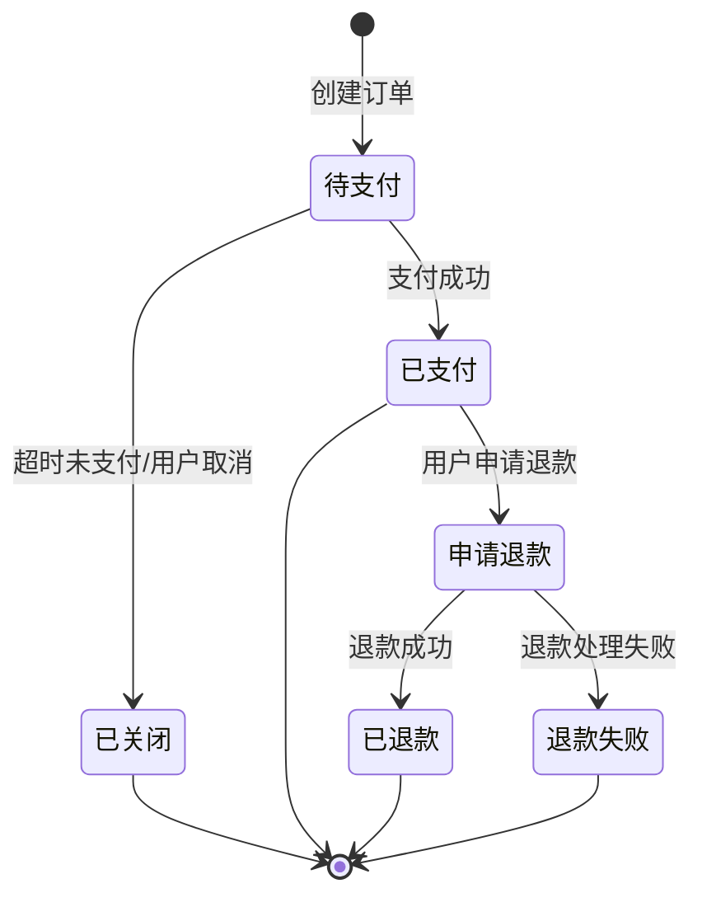
```mermaid
stateDiagram-v2
    [*] --> 待支付: 创建订单
    待支付 --> 已支付: 支付成功
    待支付 --> 已关闭: 超时未支付/用户取消
    已支付 --> 申请退款: 用户申请退款
    申请退款 --> 已退款: 退款成功
    申请退款 --> 退款失败: 退款处理失败
    已关闭 --> [*]
    已支付 --> [*]
    已退款 --> [*]
    退款失败 --> [*]
```

订单状态枚举：
- PENDING(0)：待支付
- PAID(1)：已支付
- CLOSED(2)：已关闭
- REFUNDING(3)：申请退款
- REFUNDED(4)：已退款
- REFUND_FAILED(5)：退款失败

#### 支付宝集成

系统集成了支付宝支付功能：

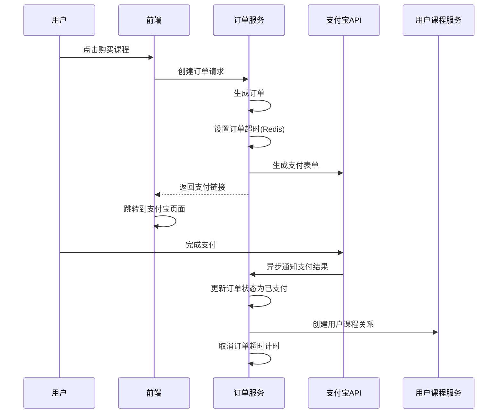
```mermaid
sequenceDiagram
    participant 用户
    participant 前端
    participant 订单服务
    participant 支付宝API
    participant 用户课程服务

    用户->>前端: 点击购买课程
    前端->>订单服务: 创建订单请求
    订单服务->>订单服务: 生成订单
    订单服务->>订单服务: 设置订单超时(Redis)
    订单服务->>支付宝API: 生成支付表单
    订单服务-->>前端: 返回支付链接
    前端->>前端: 跳转到支付宝页面
    用户->>支付宝API: 完成支付
    支付宝API->>订单服务: 异步通知支付结果
    订单服务->>订单服务: 更新订单状态为已支付
    订单服务->>用户课程服务: 创建用户课程关系
    订单服务->>订单服务: 取消订单超时计时
```

1. **支付流程**：
   - 用户创建订单
   - 系统生成支付宝支付表单
   - 用户在支付宝完成支付
   - 支付宝通过回调通知系统支付结果
   - 系统更新订单状态并创建用户课程关系

2. **安全验证**：
   - 验证支付宝回调签名
   - 比对订单金额和状态
   - 防止伪造支付通知

#### 订单超时处理

系统实现了两种机制来处理订单超时：

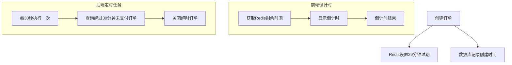
```mermaid
flowchart TD
    A[创建订单] --> B[Redis设置29分钟过期]
    A --> C[数据库记录创建时间]

    subgraph 前端倒计时
    D[获取Redis剩余时间]
    E[显示倒计时]
    F[倒计时结束]
    D --> E --> F
    end

    subgraph 后端定时任务
    G[每30秒执行一次]
    H[查询超过30分钟未支付订单]
    I[关闭超时订单]
    G --> H --> I
    end
```

1. **Redis倒计时**：
   - 创建订单时在Redis中设置29分钟的过期时间
   - 前端可以查询剩余支付时间并显示倒计时
   - 设计为29分钟，比定时任务的30分钟稍短

2. **定时任务检查**：
   - 每30秒运行一次定时任务
   - 检查数据库中超过30分钟未支付的订单
   - 将这些订单状态更新为已关闭

3. **双重保障**：
   - Redis提供实时的倒计时显示
   - 定时任务确保即使Redis出现问题，订单也能正确关闭
   - 两种机制互为补充，提高系统可靠性

#### 用户课程关系

订单支付成功后，系统会创建用户与课程的关联关系：

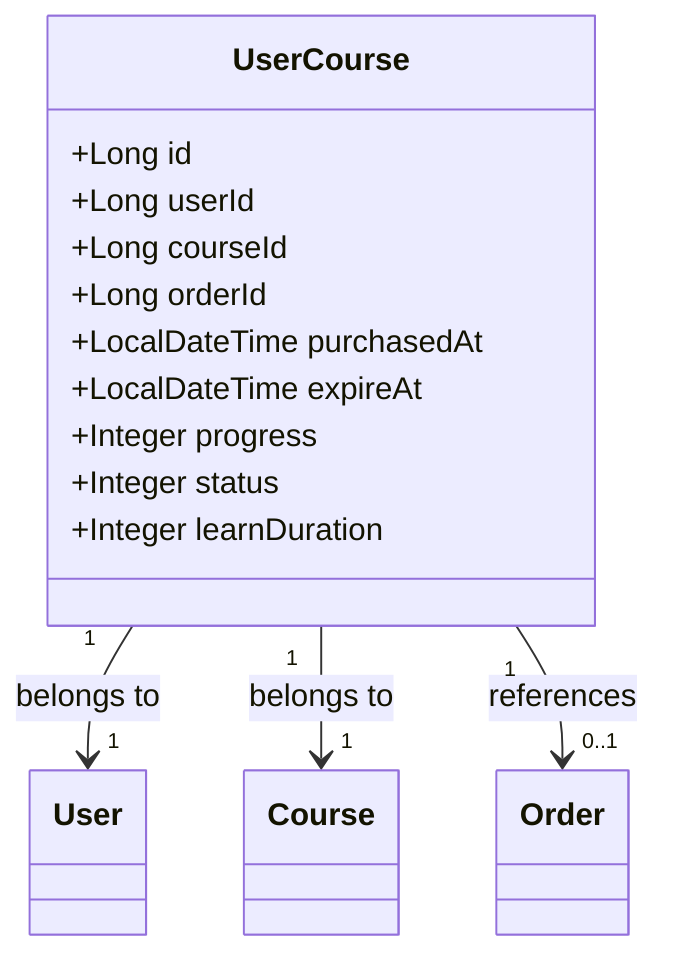
```mermaid
classDiagram
    UserCourse "1" --> "1" User : belongs to
    UserCourse "1" --> "1" Course : belongs to
    UserCourse "1" --> "0..1" Order : references

    class UserCourse {
        +Long id
        +Long userId
        +Long courseId
        +Long orderId
        +LocalDateTime purchasedAt
        +LocalDateTime expireAt
        +Integer progress
        +Integer status
        +Integer learnDuration
    }
```

用户课程状态：
- NORMAL(0)：正常学习
- EXPIRED(1)：已过期
- REFUNDED(2)：已退款

这种设计确保了用户购买课程后能够立即开始学习，同时也支持课程过期和退款等场景的处理。

### 题库与测验系统

题库与测验系统是平台的重要教学功能，支持多种题型、自动评分、成绩统计等功能。

#### 题目设计

系统采用异构设计支持多种题型：

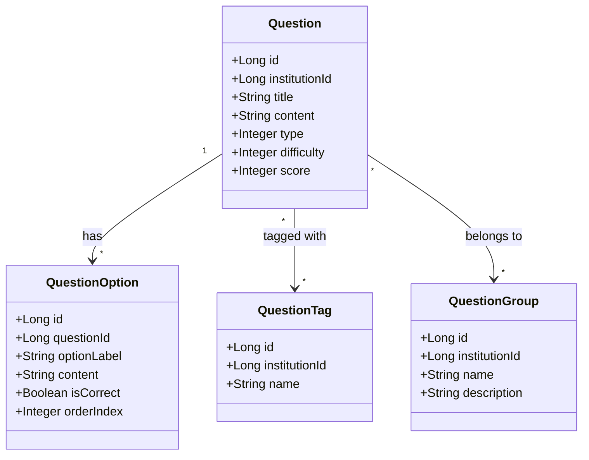
```mermaid
classDiagram
    Question "1" --> "*" QuestionOption : has
    Question "*" --> "*" QuestionTag : tagged with
    Question "*" --> "*" QuestionGroup : belongs to

    class Question {
        +Long id
        +Long institutionId
        +String title
        +String content
        +Integer type
        +Integer difficulty
        +Integer score
    }

    class QuestionOption {
        +Long id
        +Long questionId
        +String optionLabel
        +String content
        +Boolean isCorrect
        +Integer orderIndex
    }

    class QuestionTag {
        +Long id
        +Long institutionId
        +String name
    }

    class QuestionGroup {
        +Long id
        +Long institutionId
        +String name
        +String description
    }
```

1. **题目类型**：
   - 单选题(SINGLE_CHOICE)
   - 多选题(MULTIPLE_CHOICE)
   - 判断题(TRUE_FALSE)
   - 填空题(FILL_BLANK)
   - 简答题(SHORT_ANSWER)

2. **异构设计**：
   - 所有题型共享基础的`Question`表
   - 选择题（单选、多选）通过`QuestionOption`表存储选项
   - 简答题等不需要选项的题型只使用基础题目表

3. **题目组织**：
   - 通过`QuestionTag`实现题目的多维度分类
   - 通过`QuestionGroup`实现题目的集合管理
   - 题目组可以关联到课程小节，作为测验内容

#### 批量导入功能

系统支持通过Excel批量导入题目，并使用多线程优化性能：

```mermaid
sequenceDiagram
    participant 用户
    participant 前端
    participant 导入服务
    participant 线程池
    participant 数据库

    用户->>前端: 上传Excel文件
    前端->>导入服务: 提交导入请求
    导入服务->>导入服务: 读取Excel数据
    导入服务->>导入服务: 数据分批

    loop 每个批次
        导入服务->>线程池: 提交异步处理任务
        线程池->>线程池: 处理批次数据
        线程池->>数据库: 保存题目(事务)
    end

    导入服务->>导入服务: 合并处理结果
    导入服务-->>前端: 返回导入结果
```

1. **异步处理**：
   - 使用`@Async`注解和自定义线程池
   - 每个批次在独立线程中处理
   - 使用`CompletableFuture`管理异步任务

2. **事务管理**：
   - 使用`TransactionTemplate`进行事务控制
   - 每个题目在独立事务中处理
   - 一个题目的失败不影响其他题目

3. **错误处理**：
   - 详细记录每个失败项的信息
   - 提供完整的导入结果统计
   - 支持部分成功的情况

#### 测验功能

系统支持在线测验和自动评分：

```mermaid
sequenceDiagram
    participant 学习者
    participant 前端
    participant 测验服务
    participant 评分服务

    学习者->>前端: 开始测验
    前端->>测验服务: 获取题目组
    测验服务-->>前端: 返回题目列表
    学习者->>前端: 作答
    前端->>评分服务: 提交答案
    评分服务->>评分服务: 自动评分
    评分服务-->>前端: 返回评分结果
    前端->>前端: 显示正确答案和解析
```

1. **测验流程**：
   - 学习者进入测验页面
   - 系统加载题目组中的题目
   - 学习者作答并提交
   - 系统自动评分并显示结果

2. **评分规则**：
   - 客观题（单选、多选、判断）自动评分
   - 主观题（填空、简答）需要人工评分
   - 支持部分得分（如多选题部分正确）

3. **结果反馈**：
   - 显示正确答案和解析
   - 提供错题分析
   - 记录测验历史

#### 课程与测验集成

测验可以作为课程小节的学习内容：

```mermaid
flowchart TD
    A[课程] --> B[章节]
    B --> C[小节]
    C --> D{资源类型}
    D -->|视频| E[媒体播放器]
    D -->|文档| F[文档查看器]
    D -->|测验| G[题目组]
    G --> H[题目列表]
    H --> I[作答界面]
```

1. **资源类型识别**：
   - 小节通过`resourceTypeDiscriminator`字段标识资源类型
   - 当类型为测验时，加载关联的题目组

2. **学习记录**：
   - 记录测验的开始和完成时间
   - 统计测验的完成情况
   - 测验完成计入学习进度

3. **测验结果**：
   - 保存测验得分和答题记录
   - 支持重复测验，记录最高分
   - 提供测验历史查询

### 系统架构

#### 整体架构

系统采用前后端分离的微服务架构，各组件职责明确，松耦合高内聚：

```mermaid
flowchart TD
    A[用户] --> B[前端应用\nNext.js + React]
    B --> C[API网关]

    subgraph 后端服务
    C --> D[认证授权服务]
    C --> E[用户服务]
    C --> F[课程服务]
    C --> G[媒体服务]
    C --> H[订单支付服务]
    C --> I[学习记录服务]
    C --> J[统计分析服务]
    C --> K[机构管理服务]
    C --> L[题库测验服务]
    end

    subgraph 数据存储
    M[MySQL]
    N[Redis]
    O[MinIO]
    end

    D --> M
    D --> N
    E --> M
    F --> M
    G --> M
    G --> O
    H --> M
    H --> N
    I --> M
    I --> N
    J --> M
    J --> N
    K --> M
    L --> M
```

1. **前端层**：
   - 基于Next.js和React构建的单页应用
   - 响应式设计，支持多种设备
   - 组件化开发，提高代码复用

2. **API网关**：
   - 请求路由和负载均衡
   - 认证和授权
   - 请求限流和熔断

3. **后端服务**：
   - 按业务领域划分的微服务
   - 每个服务独立部署和扩展
   - 服务间通过REST API通信

4. **数据存储**：
   - MySQL：持久化存储结构化数据
   - Redis：缓存和临时数据存储
   - MinIO：对象存储，存储媒体文件

#### 技术架构

系统采用现代化的技术栈，确保性能、可靠性和可扩展性：

```mermaid
flowchart TD
    A[前端] --> B[后端] --> C[数据层]

    subgraph 前端技术栈
    D[Next.js 15.2.1]
    E[React 19]
    F[Axios]
    G[Recharts]
    end

    subgraph 后端技术栈
    H[Spring Boot 3.3.9]
    I[Spring Security]
    J[Spring Data JPA]
    K[Spring Cache]
    L[Spring Scheduled]
    M[Spring Mail]
    end

    subgraph 数据层技术
    N[MySQL 8.x]
    O[Redis]
    P[MinIO]
    end
```

1. **前端技术**：
   - Next.js：服务端渲染框架
   - React：用户界面库
   - Axios：HTTP客户端
   - Recharts：数据可视化

2. **后端技术**：
   - Spring Boot：应用框架
   - Spring Security：安全框架
   - Spring Data JPA：ORM框架
   - Spring Cache：缓存抽象
   - Spring Scheduled：定时任务

3. **数据存储技术**：
   - MySQL：关系型数据库
   - Redis：内存数据库
   - MinIO：对象存储服务

#### 部署架构

系统支持灵活的部署方式，从单机部署到云原生部署：

```mermaid
flowchart TD
    A[用户] --> B[负载均衡器]
    B --> C[前端服务器集群]
    C --> D[API网关集群]
    D --> E[后端服务集群]
    E --> F[数据库集群]
    E --> G[Redis集群]
    E --> H[MinIO集群]
```

1. **开发环境**：
   - 单机部署，便于开发和调试
   - 使用内嵌数据库和内存缓存

2. **测试环境**：
   - 模拟生产环境的简化版
   - 使用独立的数据库和缓存服务

3. **生产环境**：
   - 高可用集群部署
   - 多实例负载均衡
   - 数据库主从复制
   - Redis集群
   - MinIO分布式部署

#### 安全架构

系统实现了多层次的安全防护：

1. **认证与授权**：
   - JWT令牌认证
   - 基于角色的权限控制
   - 令牌黑名单机制

2. **数据安全**：
   - 敏感数据加密存储
   - HTTPS传输加密
   - 防SQL注入

3. **资源访问控制**：
   - 临时URL机制
   - 权限验证
   - 访问日志记录

4. **防攻击措施**：
   - 验证码防暴力破解
   - 请求限流
   - XSS和CSRF防护

## 数据模型

系统的核心数据模型设计清晰，关系合理，支持业务需求的同时保持了良好的扩展性。以下是主要实体及其关系：

### 用户与权限模型

```mermaid
classDiagram
    User "1" --> "*" Role : has
    Role "1" --> "*" Permission : has
    User "1" --> "0..1" Institution : belongs to

    class User {
        +Long id
        +String username
        +String password
        +String email
        +String phone
        +String avatar
        +Integer status
        +Long institutionId
    }

    class Role {
        +Long id
        +String name
        +String code
        +String description
    }

    class Permission {
        +Long id
        +String name
        +String code
        +String description
    }

    class Institution {
        +Long id
        +String name
        +String logo
        +String description
        +Integer status
        +String registerCode
        +String contactEmail
    }
```

### 课程与学习模型

```mermaid
classDiagram
    Course "1" --> "*" Chapter : contains
    Chapter "1" --> "*" Section : contains
    Course "*" --> "1" Category : belongs to
    Course "*" --> "*" Tag : has
    User "1" --> "*" UserCourse : has
    Course "1" --> "*" UserCourse : has
    User "1" --> "*" LearningRecord : has
    Course "1" --> "*" LearningRecord : has

    class Course {
        +Long id
        +String title
        +String description
        +String coverImage
        +Integer status
        +Boolean isPublishedVersion
        +Long publishedVersionId
        +Integer versionType
    }

    class UserCourse {
        +Long id
        +Long userId
        +Long courseId
        +Integer progress
        +Long currentChapterId
        +Long currentSectionId
        +Integer learnDuration
    }

    class LearningRecord {
        +Long id
        +Long userId
        +Long courseId
        +Long chapterId
        +Long sectionId
        +String activityType
        +Integer durationSeconds
    }
```

### 订单与支付模型

```mermaid
classDiagram
    Order "1" --> "1" User : belongs to
    Order "1" --> "1" Course : references
    Order "1" --> "0..1" UserCourse : creates

    class Order {
        +Long id
        +String orderNo
        +Long userId
        +Long courseId
        +BigDecimal amount
        +BigDecimal originalAmount
        +Integer status
        +String paymentMethod
        +String tradeNo
    }
```

### 媒体与资源模型

```mermaid
classDiagram
    Media "1" --> "1" Institution : belongs to
    Media "1" --> "1" User : uploaded by
    Section "1" --> "0..1" Media : references

    class Media {
        +Long id
        +Long institutionId
        +Long uploaderId
        +String title
        +String description
        +String type
        +Long size
        +String storagePath
        +Integer status
    }
```

### 题库与测验模型

```mermaid
classDiagram
    Question "1" --> "*" QuestionOption : has
    Question "*" --> "*" QuestionTag : tagged with
    QuestionGroup "1" --> "*" Question : contains
    Section "1" --> "0..1" QuestionGroup : references

    class Question {
        +Long id
        +Long institutionId
        +String title
        +String content
        +Integer type
        +Integer difficulty
        +Integer score
    }

    class QuestionGroup {
        +Long id
        +Long institutionId
        +String name
        +String description
    }
```

## 部署方案

系统支持多种部署方案，从开发环境到生产环境，可根据需求灵活配置：

### 开发环境

- **单机部署**：所有组件在一台机器上运行
- **内存数据库**：使用H2等内存数据库快速开发
- **本地存储**：使用本地文件系统代替MinIO

### 测试环境

- **简化集群**：关键组件部署多实例
- **独立数据库**：使用独立的MySQL实例
- **独立缓存**：使用独立的Redis实例
- **MinIO单节点**：使用单节点MinIO服务

### 生产环境

- **负载均衡**：使用Nginx或云服务提供商的负载均衡
- **多实例部署**：所有服务部署多个实例确保高可用
- **数据库集群**：MySQL主从复制或集群
- **Redis集群**：Redis哨兵模式或集群模式
- **MinIO分布式**：多节点MinIO集群
- **监控系统**：集成Prometheus和Grafana监控
- **日志系统**：集成ELK日志收集和分析
