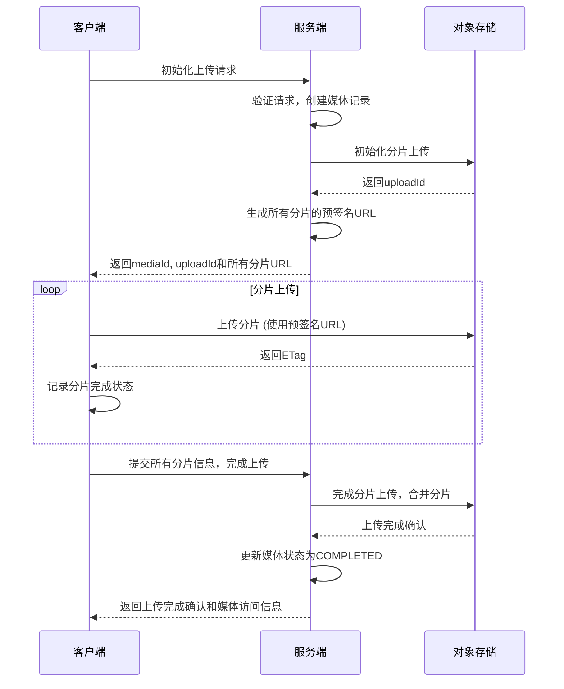

# 在线课程平台系统设计说明

## 认证与授权设计

### 邮箱验证
- 采用邮箱验证码方式确保邮箱真实性
- 验证码有效期：5分钟
- 存储方式：Redis（key前缀：email:verification:）
- 邮件模板：使用Thymeleaf模板引擎
- 验证流程：
  1. 用户获取图形验证码
  2. 验证图形验证码后发送邮箱验证码
  3. 注册时验证邮箱验证码
  4. 验证通过后完成注册

### 邮箱更新
- 采用专门的邮箱更新验证码确保邮箱真实性和操作安全性
- 验证码有效期：5分钟
- 存储方式：与注册验证码相同，使用Redis存储
- 专用邮件模板：email-update-code.html
- 更新流程：
  1. 用户获取图形验证码
  2. 验证图形验证码后发送邮箱更新验证码到新邮箱
  3. 用户提交更新请求，提供验证码和当前密码
  4. 系统验证密码和验证码，验证通过后更新邮箱

### JWT认证
- 采用无状态JWT认证方式
- 实现方式：短token + 刷新token模式
- 访问token有效期：1小时
- 刷新token有效期：7天
- 刷新机制：
  - 访问token过期后，使用刷新token获取新的访问token
  - 刷新token时只检查token是否在黑名单中
  - 令牌中仅包含用户角色信息，不包含详细权限
- token黑名单：使用Redis存储已注销但未过期的token
- 安全保障：
  - 验证刷新令牌的有效性和是否在黑名单中
  - 通过基于角色的权限控制确保API访问安全

### 角色权限设计（RBAC）
- **当前实现**：基于角色的访问控制
  - 使用`@PreAuthorize("hasRole('XXX')")`注解进行接口访问控制
  - 令牌中只存储角色信息，不包含详细权限
  - 简化的权限模型，基于固定的角色划分

- **未来计划**：
  - 完善为更细粒度的基于权限的访问控制
  - 实现动态权限分配和验证

系统定义了四种基本角色：

1. **普通用户（ROLE_USER）**
   - 默认角色，用户注册后即具有此角色
   - 权限：浏览课程、购买课程、学习课程、评价课程等

2. **管理员（ROLE_ADMIN）**
   - 系统管理员，具有最高权限
   - 权限：用户管理、角色管理、权限管理、系统配置等

3. **审核人员（ROLE_REVIEWER）**
   - 负责内容审核
   - 权限：审核课程内容、审核评论、内容管理等

4. **机构用户（ROLE_INSTITUTION）**
   - 课程提供机构账号
   - 特殊属性：机构ID（institutionId）
   - 权限：创建课程、管理课程、查看统计数据等

### 权限粒度控制
- 基于URL的权限控制
- 基于方法的权限控制（@PreAuthorize）
- 自定义权限评估器
- 接口权限文档化

## 缓存设计

### Redis缓存
- 用途：
  - 会话管理
  - 接口限流
  - 热点数据缓存
  - Token黑名单
  - 验证码存储
    - 图形验证码：5分钟过期
    - 邮箱验证码：5分钟过期
  
- 缓存策略：
  - 热门课程列表：60分钟
  - 用户信息：30分钟
  - 课程详情：60分钟
  - 分类数据：120分钟
  
- 缓存前缀设计：
  - 用户相关：`user:${userId}:*`
  - 课程相关：`course:${courseId}:*`
  - 令牌黑名单：`token:blacklist:*`
  - 图形验证码：`captcha:${key}`
  - 邮箱验证码：`email:verification:${email}`
  - 邮箱更新验证码：`email:update:code:${userId}:${newEmail}`

- 缓存更新策略：
  - 更新数据库同时更新缓存
  - 设置合理的过期时间
  - 对热点数据采用预热机制

## 数据库设计

### 用户权限相关表
- `users` - 用户基本信息
  - id：主键
  - username：用户名
  - password：密码（加密存储）
  - email：邮箱
  - phone：手机号
  - avatar：头像
  - nickname：昵称
  - status：状态（正常、禁用、锁定）
  - created_at：创建时间
  - updated_at：更新时间
  - last_login_at：最后登录时间
  - institution_id：机构ID（仅机构用户）

- `roles` - 角色信息
  - id：主键
  - name：角色名称
  - code：角色编码（ROLE_USER, ROLE_ADMIN等）
  - description：角色描述
  - created_at：创建时间
  - updated_at：更新时间

- `permissions` - 权限信息
  - id：主键
  - name：权限名称
  - code：权限编码
  - description：权限描述
  - url：资源路径
  - method：HTTP方法
  - created_at：创建时间
  - updated_at：更新时间

- `user_roles` - 用户角色关联
  - user_id：用户ID
  - role_id：角色ID
  - created_at：创建时间

- `role_permissions` - 角色权限关联
  - role_id：角色ID
  - permission_id：权限ID
  - created_at：创建时间

- `institutions` - 机构信息
  - id：主键
  - name：机构名称
  - logo：机构Logo
  - description：机构描述
  - status：状态（0-待审核，1-正常，2-禁用）
  - contact_person：联系人
  - contact_phone：联系电话
  - contact_email：联系邮箱
  - address：地址
  - register_code：注册码
  - created_at：创建时间
  - updated_at：更新时间

- `institution_applications` - 机构申请
  - id：主键
  - application_id：申请ID（业务编号）
  - name：机构名称
  - logo：机构Logo
  - description：机构描述
  - contact_person：联系人
  - contact_phone：联系电话
  - contact_email：联系邮箱
  - address：地址
  - status：状态（0-待审核，1-已通过，2-已拒绝）
  - review_comment：审核意见
  - reviewer_id：审核人ID
  - reviewed_at：审核时间
  - institution_id：关联的机构ID
  - created_at：创建时间
  - updated_at：更新时间

### 课程相关表
- `courses` - 课程基本信息
- `chapters` - 课程章节
- `lessons` - 课程小节
- `resources` - 课程资源（视频、文档等）
- `categories` - 课程分类
- `tags` - 课程标签
- `course_tags` - 课程与标签关联

### 用户学习相关表
- `enrollments` - 课程报名/购买记录
- `learning_progress` - 学习进度
- `user_notes` - 用户笔记
- `favorites` - 用户收藏

### 评价与互动相关表
- `comments` - 评论信息
- `replies` - 回复信息
- `ratings` - 评分信息

### 交易相关表
- `orders` - 订单信息
- `payments` - 支付记录
- `refunds` - 退款记录
- `coupons` - 优惠券

## 业务流程

### 注册登录流程
1. 用户注册：输入基本信息 → 验证邮箱/手机 → 创建账号 → 分配默认角色
2. 用户登录：验证身份 → 生成JWT令牌（访问+刷新）→ 返回给客户端
3. 令牌刷新：访问令牌过期 → 使用刷新令牌请求新令牌 → 验证刷新令牌有效性 → 生成新令牌

### 机构申请和注册流程

#### 1. 机构申请流程
1. **申请提交**
   - 填写机构基本信息（名称、Logo、描述等）
   - 填写联系信息（联系人、电话、邮箱）
   - 验证图形验证码
   - 提交申请，生成申请ID

2. **申请审核**
   - 审核员查看申请列表（支持分页和筛选）
   - 查看申请详情
   - 审核通过或拒绝（需要填写审核意见）
   - 发送审核结果通知邮件

3. **审核通过处理**
   - 创建机构记录
   - 生成唯一的机构注册码
   - 发送包含注册码的通知邮件

#### 2. 机构用户注册流程
1. **注册准备**
   - 获取机构注册码（从审核通过邮件中）
   - 获取图形验证码

2. **邮箱验证**
   - 输入邮箱地址
   - 验证图形验证码
   - 发送邮箱验证码
   - 验证邮箱验证码

3. **注册提交**
   - 填写用户信息（用户名、密码等）
   - 提供机构注册码
   - 提交注册信息
   - 系统验证注册码有效性
   - 创建用户账号并分配机构角色
   - 关联用户与机构

4. **注册完成**
   - 返回注册成功信息
   - 跳转到登录页面

### 用户自身管理流程

#### 个人信息管理
1. 获取个人信息：调用`/api/users/current`接口获取当前登录用户详细信息
2. 更新个人信息：调用`/api/users/current`接口更新昵称、手机号等信息

#### 密码修改
1. 输入旧密码和新密码
2. 系统验证旧密码正确性
3. 系统验证新旧密码不同
4. 更新密码并加密存储

#### 头像上传
1. 用户选择头像文件
2. 系统验证文件类型（只允许图片）和大小（最大2MB）
3. 上传到MinIO存储服务，生成唯一文件名
4. 生成访问URL并更新用户头像字段

#### 邮箱更新
1. 用户输入新邮箱
2. 系统向新邮箱发送验证码（使用专用邮件模板）
3. 用户提交验证码和当前密码
4. 系统验证密码和验证码
5. 更新用户邮箱

## 用户自身管理功能详细设计

### 功能概述
用户自身管理功能是指已登录用户对自己账号信息进行管理的功能集合，包括查看个人信息、修改个人资料、修改密码、上传头像和更新邮箱等。此功能模块的目标是提供用户对自身信息的完整管理能力，提升用户体验。

### API设计

#### 1. 获取当前用户信息

- **请求方法**: `GET`
- **接口路径**: `/api/users/current`
- **权限要求**: 已登录用户
- **实现逻辑**:
  1. 从安全上下文中获取当前用户ID
  2. 根据用户ID从数据库中查询用户信息
  3. 返回用户信息，包括基本信息和角色信息

#### 2. 更新个人资料

- **请求方法**: `PUT`
- **接口路径**: `/api/users/current`
- **权限要求**: 已登录用户
- **请求参数**: 用户可修改的信息字段（昵称、手机号等）
- **实现逻辑**:
  1. 从安全上下文中获取当前用户ID
  2. 验证请求参数（昵称长度、手机号格式等）
  3. 更新用户信息到数据库
  4. 返回更新后的用户信息

#### 3. 修改密码

- **请求方法**: `PUT`
- **接口路径**: `/api/users/current/password`
- **权限要求**: 已登录用户
- **请求参数**: 旧密码、新密码、确认密码
- **实现逻辑**:
  1. 从安全上下文中获取当前用户ID
  2. 验证旧密码是否正确
  3. 验证新密码与确认密码是否一致
  4. 验证新密码是否符合强度要求
  5. 加密新密码并更新到数据库
  6. 返回成功响应
- **安全考量**:
  - 验证旧密码以确保是用户本人操作
  - 新密码与确认密码必须一致
  - 新密码必须满足一定的强度要求
  - 新密码不能与旧密码相同

#### 4. 上传头像

- **请求方式**: `POST`
- **接口路径**: `/api/users/current/avatar`
- **权限要求**: 已登录用户
- **请求参数**: 头像图片文件（MultipartFile）
- **实现逻辑**:
  1. 从安全上下文中获取当前用户ID
  2. 验证上传的文件类型和大小
  3. 生成文件存储路径和文件名
  4. 上传文件到MinIO/S3服务
  5. 更新用户头像URL到数据库
  6. 返回头像URL
- **技术实现**:
  - 使用MinIO/S3服务作为文件存储基础设施
  - 采用统一的存储路径格式：`avatars/{userId}/{timestamp}_{filename}`
  - 对上传的图片进行压缩和格式转换，优化存储和加载性能
  - 设置文件大小限制（如最大2MB）和类型限制（仅允许jpg、png等图片格式）
  - 为每个用户创建唯一的存储路径，避免文件名冲突
  - 生成带有时间戳的文件名，防止缓存问题

#### 5. 更新邮箱

a. **获取邮箱更新验证码**
- **请求方法**: `POST`
- **接口路径**: `/api/users/current/email-code`
- **权限要求**: 已登录用户
- **请求参数**: 新邮箱地址
- **实现逻辑**:
  - 从安全上下文中获取当前用户ID
  - 验证新邮箱格式和唯一性
  - 生成6位数字验证码
  - 使用模板发送包含验证码的邮件到新邮箱
  - 将验证码存储到Redis中，设置过期时间
  - 返回发送成功响应

b. **更新邮箱**
- **请求方法**: `PUT`
- **接口路径**: `/api/users/current/email`
- **权限要求**: 已登录用户
- **请求参数**: 新邮箱地址、验证码
- **实现逻辑**:
  - 从安全上下文中获取当前用户ID
  - 从Redis中获取之前存储的验证码
  - 验证用户提交的验证码是否正确
  - 如果验证通过，更新用户邮箱到数据库
  - 删除Redis中的验证码记录
  - 返回更新成功响应

### 安全控制

- **接口权限控制**: 所有用户自身管理的接口都需要用户登录才能访问，不需要额外的角色权限
- **数据权限控制**: 用户只能查看和修改自己的信息，通过JWT令牌中的用户ID来限制数据访问范围
- **数据验证**:
  - 所有输入数据都进行验证，防止恶意数据
  - 邮箱唯一性验证
  - 密码强度检查（长度、复杂度）
  - 文件上传类型和大小限制

### 性能优化

- **头像处理**:
  - 对上传的头像进行压缩和裁剪，减小存储空间和传输大小
  - 使用MinIO/S3等对象存储服务，提高文件存取效率
  - 考虑使用CDN加速头像加载
- **并发控制**:
  - 对频繁操作（如发送验证码）设置请求频率限制
  - 使用乐观锁防止数据并发修改冲突

## 存储配额设计

### 存储配额实体设计
- **StorageQuota实体**
  - id：配额ID
  - type：配额类型（VIDEO/DOCUMENT/TOTAL）
  - totalQuota：总配额大小（字节）
  - usedQuota：已使用配额（字节）
  - institution：所属机构（多对一关联）
  - createdAt：创建时间
  - updatedAt：更新时间
  - expiresAt：过期时间（可选，支持临时扩容）

### 配额类型设计
```java
public enum QuotaType {
    VIDEO,      // 视频配额
    DOCUMENT,   // 文档配额
    TOTAL       // 总配额
}
```

### 配额服务设计
- **核心功能**：
  - 配额检查：检查机构是否有足够配额上传指定大小的文件
  - 配额更新：更新已使用的配额（支持增加和减少）
  - 配额查询：获取机构的配额使用情况
  - 配额设置：设置或调整机构的配额大小

- **业务规则**：
  - 更新特定类型配额时自动更新总配额
  - 配额不足时禁止上传
  - 支持配额过期时间设置
  - 配额过期后禁止上传新文件

- **默认配额设置**：
  - VIDEO：5GB
  - DOCUMENT：2GB
  - TOTAL：10GB

### 配额管理流程
1. **配额初始化**：
   - 机构创建时自动初始化默认配额
   - 支持管理员手动设置配额

2. **配额检查流程**：
   - 验证机构存在性
   - 检查配额是否过期
   - 计算剩余配额
   - 判断是否满足上传需求

3. **配额更新流程**：
   - 更新特定类型配额
   - 同步更新总配额
   - 记录更新时间
   - 触发配额超限告警（可选）

4. **配额展示**：
```java
public class StorageQuotaVO {
    private Long id;
    private String type;           // 配额类型
    private Long totalQuota;       // 总配额
    private Long usedQuota;        // 已用配额
    private Long availableQuota;   // 可用配额
    private double usagePercentage; // 使用百分比
    private LocalDateTime expiresAt; // 过期时间
    private Long institutionId;    // 机构ID
}
```

## 文件存储设计

本系统实现了双重文件存储方案，支持MinIO对象存储和AWS S3兼容API，为文件上传、头像存储等功能提供基础设施。

### MinIO存储
- **配置属性**：
  - endpoint：MinIO服务端点
  - accessKey：访问密钥
  - secretKey：访问密钥密文
  - bucketName：存储桶名称
  
- **功能实现**：
  - 文件上传：支持流式上传，自动设置内容类型
  - 文件删除：根据对象名删除文件
  - URL生成：获取文件访问URL
  - 文件列表：获取存储桶中所有文件
  - 自动创建存储桶：检查并创建存储桶
  
- **访问策略优化**：
  - 公开资源（如用户头像）使用永久URL，而非预签名URL
  - 为存储桶设置公共读取权限，确保公开资源可直接访问
  - 永久URL格式：`endpoint/bucketName/objectName`
  - 优势：减少数据库存储长度需求，提高访问稳定性，消除URL过期问题

- **资源清理机制**：
  - 头像更新时自动删除旧文件，避免存储空间浪费
  - 从URL中提取对象名，使用MinioService删除旧文件
  - 错误处理确保即使删除旧文件失败，用户头像更新操作仍能正常完成
  - 实现高效的存储资源管理，防止无用文件积累
  
- **应用场景**：
  - 用户头像存储
  - 课程资源文件存储
  - 临时文件存储

### AWS S3兼容API
- **配置属性**：
  - endpoint：S3服务端点
  - region：区域
  - accessKey：访问密钥
  - secretKey：访问密钥密文
  - bucketName：存储桶名称
  - pathStyleAccess：是否使用路径样式访问
  
- **功能实现**：
  - 对象操作：上传、下载、删除
  - 存储桶管理：创建、检查、列出
  - 预签名URL：生成带有时效性的访问URL
  
- **测试策略**：
  - 集成测试采用环境变量控制（MINIO_ENABLED, S3_ENABLED）
  - 在CI/CD环境中可按需启用

### 存储策略
- **存储路径设计**：
  - 用户头像：`avatars/{userId}/{filename}`
  - 课程资源：`courses/{courseId}/{resourceType}/{filename}`
  - 临时文件：`temp/{uuid}/{filename}`
  
- **文件命名规则**：
  - 使用UUID生成唯一文件名
  - 保留原始文件扩展名
  - 添加时间戳避免缓存问题
  
- **安全考量**：
  - 访问控制：非公开文件通过预签名URL访问
  - 文件验证：检查文件类型和大小
  - 过期策略：临时文件设置TTL自动清理

### 课程发布流程
1. 机构用户创建课程草稿
2. 上传课程内容和资料
3. 提交审核
4. 审核人员审核课程内容
5. 审核通过后发布课程
6. 课程上线

### 购买学习流程
1. 用户浏览课程
2. 下单购买（或免费报名）
3. 支付完成
4. 开始学习
5. 记录学习进度
6. 完成学习后评价

## 集成测试设计

### 权限管理集成测试

为了确保权限管理模块的正确性和稳定性，我们设计了专门的集成测试：

1. **测试环境与配置**
   - 使用H2内存数据库作为测试数据库
   - 使用`@SpringBootTest`加载完整应用上下文
   - 使用`@Import(TestSecurityConfig.class)`导入测试安全配置
   - 启用Bean覆盖：`spring.main.allow-bean-definition-overriding=true`
   - 使用`@ActiveProfiles("test")`激活测试环境配置

2. **测试用户详情服务**
   - 提供`TestUserDetailsService`专用于测试环境
   - 固定的测试用户和权限：
     - admin_test用户：具有ROLE_ADMIN角色和管理权限
     - user_test用户：具有ROLE_USER角色和普通用户权限
   - 通过`@WithUserDetails`注解与`userDetailsService` Bean整合

3. **测试场景**
   - 权限管理CRUD操作：创建、读取、更新、删除权限
   - 用户角色测试：验证不同角色用户的权限边界
   - 资源依赖关系：测试已被角色引用的权限删除限制

4. **测试数据准备**
   - 每个测试开始前创建测试权限和角色
   - 建立测试角色与权限的关联关系
   - 创建具有不同角色的测试用户

5. **测试优化**
   - 权限代码格式规范化：使用大写字母、数字和下划线格式（如`TEST_READ`）
   - 删除权限前先解除权限与角色的关联，确保测试资源可以正确清理
   - 验证正确的HTTP状态码（创建返回201，删除返回204）
   - 每个测试结束后清理所有测试数据，确保测试隔离性

6. **解决的关键问题**
   - 修复了Bean依赖注入问题
   - 优化了资源依赖清理逻辑
   - 统一了权限代码格式标准
   - 确保了测试环境与开发环境的隔离 

## 媒体管理模块

### 媒体上传流程

系统实现了基于分片上传的媒体文件处理流程，支持大文件的高效上传。


#### 关键流程

1. **初始化上传**
   - 前端将文件分割成固定大小的分片（默认10MB）
   - 调用服务端接口初始化上传
   - 服务端生成所有分片的预签名URL，并返回给前端

2. **分片上传**
   - 前端使用预签名URL直接上传分片到对象存储
   - 前端负责跟踪所有分片的上传状态和进度
   - 前端收集每个分片上传完成后返回的ETag

3. **完成上传**
   - 所有分片上传完成后，前端调用完成接口
   - 前端提供所有分片的信息（分片编号和ETag）
   - 后端调用对象存储API完成分片合并

4. **取消上传**
   - 用户可随时取消上传过程
   - 后端负责清理对象存储中的临时分片

### API设计

#### 媒体上传相关接口

| 接口                               | 方法   | 描述                     |
|----------------------------------|------|------------------------|
| /api/media/initiate-upload       | POST | 初始化上传，获取分片上传的预签名URL |
| /api/media/{mediaId}/complete    | POST | 完成上传，合并所有分片          |
| /api/media/{mediaId}/cancel      | DELETE | 取消上传，清理临时分片       |
| /api/media/{mediaId}             | DELETE | 删除媒体文件               |

#### 媒体查询接口

| 接口                              | 方法   | 描述           |
|---------------------------------|------|--------------|
| /api/media/list                 | GET  | 获取媒体文件列表    |
| /api/media/{mediaId}            | GET  | 获取媒体文件详细信息  |
| /api/media/usage                | GET  | 获取当前存储使用情况  |

### 前后端交互流程



### 数据结构设计

```java
// 媒体文件实体
public class Media {
    private Long id;              // 主键ID
    private String originalFilename; // 原始文件名
    private String uniqueKey;     // 唯一标识符
    private String title;         // 标题
    private String description;   // 描述
    private String contentType;   // 内容类型
    private Long fileSize;        // 文件大小(字节)
    private MediaStatus status;   // 媒体状态
    private String url;           // 访问URL
    private Long userId;          // 所属用户ID
    private LocalDateTime createdAt; // 创建时间
    private LocalDateTime updatedAt; // 更新时间
}

// 媒体状态枚举
public enum MediaStatus {
    UPLOADING,    // 上传中
    COMPLETED,    // 上传完成
    CANCELLED,    // 已取消
    ERROR         // 错误状态
}

// 初始化上传请求DTO
public class InitiateUploadDTO {
    private String filename;      // 文件名
    private String contentType;   // 内容类型
    private Long fileSize;        // 文件大小
    private String title;         // 标题
    private String description;   // 描述
    private Integer chunkSize;    // 分片大小(可选)
}

// 初始化上传响应DTO
public class InitiateUploadResponseDTO {
    private Long mediaId;           // 媒体ID
    private String uploadId;        // 上传ID
    private Integer totalParts;     // 总分片数
    private List<PresignedUrlDTO> presignedUrls; // 所有分片的预签名URL
}

// 完成上传请求DTO
public class CompleteUploadDTO {
    private String uploadId;         // 上传ID
    private List<PartInfo> completedParts; // 已完成分片信息
    
    // 分片信息
    public static class PartInfo {
        private Integer partNumber;  // 分片编号
        private String eTag;         // ETag
    }
}
```

## 安全框架设计

系统采用Spring Security作为安全框架，通过JWT令牌实现无状态认证。

### 安全配置设计

**核心组件**：`SecurityConfig`

**配置要点**：
1. **禁用CSRF**：由于使用JWT进行无状态认证，不需要CSRF保护
   ```java
   http.csrf(AbstractHttpConfigurer::disable)
   ```

2. **启用CORS**：支持跨域请求，配置允许的源、方法和头
   ```java
   http.cors(cors -> cors.configurationSource(corsConfigurationSource()))
   ```

3. **无状态会话管理**：不使用session，完全基于JWT令牌
   ```java
   http.sessionManagement(session -> 
       session.sessionCreationPolicy(SessionCreationPolicy.STATELESS))
   ```

4. **请求路径安全规则**：
   ```java
   http.authorizeHttpRequests(auth -> auth
       // 公开路径，无需认证
       .requestMatchers("/api/auth/**", "/api/public/**").permitAll()
       // Swagger文档相关路径
       .requestMatchers("/swagger-ui/**", "/v3/api-docs/**").permitAll()
       // 所有其他请求需要认证
       .anyRequest().authenticated()
   )
   ```

5. **JWT认证过滤器**：在用户名密码过滤器之前添加JWT认证过滤器
   ```java
   http.addFilterBefore(jwtAuthenticationFilter, 
       UsernamePasswordAuthenticationFilter.class)
   ```

6. **密码编码器**：使用BCrypt加密算法
   ```java
   @Bean
   public PasswordEncoder passwordEncoder() {
       return new BCryptPasswordEncoder();
   }
   ```

7. **认证管理器**：配置认证管理器Bean
   ```java
   @Bean
   public AuthenticationManager authenticationManager(
           AuthenticationConfiguration configuration) throws Exception {
       return configuration.getAuthenticationManager();
   }
   ```

8. **CORS配置**：详细配置跨域策略
   ```java
   @Bean
   public CorsConfigurationSource corsConfigurationSource() {
       CorsConfiguration configuration = new CorsConfiguration();
       configuration.setAllowedOrigins(Arrays.asList("*"));
       configuration.setAllowedMethods(Arrays.asList("GET", "POST", "PUT", "DELETE", "OPTIONS"));
       configuration.setAllowedHeaders(Arrays.asList("Authorization", "Cache-Control", "Content-Type"));
       configuration.setExposedHeaders(Arrays.asList("Authorization"));
       configuration.setMaxAge(3600L);
       
       UrlBasedCorsConfigurationSource source = new UrlBasedCorsConfigurationSource();
       source.registerCorsConfiguration("/**", configuration);
       return source;
   }
   ```

### 认证与权限实现

1. **JWT认证过滤器**：`JwtAuthenticationFilter`
   - 提取请求中的JWT令牌
   - 验证令牌有效性和过期状态
   - 从令牌中获取用户身份信息
   - 构建认证对象并设置到安全上下文
   - 处理无效令牌和授权异常

2. **用户详情服务**：`UserDetailsServiceImpl`
   - 根据用户名加载用户详情
   - 加载用户的角色和权限
   - 创建UserDetails对象返回给Spring Security
   - 支持动态权限检查

3. **权限控制注解**：`@PreAuthorize`
   - 控制器方法使用`@PreAuthorize("hasRole('XXX')")`控制访问
   - 服务方法使用`@PreAuthorize("hasPermission(#id, 'ENTITY_TYPE', 'ACTION')")`控制访问
   - 支持基于角色和权限的复合表达式

4. **安全工具类**：`SecurityUtil`
   - 获取当前认证信息
   - 获取当前用户ID
   - 获取当前用户名
   - 获取当前机构ID
   - 获取当前用户权限集合
   - 判断用户是否具有特定角色或权限
   - 判断是否是管理员、机构管理员等

### 安全考量和最佳实践

1. **令牌安全**：
   - 令牌签名使用强密钥
   - 令牌有较短的有效期（1小时）
   - 支持令牌刷新机制
   - 注销时将令牌加入黑名单

2. **密码安全**：
   - 使用BCrypt加密存储密码
   - 设置密码强度要求
   - 支持密码过期和强制修改

3. **API安全**：
   - 敏感接口添加额外验证（如删除操作需要验证密码）
   - 支持操作审计追踪
   - 限制API请求频率防止滥用

4. **数据隔离**：
   - 基于机构ID的数据过滤
   - 确保用户只能访问自己有权限的资源
   - 服务层进行权限验证

5. **异常处理**：
   - 统一的安全异常处理
   - 不泄露敏感错误信息
   - 记录安全相关日志 

## 题目管理系统设计

### 整体架构

题目管理系统是在线课程平台的核心组件之一，负责管理各类题目、题目分组和标签。采用分层设计，包括实体层、数据访问层、服务层和控制层，各层职责明确。

**系统分层设计**：
- **实体层**：定义题目、题目组、题目标签等核心数据结构
- **数据访问层**：提供对实体对象的CRUD操作接口
- **服务层**：实现业务逻辑，处理实体之间的关系
- **控制层**：提供RESTful API，处理请求和响应

### 核心实体设计

1. **Question（题目）**
   - 基本属性：标题、内容、类型、难度、分值等
   - 关联关系：与选项一对多关系，与标签多对多关系
   - 资源隔离：每个题目关联到特定机构
   - 状态管理：支持草稿、发布等状态

2. **QuestionOption（题目选项）**
   - 基本属性：内容、是否正确答案、排序等
   - 关联关系：与题目多对一关系
   - 业务规则：单选题只能有一个正确选项

3. **QuestionGroup（题目组）**
   - 基本属性：名称、描述、创建时间等
   - 关联关系：通过QuestionGroupItem与题目建立多对多关系
   - 资源隔离：每个题目组关联到特定机构
   - 业务功能：支持题目分组管理，与章节关联

4. **QuestionGroupItem（题目组项）**
   - 基本属性：题目ID、题目组ID、排序索引等
   - 扩展属性：可覆盖题目原始难度和分值
   - 业务功能：支持题目在组内排序

5. **QuestionTag（题目标签）**
   - 基本属性：名称、描述、创建时间等
   - 关联关系：通过QuestionTagMapping与题目建立多对多关系
   - 资源隔离：每个标签关联到特定机构
   - 业务功能：支持题目分类和检索

6. **QuestionTagMapping（题目标签映射）**
   - 基本属性：题目ID、标签ID
   - 业务功能：维护题目与标签的多对多关系

### 服务层设计

1. **QuestionService（题目服务）**
   - 题目基本管理：创建、更新、删除、查询题目
   - 题目选项管理：创建、更新选项
   - 题目查询功能：分页查询、基于条件筛选、随机获取
   - 权限验证：确保机构用户只能访问自己的题目

2. **QuestionGroupService（题目组服务）**
   - 题目组管理：创建、更新、删除、查询题目组
   - 题目组项管理：添加题目、移除题目、更新题目顺序
   - 章节关联管理：关联/解除题目组与章节的关联
   - 权限验证：确保机构用户只能访问自己的题目组

3. **QuestionTagService（题目标签服务）**
   - 标签管理：创建、更新、删除、查询标签
   - 标签关联管理：关联/解除题目与标签的关联
   - 标签查询功能：获取机构所有标签、分页查询
   - 权限验证：确保机构用户只能访问自己的标签

### 业务规则

1. **题目类型规则**
   - 单选题：必须且只能有一个正确选项
   - 多选题：可以有多个正确选项
   - 题目类型一旦创建不可更改（避免选项规则冲突）

2. **资源隔离规则**
   - 每个题目、题目组和标签都关联到特定机构
   - 用户只能访问自己机构的资源
   - 跨机构资源共享需要单独的权限管理

3. **题目组项规则**
   - 同一题目可以添加到多个题目组
   - 题目组内题目顺序可自定义
   - 可以在题目组中覆盖题目原始难度和分值

4. **标签关联规则**
   - 同一题目可以关联多个标签
   - 标签可以用于题目筛选和分类
   - 标签关联计数用于统计和权重计算

### 数据访问层设计

1. **QuestionRepository**
   - 基本CRUD操作
   - 根据条件查询题目（类型、难度、关键词等）
   - 随机获取指定数量题目
   - 获取机构所有题目

2. **QuestionOptionRepository**
   - 基本CRUD操作
   - 根据题目ID获取所有选项
   - 批量保存/更新选项

3. **QuestionGroupRepository**
   - 基本CRUD操作
   - 获取机构所有题目组
   - 根据章节ID获取关联题目组

4. **QuestionGroupItemRepository**
   - 基本CRUD操作
   - 根据题目组ID获取所有题目（排序）
   - 批量更新题目顺序

5. **QuestionTagRepository**
   - 基本CRUD操作
   - 获取机构所有标签
   - 根据名称查询标签

6. **QuestionTagMappingRepository**
   - 基本CRUD操作
   - 根据题目ID获取所有标签
   - 根据标签ID获取所有题目

### 性能优化设计

1. **缓存策略**
   - 热门题目和题目组缓存
   - 标签列表缓存
   - 使用Redis进行缓存管理

2. **分页查询优化**
   - 所有列表查询均支持分页
   - 避免大量数据一次性加载
   - 支持动态排序和筛选

3. **批量操作支持**
   - 批量创建/更新题目
   - 批量处理题目与标签关系
   - 减少数据库交互次数

### 接口设计

题目管理系统提供RESTful API，支持各类题目管理操作：

1. **题目管理API**
   - `POST /api/questions` - 创建题目
   - `PUT /api/questions/{id}` - 更新题目
   - `GET /api/questions/{id}` - 获取题目详情
   - `DELETE /api/questions/{id}` - 删除题目
   - `GET /api/questions` - 分页查询题目
   - `GET /api/questions/random` - 随机获取题目

2. **题目组管理API**
   - `POST /api/question-groups` - 创建题目组
   - `PUT /api/question-groups/{id}` - 更新题目组
   - `GET /api/question-groups/{id}` - 获取题目组详情
   - `DELETE /api/question-groups/{id}` - 删除题目组
   - `GET /api/question-groups` - 获取所有题目组
   - `POST /api/question-groups/{id}/items` - 添加题目到题目组
   - `PUT /api/question-groups/{id}/items/{itemId}` - 更新题目组项
   - `DELETE /api/question-groups/{id}/items/{itemId}` - 从题目组移除题目
   - `PUT /api/question-groups/{id}/items/order` - 更新题目顺序
   - `GET /api/question-groups/{id}/items` - 获取题目组中的所有题目

3. **标签管理API**
   - `POST /api/question-tags` - 创建标签
   - `PUT /api/question-tags/{id}` - 更新标签
   - `GET /api/question-tags/{id}` - 获取标签详情
   - `DELETE /api/question-tags/{id}` - 删除标签
   - `GET /api/question-tags` - 获取所有标签
   - `POST /api/questions/{id}/tags/{tagId}` - 关联标签到题目
   - `DELETE /api/questions/{id}/tags/{tagId}` - 从题目移除标签

### 测试策略

题目管理系统的测试采用多层次策略，确保系统功能的正确性和稳定性：

1. **单元测试**
   - 服务层测试：验证业务逻辑正确性
   - 数据访问层测试：验证数据操作正确性
   - 异常处理测试：验证系统在异常情况下的行为

2. **集成测试**
   - API接口测试：验证控制器层功能
   - 服务间交互测试：验证不同服务之间的协作

3. **端到端测试**
   - 业务流程测试：验证完整业务流程
   - 权限控制测试：验证资源隔离和权限管理

### 未来扩展

题目管理系统设计考虑了未来的扩展需求：

1. **题目类型扩展**
   - 支持更多题目类型（如填空题、判断题等）
   - 每种类型可定义特定的选项规则和评分规则

2. **智能题目推荐**
   - 基于用户历史数据推荐合适难度的题目
   - 学习路径优化和知识点覆盖分析

3. **题库共享机制**
   - 跨机构题库共享
   - 题目评价和质量控制机制

4. **题目难度自动分析**
   - 基于用户作答数据动态调整题目难度
   - 题目区分度和有效性分析 