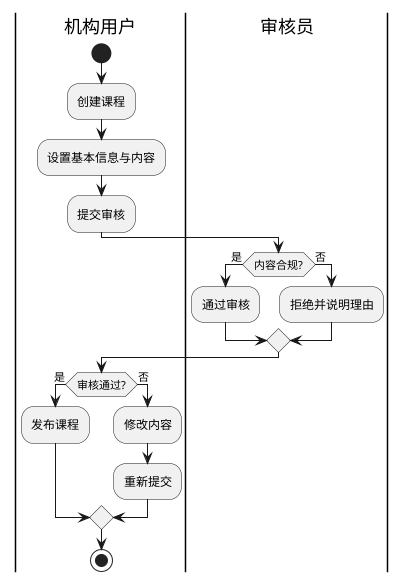
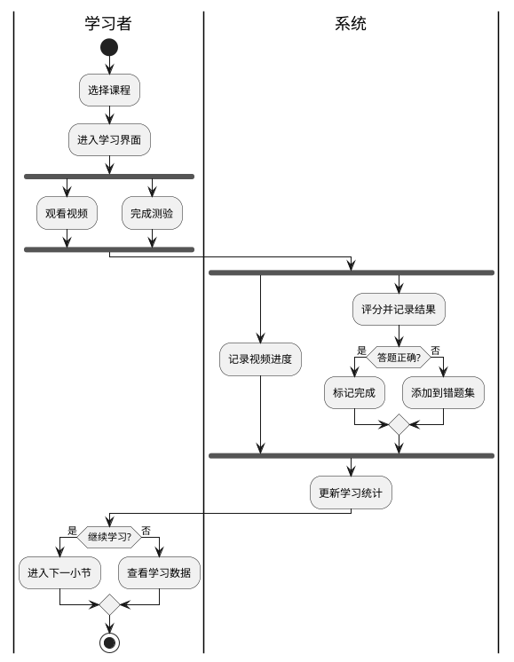
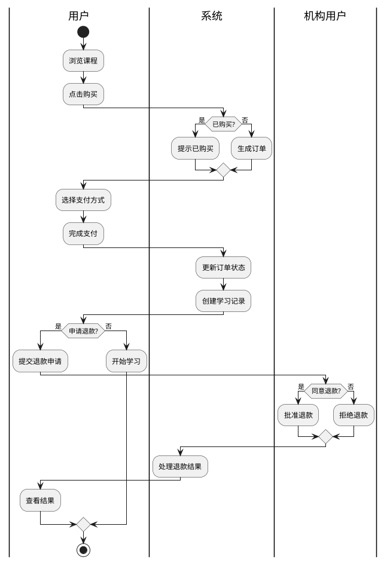
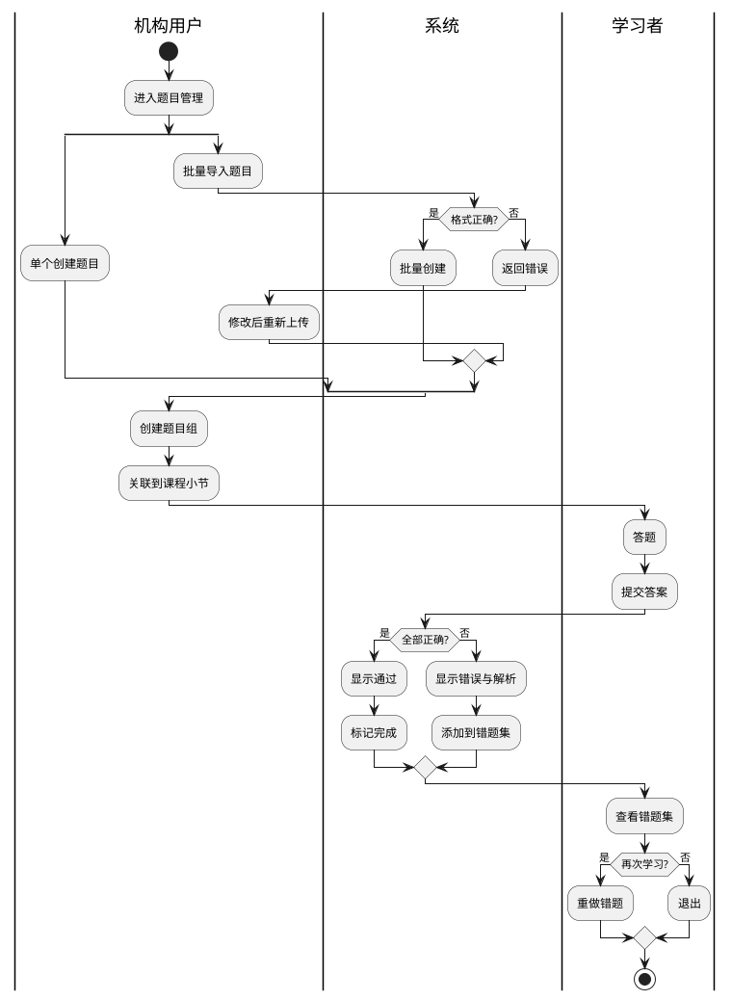
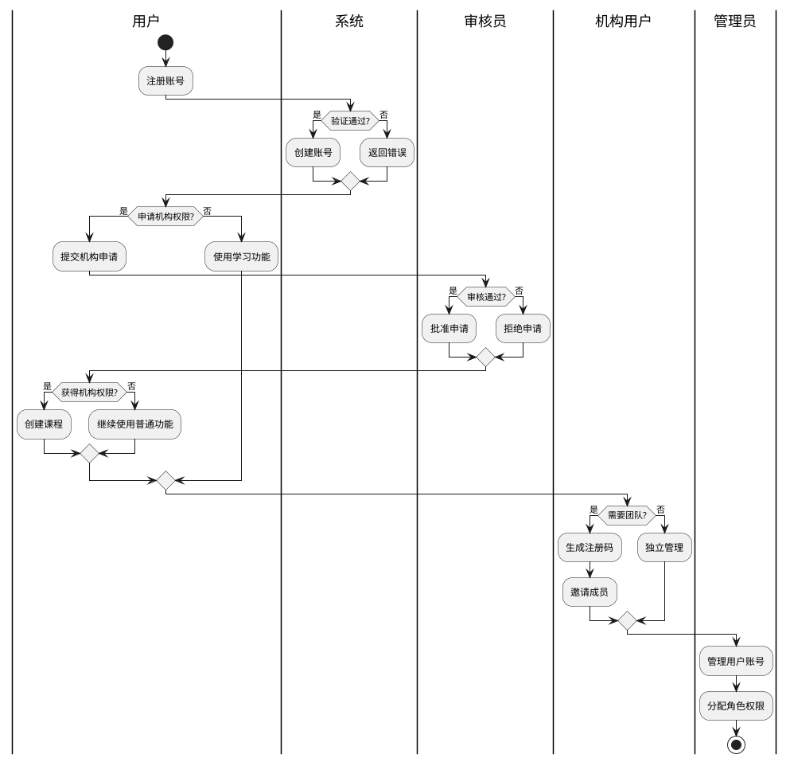
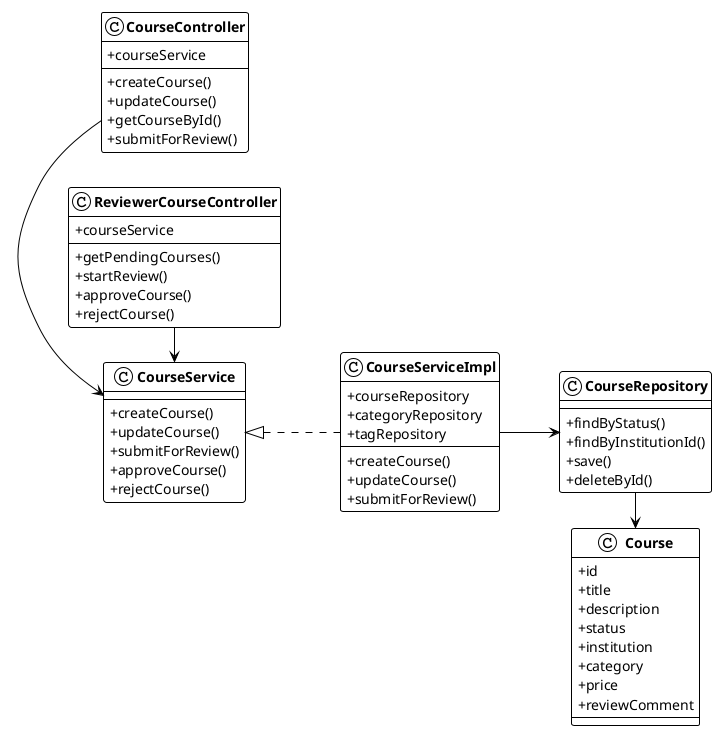
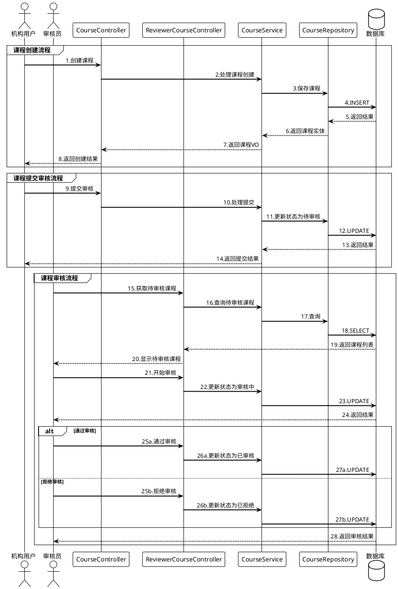

2.3 课程浏览与学习模块
课程浏览与学习模块是学生获取知识的核心路径。学生可在课程搜索页面浏览已发布课程，该页面提供多种筛选条件，包括分类、标签、难度级别和价格区间等。系统支持按评分、最新和最热门排序，课程卡片展示标题、封面图、简介、评分和价格信息。点击课程卡片后进入详情页，该页面分为概述、课程大纲和评价三部分。概述部分展示课程介绍和讲师信息；大纲部分列出章节和小节，并标记免费试学内容；评价部分显示学生评分和评论。已登录学生可收藏感兴趣的课程，也可发表评价和评分。对于已购买课程，系统显示"继续学习"按钮和学习进度，方便快速返回学习位置。
学习界面采用分栏设计，左侧为章节导航栏，通过图标和进度指示标记各小节状态；右侧为内容区域，根据小节类型展示学习内容。视频类小节提供完整播放器，支持播放/暂停、音量调节、倍速播放和全屏等功能。系统自动记录学习进度，确保下次登录时从上次位置继续学习。测验类小节展示题目列表，学生回答后才能完成该小节。系统记录错误答题，并自动添加到错题本中供复习。
学习中心还提供学习统计功能，记录学习时长、进度变化和测验成绩，生成学习报告。当完成所有小节后，系统会弹出完成提示并颁发数字证书，鼓励持续学习。系统根据学习记录在首页推荐相关课程，提高学习体验。未登录用户在尝试收藏或购买课程时会收到登录提示，确保完成身份验证后才能进行操作。

2.4 个人中心与订单管理模块
个人中心与订单管理模块整合了学生的个人信息、学习数据和交易管理功能。主页展示学习概览，包括累计学习时长、完成课程数量和收藏课程数量等统计数据。在"个人资料"选项卡，学生可更新基本信息，包括头像、昵称、手机号和邮箱等。修改邮箱时需通过验证码验证，确保账号安全。"修改密码"功能要求输入原密码和两次新密码，系统实时验证密码强度。

"我的订单"列出所有购买记录，学生可查看详情，对未支付订单进行支付或取消，也可对已完成订单申请退款或开具电子发票。退款申请需填写退款原因，系统自动记录申请时间并更新订单状态为"退款中"，等待机构审批。"我的收藏"展示所有收藏课程，支持按时间排序和快速取消收藏操作。"学习统计"通过图表展示学习趋势，包括每日学习时长和课程完成情况。"错题本"集中展示测验中答错的题目，可按课程分类查看，并标记已理解的题目。

模块还整合了支付功能，支持支付宝在线支付。支付过程中显示订单倒计时，超时自动取消。支付成功后立即授予课程访问权限，系统自动生成学习记录，用户可无缝切换至学习界面。

2.5 课程管理模块
课程管理模块专为机构用户设计，是内容创建和管理的核心。首页以表格形式展示机构创建的所有课程，按状态（草稿、审核中、已发布、已下架）分类，支持状态筛选和标题搜索。创建课程流程分三步：首先填写基本信息，包括名称、封面、分类、难度、简介和价格等；然后进入结构编辑页面，添加章节和小节，设置标题、排序和访问权限；最后添加学习资源，系统支持视频和测验两种类型。视频上传支持分片和断点续传，测验题目可直接创建或从题库导入。

在选择课程分类和标签时，机构用户只能从系统预设的选项中进行选择，无法自行创建。这些分类和标签由平台管理员或审核员统一管理，确保分类体系的一致性和专业性。管理员可通过分类管理界面创建多级分类结构，设置分类的启用状态和显示顺序；通过标签管理界面创建、编辑和删除标签，并可查看各标签的使用频率。这种中心化的分类和标签管理机制有效避免了冗余和混乱，同时便于平台进行内容整合和推荐。

课程编辑完成后，点击"提交审核"按钮，系统自动检查完整性并提交审核。提交后系统显示审核状态和反馈意见。被拒绝的课程可根据反馈修改后重新提交，通过审核的课程可选择立即或定时发布。课程发布后，机构用户可在"数据分析"页面查看销售和学习数据，为内容优化提供依据。

2.6 资源与题库管理模块
资源与题库管理模块为机构用户提供完整的媒体资源和测试题管理功能。媒体资源管理部分以分页列表展示机构上传的所有媒体文件，包括标题、类型、大小和上传时间等信息。支持按名称搜索和按类型筛选，便于快速定位资源。媒体上传采用分片上传技术，确保大文件传输的可靠性和续传能力。上传界面显示实时进度条、剩余时间和传输速度，增强用户体验。

系统为每个机构设置存储配额，配额信息在界面上展示为进度条和详细数据。媒体文件支持预览功能，视频类型资源可在线播放，文档类型可在线查看，实现"所见即所得"的编辑体验。媒体详情页提供文件下载、生成临时访问链接和删除操作，删除前会检查资源引用情况并提供警告。

题库管理部分支持单选题、多选题、判断题和简答题四种基本题型。创建题目时提供结构化表单，包括题干、选项、答案和解析等字段，支持富文本编辑和媒体资源引用。题目可关联标签进行分类，系统提供按类型、难度和标签的多维度筛选和全文搜索功能。

模块还支持批量导入功能，机构用户可通过Excel模板批量创建题目，提高工作效率。系统提供模板下载，并在导入过程中进行数据验证，确保格式正确。为方便组织和复用，系统支持创建题组，将多个相关题目组合在一起用于测验或考试。题组编辑界面支持拖拽排序和随机抽题功能，可设置每道题的分值。

2.7 交易与财务管理模块
交易与财务管理模块为机构用户提供订单处理和财务分析工具。系统提供订单查询和统计功能，机构用户可通过高级搜索按课程名称、用户信息、订单状态和时间范围等条件筛选订单。订单详情页展示完整交易信息，包括用户资料、课程信息、支付状态和金额等。

退款处理是交易管理的重要环节。机构接收到退款申请后，在"待处理退款"页面查看所有申请，包括订单信息、退款原因和申请时间。机构管理员可选择批准或拒绝退款，批准后系统自动调用支付宝接口执行退款操作，更新订单状态为"已退款"；拒绝则更新状态为"退款失败"并通知学生。退款成功后，系统自动调整机构收入统计数据，确保财务数据准确性。

模块提供多维度的财务统计分析，支持日收入、周收入、月收入和自定义时间段收入统计，通过图表直观展示销售趋势和退款情况。系统计算关键指标包括总收入、退款金额、净收入、退款率和客单价等，帮助机构全面了解经营状况。课程销售排行榜展示热门课程，结合退款分析工具，帮助机构识别退款高发课程，优化产品质量和定价策略。机构可导出财务报表为Excel或PDF格式，便于存档和进一步分析。

2.8 审核与质量控制模块
审核与质量控制模块面向审核员用户，确保平台内容质量。导航栏显示"待审核"提醒，指示待处理任务数量。进入页面后默认显示待审核课程列表，支持关键词搜索和状态筛选。点击"开始审核"按钮进入详细审核界面，该界面分为三部分：课程信息、课程结构和内容预览。课程信息部分展示基本资料；课程结构以树形展示章节组织；内容预览允许体验学习流程，播放视频和回答测验，全面评估课程质量。
审核操作提供"通过"和"拒绝"选项。选择"通过"时课程状态变为"已审核"；选择"拒绝"时需填写原因，帮助机构有针对性修改。审核完成后系统自动更新状态并通知机构用户。
模块还负责机构入驻申请审核，审核员可查看申请机构资料和证明材料。审核通过后系统生成机构注册码。"审核历史"页面记录所有已处理任务，支持按时间和结果筛选。系统提供审核效率分析，包括平均审核时长和通过率等指标，帮助优化审核流程。
为确保平台内容质量，审核员还可对已发布课程进行抽查，发现问题可发送整改通知或在严重违规情况下直接下架课程。系统保存所有审核记录和沟通历史，便于回溯和仲裁。

2.9 系统与权限管理模块
系统与权限管理模块是管理员的核心工作区域。首页呈现平台概览，包括用户数量、课程数量、活跃用户和订单数据等关键指标。"用户管理"页面展示所有用户信息，支持按角色和时间筛选，管理员可编辑信息、重置密码或禁用账号。"角色管理"列出系统所有角色，支持创建新角色和修改权限范围。"权限管理"是核心功能，管理员可定义操作权限并分配给不同角色，构建完整权限体系。
"课程分类管理"支持多级分类结构的创建和编辑。"存储管理"显示平台存储使用情况，可设置不同机构的存储配额。"系统设置"包含基本参数配置，如网站名称、LOGO等。"系统日志"记录所有关键操作，用于安全审计和问题排查。
模块还提供数据备份功能，定期保存关键数据确保安全。系统性能监控工具实时展示服务器负载、响应时间和数据库性能等指标，帮助管理员及时发现并解决潜在问题。管理员可配置全局参数，如注册方式、支付设置和通知规则等，灵活调整系统行为。
仪表盘通过图表展示系统实时数据，包括用户增长、课程发布趋势和收入统计，帮助管理员做出数据驱动的决策。模块与外部系统的集成接口，支持与企业内部系统或第三方服务对接，提升整体生态的连接性和扩展性。

3 系统模块总结

本系统共设计了七个功能模块，包括课程浏览与学习模块、个人中心与订单管理模块、课程管理模块、资源与题库管理模、审核与质量控制模块以及系统与权限管理模块，通过这些模块为不同角色提供全面的在线教育服务。系统采用前后端分离架构，前端面向普通用户（游客、学生、机构）提供课程学习和内容创作服务，后端面向平台运营人员（审核员、管理员）提供内容审核和系统管理服务。在用户权限方面，系统实行严格的角色划分。游客仅能浏览部分公开内容，如课程列表、课程详情和部分免费试学资源，无法收藏课程或参与完整学习。注册成为学生用户后，可享受完整的学习体验，包括购买课程、学习内容、参与测验、收藏课程、发表评价、申请退款等功能，并通过个人中心管理个人信息和学习数据。机构用户则可以创建和管理课程，上传媒体资源，制作测验题目，处理订单和退款申请，以及查看销售和收入统计。平台运营方面，审核员负责确保内容质量，主要职责包括审核机构入驻申请和课程发布申请，可以预览课程内容，对违规内容进行处理。最高权限的管理员则掌握系统配置和全局管理功能，包括用户管理、角色权限配置、课程分类管理、存储配额设置等。各模块协同工作，形成完整的业务闭环：机构创建课程并提交审核，审核员审核通过后课程发布到平台，学生浏览并购买课程进行学习，在学习过程中可以参与测验并获取认证，如有问题可申请退款，机构处理退款并优化课程内容，管理员则负责整个平台的稳定运行和政策制定。通过这种分工合作的方式，系统有效支持了从内容创建、审核、学习到运营管理的全流程，为用户提供高质量的在线教育体验。

## 3.1 课程管理功能活动图

## 3.2 学习与进度管理功能活动图

## 3.3 订单与支付功能活动图

## 3.4 题目与测验管理功能活动图

## 3.5 用户与权限管理功能活动图

这些修改后的活动图使用了以下技巧来使布局更紧凑：

1. 添加了`!pragma layout smetana`指令尝试优化布局
2. 使用`skinparam ActivityShape roundBox`使活动形状更紧凑
3. 缩短了每个活动步骤的描述文本
4. 使用了`fork/fork again/end fork`和`split/split again/end split`结构来增加水平方向的布局元素
5. 简化了一些流程步骤，保留核心逻辑

这些修改应该会使活动图更加紧凑，更接近矩形布局，更适合插入到Word文档中。如果还需要进一步调整，可以再精简一些步骤或者调整描述内容。

本模块对在线课程学习平台的各模块概要设计进行了详细说明。系统分为前端与后端两部分，前端面向普通学习者与机构用户使用，完成首页展示、课程浏览与搜索、课程学习、订单支付、个人学习中心等任务；后台管理部分主要由审核员与管理员使用，完成课程审核、用户管理、订单管理、内容监控、权限分配、系统配置等任务。系统前端主要划分为课程展示与搜索、学习中心、订单管理、个人中心四大功能区域，通过直观的界面设计帮助用户快速找到所需课程并进行高效学习。后台管理系统则提供了完善的课程审核流程、用户管理机制和数据统计分析功能，确保平台内容质量和运营效率。整个平台通过精心设计的课程管理、学习进度跟踪、题目与测验、支付订单等功能模块，有效连接了知识提供者与学习者，打造了一个高效、安全、便捷的在线学习生态系统。系统帮助机构用户能够便捷地创建和管理优质课程内容，同时让学习者能够随时随地获取所需知识，跟踪自己的学习进度，完成从知识获取到能力提升的全过程。通过严格的课程审核机制和完善的用户权限管理，平台确保了学习内容的质量和安全性，为用户提供可靠的学习环境。同时，系统的订单与支付功能保障了交易的安全性和便捷性，为平台的可持续发展提供了重要支持。

## 4.1.2 课程管理功能类图（优化布局）

#### 图4-1 课程管理功能类图

课程管理功能的核心类结构分为控制层、服务层和数据访问层。机构用户通过`CourseController`创建和管理课程，提交课程审核，控制器将请求转发至`CourseService`接口，具体业务逻辑由`CourseServiceImpl`实现。`CourseServiceImpl`负责课程的创建、更新、提交审核等核心操作，通过`CourseRepository`访问数据库中的`Course`实体。审核员通过`ReviewerCourseController`获取待审核课程列表，执行开始审核、通过审核或拒绝审核等操作。`Course`实体包含了课程的所有属性，如标题、描述、状态、价格等，是整个功能模块的数据核心。

### 4.1.3 课程管理功能时序图（优化布局）

#### 图4-2 课程管理功能时序图

当机构用户需要创建新课程时，首先通过`CourseController`的`createCourse()`方法提交课程信息，控制器调用`CourseService`的相应方法处理业务逻辑，最终通过`CourseRepository`将课程信息保存到数据库中。课程编辑完成后，机构用户可以调用`submitForReview()`方法提交课程审核，此时系统将课程状态更新为"待审核"。

审核员通过`ReviewerCourseController`获取待审核课程列表，选择课程开始审核时调用`startReview()`方法，将课程状态更新为"审核中"。审核员审核完成后，可以选择通过审核(`approveCourse()`)或拒绝审核(`rejectCourse()`)，系统相应地更新课程状态。如果审核通过，课程状态变为"已审核"，可以发布；如果审核拒绝，课程状态变为"已拒绝"，机构用户需要根据审核意见修改后重新提交。

整个流程形成了一个完整的课程管理闭环，确保了平台内容的规范性和质量。
@startuml 学习与进度管理功能时序图
!theme plain
skinparam sequenceArrowThickness 2
skinparam sequenceParticipantBorderThickness 1
skinparam sequenceBoxBorderThickness 1
skinparam maxMessageSize 100
skinparam sequenceMessageAlign center

actor 学习者
participant "学习页面" as LearnPage
participant LearningController
participant UserCourseService
participant "统计与错题服务" as Services
database 数据库

group 课程学习流程
学习者 -> LearnPage: 1.进入学习页面
LearnPage -> LearningController: 2.获取课程结构
LearningController -> 数据库: 3.查询权限与进度
数据库 --> LearnPage: 4.返回结构与进度

学习者 -> LearnPage: 5.选择章节
LearnPage -> LearningController: 6.获取学习内容
LearningController -> 数据库: 7.查询内容资源
数据库 --> LearnPage: 8.返回内容

alt 视频学习
  学习者 -> LearnPage: 9a.观看视频
  LearnPage -> UserCourseService: 10a.更新进度
  UserCourseService -> 数据库: 11a.保存进度
else 测验学习
  学习者 -> LearnPage: 9b.作答题目
  LearnPage -> LearningController: 10b.提交答案
  LearningController -> Services: 11b.处理结果
  Services -> 数据库: 12b.记录错题与进度
end
end

group 学习统计
学习者 -> LearnPage: 13.查看统计
LearnPage -> Services: 14.获取统计数据
Services -> 数据库: 15.查询记录
数据库 --> LearnPage: 16.返回统计结果
end

group 错题管理
学习者 -> LearnPage: 17.错题本操作
LearnPage -> Services: 18.错题管理请求
Services -> 数据库: 19.更新错题状态
数据库 --> 学习者: 20.返回结果
end

@enduml
订单与支付功能
题目与测验管理功能
用户与权限管理功能
用户和权限管理相关：
用户(User)
角色(Role)
机构(Institution)
课程结构相关：
课程(Course)
章节(Chapter)
小节(Section)
内容资源相关：
媒体(Media)
题目管理相关：
题目(Question)
题目组(QuestionGroup)
题目组项(QuestionGroupItem)
5. 用户交互相关：
用户课程(UserCourse) - 记录用户学习情况
订单(Order) - 用户购买课程的交易记录
用户收藏(UserFavorite) - 用户收藏的课程

| 序号 | 数据库字段 | 备注 | 类型 | 长度 |
|-----|----------------------------|------------------------|--------------|-------|
| 1 | id | 主键，自增 | Long | - |
| 2 | title | 小节标题，不可为空 | varchar | 200 |
| 3 | description | 小节描述 | varchar | 1000 |
| 4 | order_index | 排序索引 | int | - |
| 5 | content_type | 内容类型 | varchar | 20 |
| 6 | chapter_id | 所属章节ID(外键)，不可为空 | bigint | - |
| 7 | resource_type_discriminator | 资源类型鉴别器(MEDIA/QUESTION_GROUP/NONE) | varchar | 20 |
| 8 | media_id | 媒体资源ID(外键) | bigint | - |
| 9 | media_resource_type | 媒体资源类型 | varchar | 20 |
| 10 | question_group_id | 题目组ID(外键) | bigint | - |
| 11 | random_order | 是否随机题目顺序 | boolean | - |
| 12 | created_at | 创建时间，不可为空 | datetime | - |
| 13 | updated_at | 更新时间，不可为空 | datetime | - |