# 系统设计文档

## 1. 题目系统设计

### 1.1 题目模型设计

系统采用了灵活的异构设计来支持多种题型，特别是不定项选择题。核心设计思路是将题目基本信息与选项信息分离，通过关联关系组织在一起。

#### 1.1.1 核心实体关系

系统中的题目相关实体及其关系如下图所示：

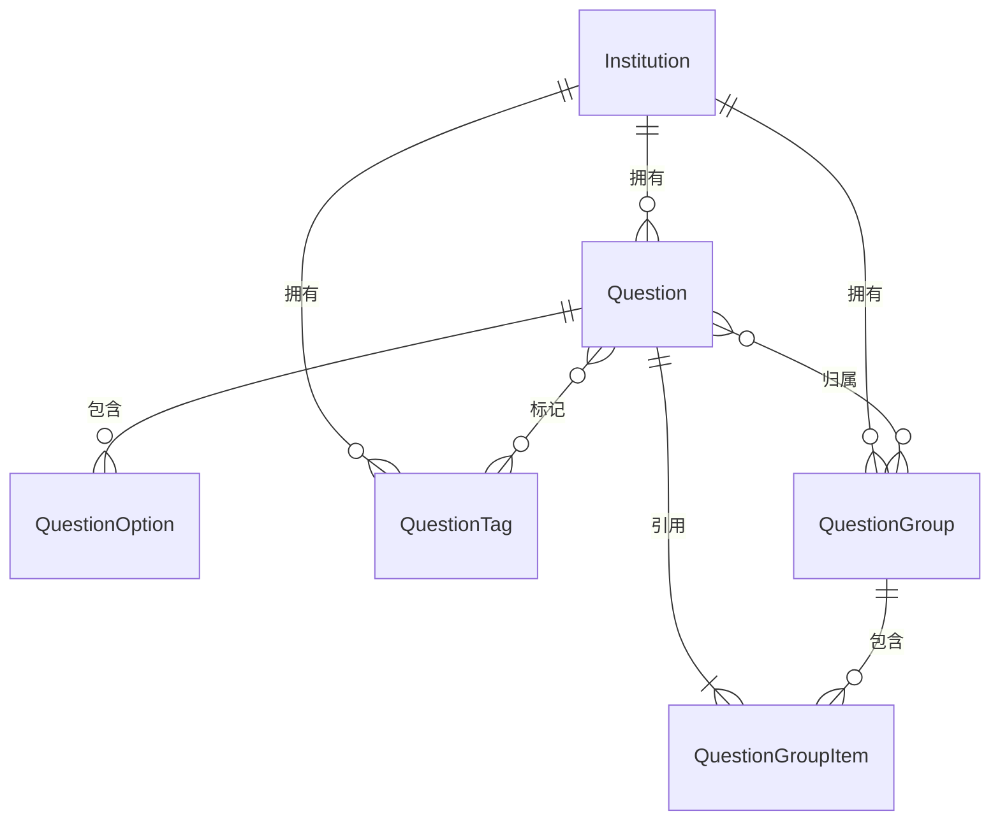
```mermaid
erDiagram
    Question ||--o{ QuestionOption : "包含"
    Question }o--o{ QuestionTag : "标记"
    Question }o--o{ QuestionGroup : "归属"
    QuestionGroup ||--o{ QuestionGroupItem : "包含"
    QuestionGroupItem }|--|| Question : "引用"
    Institution ||--o{ Question : "拥有"
    Institution ||--o{ QuestionTag : "拥有"
    Institution ||--o{ QuestionGroup : "拥有"
```

主要实体说明：
- **Question**：题目基本信息，包括标题、内容、类型、难度、分值等
- **QuestionOption**：题目选项，包括选项内容、是否正确选项、排序序号等
- **QuestionTag**：题目标签，用于题目分类和检索
- **QuestionGroup**：题目组，用于组织题目集合
- **QuestionGroupItem**：题目组项，维护题目在题目组中的顺序和属性

#### 1.1.2 题目数据结构

题目实体(`Question`)包含所有题型共有的基本信息：
- 题目标题/简称(title)
- 题目内容/题干(content)
- 题目类型(type)：0-单选题，1-多选题，2-判断题，3-填空题，4-简答题
- 难度级别(difficulty)：1-5级
- 分值(score)
- 解析(analysis)
- 正确答案(answer)：填空题和简答题使用
- 所属机构(institution)
- 选项列表(options)：一对多关系

选项实体(`QuestionOption`)用于存储选择题的选项信息：
- 所属题目(question)
- 选项内容(content)
- 是否正确选项(isCorrect)
- 排序序号(orderIndex)

#### 1.1.3 题目类型设计

系统支持多种题型，通过枚举类型定义：

| 类型值 | 类型名称 | 说明 |
|-------|---------|------|
| 0 | SINGLE_CHOICE | 单选题 |
| 1 | MULTIPLE_CHOICE | 多选题 |
| 2 | TRUE_FALSE | 判断题 |
| 3 | FILL_BLANK | 填空题 |
| 4 | SHORT_ANSWER | 简答题 |

### 1.2 不定项选择题支持

系统通过以下设计支持不定项选择题（包括单选题和多选题）：

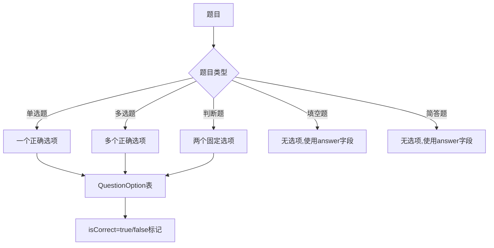
```mermaid
graph TD
    A[题目] --> B{题目类型}
    B -->|单选题| C[一个正确选项]
    B -->|多选题| D[多个正确选项]
    B -->|判断题| E[两个固定选项]
    B -->|填空题| F[无选项,使用answer字段]
    B -->|简答题| G[无选项,使用answer字段]

    C --> H[QuestionOption表]
    D --> H
    E --> H

    H --> I[isCorrect=true/false标记]
```

核心设计要点：

1. **统一的题目表结构**：所有题型共享同一个`Question`表，通过`type`字段区分不同题型
2. **选项表中的正确标记**：在`QuestionOption`表中使用`isCorrect`字段标记正确选项
3. **选项数量不限**：一个题目可以关联任意数量的选项
4. **正确选项数量区分**：
   - 单选题：只有一个选项的`isCorrect`为true
   - 多选题：可以有多个选项的`isCorrect`为true

这种设计的优势：
- 支持任意数量的选项
- 灵活支持单选和多选题型
- 统一的数据访问和处理逻辑
- 便于扩展新的题型

## 2. 多线程批量处理设计

### 2.1 线程池配置

系统使用自定义线程池处理批量操作，提高处理效率：

```java
@Configuration
@EnableAsync
public class AsyncConfig {
    @Bean(name = "importTaskExecutor")
    public Executor importTaskExecutor() {
        ThreadPoolTaskExecutor executor = new ThreadPoolTaskExecutor();

        // 核心线程数：CPU核心数
        executor.setCorePoolSize(Runtime.getRuntime().availableProcessors());

        // 最大线程数：CPU核心数 * 2
        executor.setMaxPoolSize(Runtime.getRuntime().availableProcessors() * 2);

        // 队列容量
        executor.setQueueCapacity(500);

        // 线程名前缀
        executor.setThreadNamePrefix("import-task-");

        // 拒绝策略：由调用者线程执行
        executor.setRejectedExecutionHandler(new ThreadPoolExecutor.CallerRunsPolicy());

        return new DelegatingSecurityContextAsyncTaskExecutor(executor);
    }
}
```

### 2.2 批量处理流程设计

系统实现了高效的批量处理机制，特别是在题目导入和删除操作中。整体处理流程如下图所示：

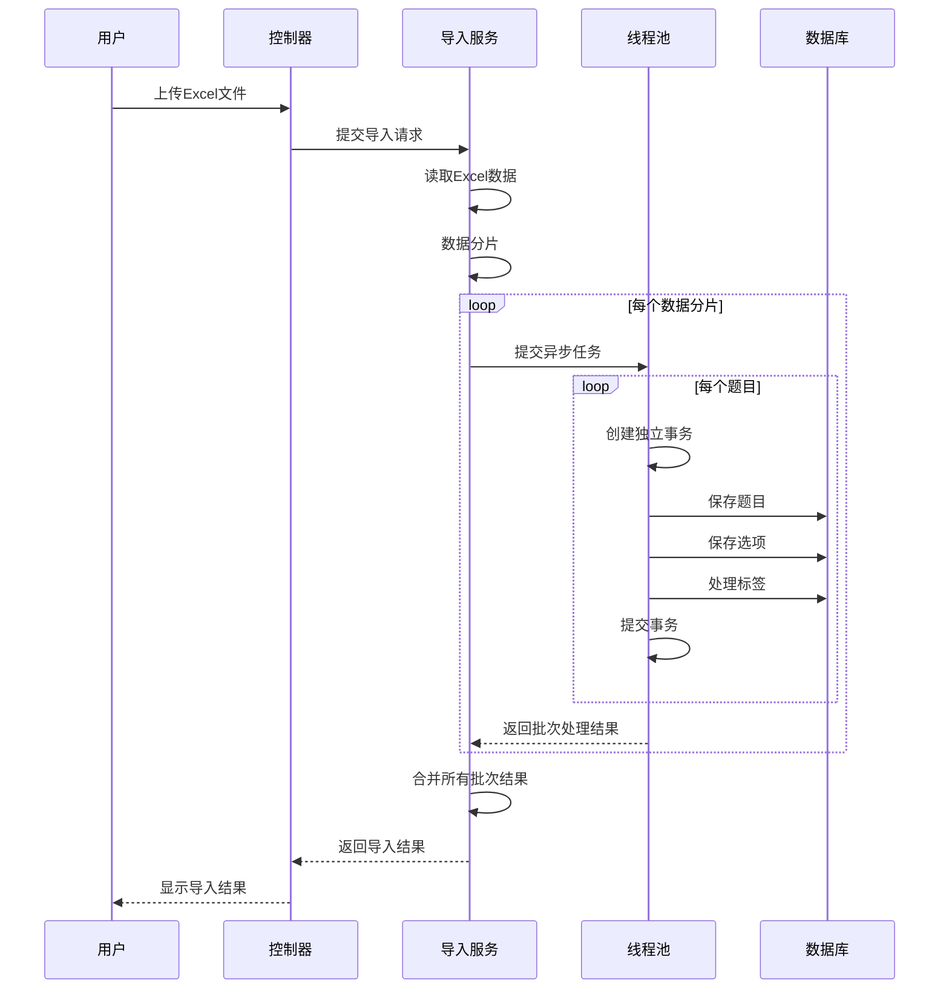
```mermaid
sequenceDiagram
    participant 用户
    participant 控制器
    participant 导入服务
    participant 线程池
    participant 数据库

    用户->>控制器: 上传Excel文件
    控制器->>导入服务: 提交导入请求
    导入服务->>导入服务: 读取Excel数据
    导入服务->>导入服务: 数据分片

    loop 每个数据分片
        导入服务->>线程池: 提交异步任务

        loop 每个题目
            线程池->>线程池: 创建独立事务
            线程池->>数据库: 保存题目
            线程池->>数据库: 保存选项
            线程池->>数据库: 处理标签
            线程池->>线程池: 提交事务
        end

        线程池-->>导入服务: 返回批次处理结果
    end

    导入服务->>导入服务: 合并所有批次结果
    导入服务-->>控制器: 返回导入结果
    控制器-->>用户: 显示导入结果
```

批量处理的核心步骤包括：

1. **数据分片**：将大批量数据分成多个小批次，每个批次包含固定数量的题目
2. **并行处理**：每个批次创建一个异步任务，提交到线程池并发执行
3. **独立事务**：每个题目使用独立的事务处理，确保一个题目的失败不影响其他题目
4. **结果合并**：等待所有任务完成后，合并处理结果并返回

#### 2.2.1 批量数据分片与并行处理

系统使用CompletableFuture实现异步并行处理，主要流程如下：

1. 读取Excel文件中的所有数据
2. 根据配置的批次大小将数据分成多个批次
3. 为每个批次创建一个异步任务，提交到线程池
4. 使用CompletableFuture.allOf等待所有任务完成
5. 合并所有批次的处理结果

#### 2.2.2 独立事务处理

每个题目使用独立事务处理，确保数据一致性和操作的原子性：

1. 使用TransactionTemplate手动控制事务
2. 在事务中完成题目的创建、选项保存和标签处理
3. 如果处理过程中发生异常，自动回滚当前题目的事务
4. 记录成功和失败的统计信息

这种设计确保了即使部分题目处理失败，也不会影响其他题目的导入，提高了批量操作的可靠性。
### 2.3 多线程处理的优势

1. **提高处理效率**：充分利用多核CPU资源，显著提升批量操作性能
2. **独立事务隔离**：每个题目使用独立事务，一个题目处理失败不影响其他题目
3. **可靠性保证**：使用事务模板确保数据一致性，失败时自动回滚
4. **资源控制**：通过线程池配置控制并发度，避免系统资源过度消耗
5. **异步处理**：使用`@Async`和`CompletableFuture`实现非阻塞异步处理

## 3. 课程结构与状态转换设计

### 3.1 课程层级结构设计

系统采用三级层级结构组织课程内容，实现了灵活的课程组织方式。

#### 3.1.1 层级结构关系

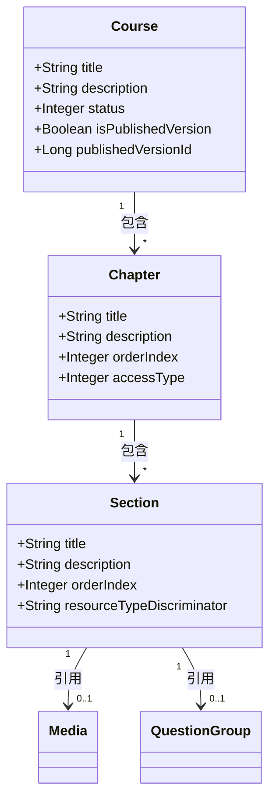
```mermaid
classDiagram
    Course "1" --> "*" Chapter : 包含
    Chapter "1" --> "*" Section : 包含
    Section "1" --> "0..1" Media : 引用
    Section "1" --> "0..1" QuestionGroup : 引用

    class Course {
        +String title
        +String description
        +Integer status
        +Boolean isPublishedVersion
        +Long publishedVersionId
    }

    class Chapter {
        +String title
        +String description
        +Integer orderIndex
        +Integer accessType
    }

    class Section {
        +String title
        +String description
        +Integer orderIndex
        +String resourceTypeDiscriminator
    }
```

核心实体说明：
- **Course(课程)**：最顶层实体，包含课程基本信息和版本管理属性
- **Chapter(章节)**：课程的一级子单元，用于组织相关内容的小节
- **Section(小节)**：最小内容单元，可以关联具体的学习资源

这种层级结构设计的优势：
1. 清晰的内容组织层次，便于管理和导航
2. 灵活的内容组合，支持不同类型的学习资源
3. 统一的访问控制，可在不同层级设置权限
4. 便于实现课程进度跟踪和学习路径设计

#### 3.1.2 小节资源关联设计

小节(Section)采用了灵活的资源关联设计，通过鉴别器字段支持不同类型的资源：

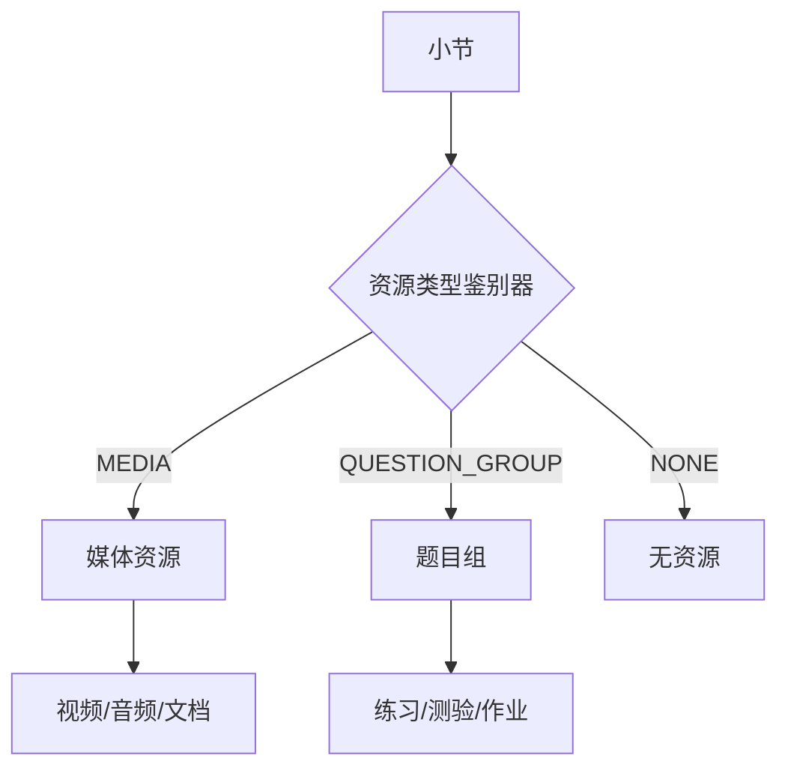
```mermaid
graph TD
    A[小节] --> B{资源类型鉴别器}
    B -->|MEDIA| C[媒体资源]
    B -->|QUESTION_GROUP| D[题目组]
    B -->|NONE| E[无资源]

    C --> F[视频/音频/文档]
    D --> G[练习/测验/作业]
```

关键设计点：
- 使用`resourceTypeDiscriminator`字段标识资源类型
- 根据不同资源类型，关联不同的实体（Media或QuestionGroup）
- 支持资源特定的配置参数（如题目组的随机排序、按难度排序等）

### 3.2 课程状态转换设计

系统实现了完整的课程状态管理机制，支持课程从创建到发布的全生命周期管理。

#### 3.2.1 课程状态流转

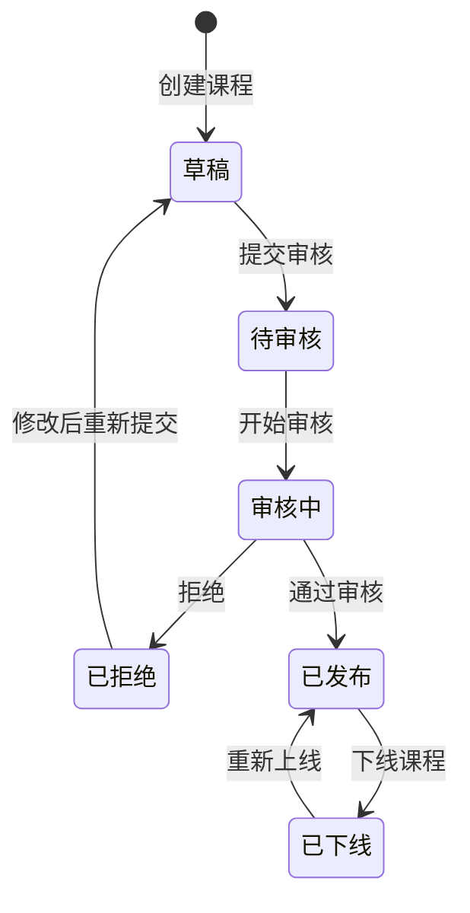
```mermaid
stateDiagram-v2
    [*] --> 草稿: 创建课程
    草稿 --> 待审核: 提交审核
    待审核 --> 审核中: 开始审核
    审核中 --> 已拒绝: 拒绝
    审核中 --> 已发布: 通过审核
    已发布 --> 已下线: 下线课程
    已下线 --> 已发布: 重新上线
    已拒绝 --> 草稿: 修改后重新提交
```

课程状态说明：
- **草稿(DRAFT)**：初始状态，可自由编辑
- **待审核(PENDING_REVIEW)**：已提交等待审核
- **审核中(REVIEWING)**：审核人员正在审核
- **已拒绝(REJECTED)**：审核未通过，需修改
- **已发布(PUBLISHED)**：审核通过并发布，学习者可见
- **已下线(UNPUBLISHED)**：暂时下线，学习者不可见

#### 3.2.2 工作区与发布版本设计

系统采用了创新的工作区与发布版本分离设计，在同一张表中实现了版本管理功能：

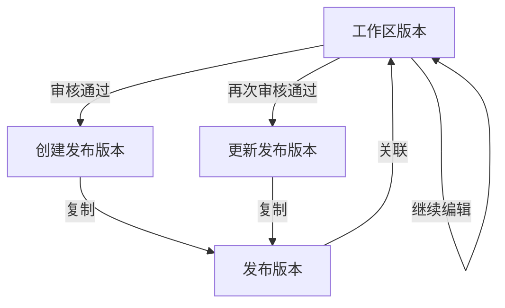
```mermaid
graph TD
    A[工作区版本] -->|审核通过| B[创建发布版本]
    B -->|复制| C[发布版本]
    C -->|关联| A
    A -->|继续编辑| A
    A -->|再次审核通过| D[更新发布版本]
    D -->|复制| C
```

关键设计点：
1. **同表不同角色**：
   - 使用`isPublishedVersion`字段区分工作区版本和发布版本
   - 工作区版本：可编辑，用于内容创建和修改
   - 发布版本：不可直接编辑，对学习者可见

2. **版本关联**：
   - 工作区版本通过`publishedVersionId`字段关联到发布版本
   - 发布版本通过`publishedVersionId`字段关联到工作区版本

3. **深度复制**：
   - 审核通过时，系统创建发布版本，复制工作区版本的所有内容
   - 使用递归复制确保章节和小节结构完整保留
   - 资源引用（如媒体和题目组）采用引用复制而非深度复制

#### 3.2.3 深度复制实现

在创建发布版本时，系统实现了课程内容的深度复制：

1. **基本属性复制**：
   ```java
   BeanUtils.copyProperties(savedCourse, publishedVersion,
       "id", "dataVersion", "chapters", "tags", "category", "institution",
       "isPublishedVersion", "publishedVersionId", "status", "versionType",
       "studentCount", "averageRating", "ratingCount", "favoriteUsers",
       "enrolledUsers", "orders");
   ```

2. **章节复制**：
   ```java
   for (Chapter originalChapter : savedCourse.getChapters()) {
       Chapter copiedChapter = new Chapter();
       BeanUtils.copyProperties(originalChapter, copiedChapter,
           "id", "course", "sections", "dataVersion");
       copiedChapter.setCourse(publishedVersion);
       // ...
   }
   ```

3. **小节复制**：
   ```java
   for (Section originalSection : originalChapter.getSections()) {
       Section copiedSection = new Section();
       BeanUtils.copyProperties(originalSection, copiedSection,
           "id", "chapter", "media", "questionGroup", "dataVersion");
       copiedSection.setChapter(copiedChapter);
       // ...
   }
   ```

### 3.3 设计优势

这种课程结构和状态转换设计具有以下优势：

1. **内容组织清晰**：三级层级结构使课程内容组织清晰，便于管理和导航
2. **版本管理灵活**：工作区与发布版本分离，实现了类似Git的工作流
3. **状态转换明确**：完整的状态流转确保课程发布过程可控
4. **资源关联灵活**：小节可以关联不同类型的资源，满足多样化教学需求
5. **数据结构统一**：在同一张表中实现版本管理，简化了数据模型
6. **学习体验一致**：发布版本保持稳定，确保学习者体验一致性

## 4. 认证与权限管理设计

### 4.1 认证机制设计

系统采用基于JWT的无状态认证机制，实现了高效、安全的用户认证。

#### 4.1.1 JWT令牌设计

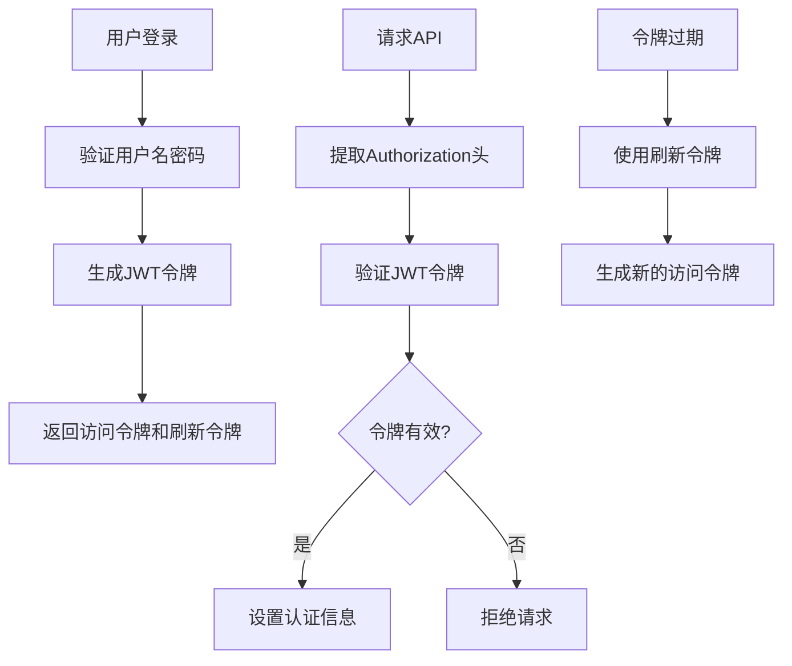
```mermaid
graph TD
    A[用户登录] --> B[验证用户名密码]
    B --> C[生成JWT令牌]
    C --> D[返回访问令牌和刷新令牌]

    E[请求API] --> F[提取Authorization头]
    F --> G[验证JWT令牌]
    G --> H{令牌有效?}
    H -->|是| I[设置认证信息]
    H -->|否| J[拒绝请求]

    K[令牌过期] --> L[使用刷新令牌]
    L --> M[生成新的访问令牌]
```

JWT令牌包含以下关键信息：
- 用户名(subject)：用户的唯一标识
- 角色信息(auth)：用户的角色，用于权限控制
- 用户ID(userId)：用户的数据库ID
- 机构ID(institutionId)：用户所属机构ID（如果有）
- 过期时间(expiration)：令牌的有效期

关键设计点：
1. **双令牌机制**：
   - 访问令牌(Access Token)：短期有效（1小时），用于API访问
   - 刷新令牌(Refresh Token)：长期有效（7天），用于刷新访问令牌

2. **令牌黑名单**：
   - 使用Redis实现令牌黑名单
   - 支持单个令牌失效和用户级别的批量失效
   - 解决JWT无法主动撤销的问题

#### 4.1.2 认证流程

以下是完整的认证流程时序图，展示了前端、后端、Redis和数据库之间的交互：

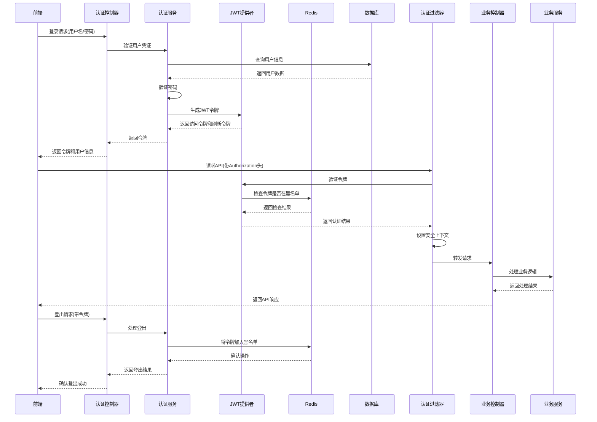
```mermaid
sequenceDiagram
    participant 前端
    participant 认证控制器
    participant 认证服务
    participant JWT提供者
    participant Redis
    participant 数据库

    %% 登录流程
    前端->>认证控制器: 登录请求(用户名/密码)
    认证控制器->>认证服务: 验证用户凭证
    认证服务->>数据库: 查询用户信息
    数据库-->>认证服务: 返回用户数据
    认证服务->>认证服务: 验证密码
    认证服务->>JWT提供者: 生成JWT令牌
    JWT提供者-->>认证服务: 返回访问令牌和刷新令牌
    认证服务-->>认证控制器: 返回令牌
    认证控制器-->>前端: 返回令牌和用户信息

    %% API访问流程
    前端->>认证过滤器: 请求API(带Authorization头)
    认证过滤器->>JWT提供者: 验证令牌
    JWT提供者->>Redis: 检查令牌是否在黑名单
    Redis-->>JWT提供者: 返回检查结果
    JWT提供者-->>认证过滤器: 返回认证结果
    认证过滤器->>认证过滤器: 设置安全上下文
    认证过滤器->>业务控制器: 转发请求
    业务控制器->>业务服务: 处理业务逻辑
    业务服务-->>业务控制器: 返回处理结果
    业务控制器-->>前端: 返回API响应

    %% 登出流程
    前端->>认证控制器: 登出请求(带令牌)
    认证控制器->>认证服务: 处理登出
    认证服务->>Redis: 将令牌加入黑名单
    Redis-->>认证服务: 确认操作
    认证服务-->>认证控制器: 返回登出结果
    认证控制器-->>前端: 确认登出成功
```

JWT令牌生成代码：
```java
// JWT令牌生成
String accessToken = Jwts.builder()
    .subject(username)
    .claim("auth", roles)
    .claim("userId", userId)
    .claim("institutionId", institutionId)
    .issuedAt(new Date(now))
    .expiration(new Date(now + jwtConfig.getAccessTokenExpiration()))
    .signWith(getSigningKey())
    .compact();
```

认证过滤器实现：
```java
@Override
protected void doFilterInternal(HttpServletRequest request, HttpServletResponse response, FilterChain filterChain)
        throws ServletException, IOException {
    try {
        String jwt = resolveToken(request);
        if (StringUtils.hasText(jwt) && validateToken(jwt)) {
            Authentication authentication = tokenProvider.getAuthentication(jwt);
            SecurityContextHolder.getContext().setAuthentication(authentication);
        }
    } catch (Exception e) {
        log.error("无法设置用户认证到安全上下文", e);
    }

    filterChain.doFilter(request, response);
}
```

### 4.2 权限控制设计

系统采用基于角色的访问控制(RBAC)模型，但实现方式进行了简化，主要通过Spring Security的注解实现。

#### 4.2.1 角色设计

系统定义了四种基本角色：

| 角色 | 编码 | 说明 |
|------|------|------|
| 普通用户 | ROLE_USER | 可以浏览、购买、学习课程 |
| 机构用户 | ROLE_INSTITUTION | 可以创建和管理课程、题库等 |
| 审核人员 | ROLE_REVIEWER | 负责内容审核，如课程审核 |
| 管理员 | ROLE_ADMIN | 系统最高权限，可以管理所有内容 |

#### 4.2.2 权限控制实现

系统主要通过`@PreAuthorize`注解实现权限控制：

```java
@PostMapping
@ResponseStatus(HttpStatus.CREATED)
@PreAuthorize("hasAuthority('ROLE_INSTITUTION')")
@Operation(summary = "创建章节", description = "创建一个新的课程章节")
public Result<ChapterVO> createChapter(@Valid @RequestBody ChapterCreateDTO dto) {
    Long institutionId = SecurityUtil.getCurrentInstitutionId();
    // ...
}
```

安全工具类`SecurityUtil`提供了便捷的方法获取当前用户信息：

```java
/**
 * 获取当前用户ID
 */
public static Long getCurrentUserId() {
    Authentication authentication = getAuthentication();

    // 从JWT token中获取用户ID
    if (authentication instanceof JwtAuthenticationToken) {
        Claims claims = ((JwtAuthenticationToken) authentication).getClaims();
        Object userIdObj = claims.get("userId");
        if (userIdObj != null) {
            return ((Number) userIdObj).longValue();
        }
    }

    throw new BusinessException(401, "无法获取当前用户ID");
}

/**
 * 获取当前用户的机构ID
 */
public static Long getCurrentInstitutionId() {
    Authentication authentication = getAuthentication();

    // 从JWT token中获取机构ID
    if (authentication instanceof JwtAuthenticationToken) {
        Long institutionId = ((JwtAuthenticationToken) authentication).getInstitutionId();
        if (institutionId != null) {
            return institutionId;
        }
    }

    return null;
}
```

#### 4.2.3 多租户数据隔离

系统通过在JWT令牌中嵌入机构ID，实现了优雅的多租户数据隔离：

1. 在JWT令牌中存储机构ID
2. 在控制器中通过`SecurityUtil.getCurrentInstitutionId()`获取机构ID
3. 在服务层使用机构ID过滤数据
4. 在数据访问层添加机构ID条件

这种设计确保了机构用户只能访问其所属机构的数据，实现了简单有效的数据隔离。

### 4.3 安全最佳实践

系统实现了多项安全最佳实践：

1. **密码安全**：
   - 使用BCrypt加密存储密码
   - 密码强度要求和复杂度验证

2. **令牌安全**：
   - 短期访问令牌（1小时）
   - 令牌黑名单机制
   - 敏感操作需要重新验证

3. **API安全**：
   - 基于角色的访问控制
   - 输入验证和数据清洗
   - CORS配置防止跨站请求

4. **数据安全**：
   - 多租户数据隔离
   - 敏感数据加密存储
   - 审计日志记录关键操作

## 5. 媒体存储与分片上传设计

系统实现了灵活、高效的媒体存储和大文件上传机制，满足了在线教育平台对多媒体资源的管理需求。

### 5.1 媒体存储设计

系统采用了双重存储策略，根据资源的不同特性和访问需求，实现了灵活的存储和访问控制。

#### 5.1.1 存储策略分类

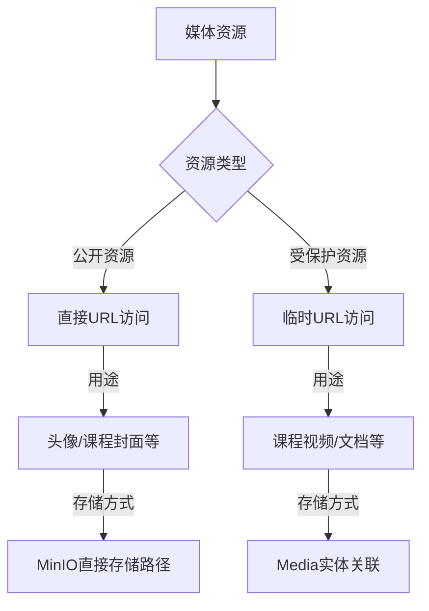
```mermaid
graph TD
    A[媒体资源] --> B{资源类型}
    B -->|公开资源| C[直接URL访问]
    B -->|受保护资源| D[临时URL访问]

    C -->|用途| E[头像/课程封面等]
    D -->|用途| F[课程视频/文档等]

    E -->|存储方式| G[MinIO直接存储路径]
    F -->|存储方式| H[Media实体关联]
```

系统实现了两种不同的存储策略：

1. **公开资源存储**：
   - 适用于头像、课程封面等公开内容
   - 直接存储MinIO文件路径
   - 任何人通过URL可直接访问
   - 无需权限验证，类似图床功能

2. **受保护资源存储**：
   - 适用于课程视频、音频、文档等核心内容
   - 通过Media实体关联存储
   - 访问时生成临时URL，有效期可控
   - 支持权限验证和访问控制

#### 5.1.2 媒体实体设计

```java
@Entity
@Table(name = "media")
public class Media {
    @Id
    @GeneratedValue(strategy = GenerationType.IDENTITY)
    private Long id;

    private String title;           // 媒体标题
    private String description;     // 媒体描述

    @Enumerated(EnumType.STRING)
    private MediaType type;         // 媒体类型（视频、音频、文档）

    private Long size;              // 文件大小（字节）
    private String originalFilename; // 原始文件名
    private String storagePath;     // 存储路径

    @Enumerated(EnumType.STRING)
    private MediaStatus status;     // 媒体状态

    @ManyToOne(fetch = FetchType.LAZY)
    private Institution institution; // 所属机构

    private Long uploaderId;        // 上传者ID
    private LocalDateTime uploadTime; // 上传时间
    private LocalDateTime lastAccessTime; // 最后访问时间
}
```

#### 5.1.3 临时URL生成机制

系统通过S3兼容API生成临时访问URL，实现了对受保护资源的安全访问：

```java
@Override
@Transactional(readOnly = true)
public String getMediaAccessUrl(Long mediaId, Long institutionId, Long expirationMinutes) {
    // 验证Media记录
    Media media = getMediaForInstitution(mediaId, institutionId);

    // 检查媒体状态
    if (media.getStatus() != MediaStatus.COMPLETED) {
        throw new BusinessException(400, "媒体文件未上传完成，无法获取访问URL");
    }

    // 生成预签名URL
    String url = s3UploadManager.generatePresignedGetUrl(
            media.getStoragePath(), expirationMinutes);

    // 更新最后访问时间
    media.setLastAccessTime(LocalDateTime.now());
    mediaRepository.save(media);

    return url;
}
```

### 5.2 分片上传设计

系统实现了基于S3兼容API的分片上传机制，支持大文件的高效上传和断点续传。

#### 5.2.1 分片上传流程

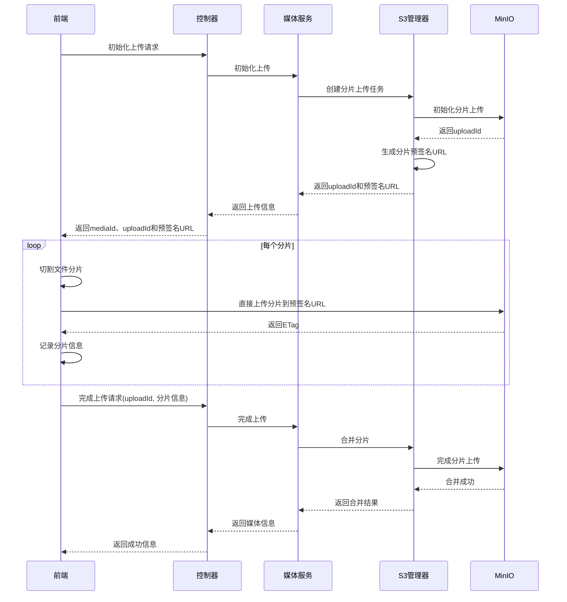
```mermaid
sequenceDiagram
    participant 前端
    participant 控制器
    participant 媒体服务
    participant S3管理器
    participant MinIO

    前端->>控制器: 初始化上传请求
    控制器->>媒体服务: 初始化上传
    媒体服务->>S3管理器: 创建分片上传任务
    S3管理器->>MinIO: 初始化分片上传
    MinIO-->>S3管理器: 返回uploadId
    S3管理器->>S3管理器: 生成分片预签名URL
    S3管理器-->>媒体服务: 返回uploadId和预签名URL
    媒体服务-->>控制器: 返回上传信息
    控制器-->>前端: 返回mediaId、uploadId和预签名URL

    loop 每个分片
        前端->>前端: 切割文件分片
        前端->>MinIO: 直接上传分片到预签名URL
        MinIO-->>前端: 返回ETag
        前端->>前端: 记录分片信息
    end

    前端->>控制器: 完成上传请求(uploadId, 分片信息)
    控制器->>媒体服务: 完成上传
    媒体服务->>S3管理器: 合并分片
    S3管理器->>MinIO: 完成分片上传
    MinIO-->>S3管理器: 合并成功
    S3管理器-->>媒体服务: 返回合并结果
    媒体服务-->>控制器: 返回媒体信息
    控制器-->>前端: 返回成功信息
```

关键设计点：
1. **服务器资源优化**：文件分片直接从前端上传到MinIO，不经过Spring Boot服务器
2. **分片管理**：前端负责文件分片和上传进度跟踪
3. **断点续传支持**：记录已上传分片信息，支持断点续传
4. **合并操作**：上传完成后，后端请求MinIO合并分片

#### 5.2.2 前端分片实现

前端使用File API实现文件分片，并通过预签名URL直接上传到MinIO：

```typescript
// 上传分片
const uploadPromises = presignedUrls.map(async ({ partNumber, url }) => {
  const start = (partNumber - 1) * chunkSize;
  const end = partNumber === totalParts ? file.size : partNumber * chunkSize;
  const chunk = file.slice(start, end);

  // 上传分片到S3
  const response = await fetch(url, {
    method: 'PUT',
    body: chunk,
    headers: {
      'Content-Type': 'application/octet-stream'
    }
  });

  // 获取ETag并记录
  let eTag = response.headers.get('ETag') || '';
  completedParts.push({
    partNumber: Number(partNumber),
    etag: eTag
  });
});
```

#### 5.2.3 后端分片管理

后端使用S3兼容API管理分片上传过程：

1. **初始化分片上传**：
```java
public String initiateMultipartUpload(String objectKey, String contentType) {
    CreateMultipartUploadRequest createRequest = CreateMultipartUploadRequest.builder()
            .bucket(s3Config.getBucketName())
            .key(objectKey)
            .contentType(contentType)
            .build();

    CreateMultipartUploadResponse response = s3Client.createMultipartUpload(createRequest);
    return response.uploadId();
}
```

2. **生成分片预签名URL**：
```java
public String generatePresignedUrlForPart(String uploadId, String objectKey, int partNumber) {
    UploadPartRequest uploadPartRequest = UploadPartRequest.builder()
            .bucket(s3Config.getBucketName())
            .key(objectKey)
            .uploadId(uploadId)
            .partNumber(partNumber)
            .build();

    PresignRequest presignRequest = PresignRequest.builder()
            .signatureDuration(Duration.ofMinutes(15))
            .uploadPartRequest(uploadPartRequest)
            .build();

    return s3Presigner.presignUploadPart(presignRequest).url().toString();
}
```

3. **完成分片上传**：
```java
public CompleteMultipartUploadResponse completeMultipartUpload(
        String uploadId, String objectKey, List<CompletedPartDTO> parts) {

    List<CompletedPart> completedParts = parts.stream()
            .map(part -> CompletedPart.builder()
                    .partNumber(part.getPartNumber())
                    .eTag(part.getETag())
                    .build())
            .collect(Collectors.toList());

    CompleteMultipartUploadRequest completeRequest = CompleteMultipartUploadRequest.builder()
            .bucket(s3Config.getBucketName())
            .key(objectKey)
            .uploadId(uploadId)
            .multipartUpload(CompletedMultipartUpload.builder()
                    .parts(completedParts)
                    .build())
            .build();

    return s3Client.completeMultipartUpload(completeRequest);
}
```

### 5.3 存储配置设计

系统同时配置了MinIO原生客户端和S3兼容客户端，满足不同的存储需求：

#### 5.3.1 MinIO配置

```java
@Configuration
@ConfigurationProperties(prefix = "minio")
public class MinioConfig {
    private String endpoint;
    private String accessKey;
    private String secretKey;
    private String bucketName;

    @Bean
    public MinioClient minioClient() {
        return MinioClient.builder()
                .endpoint(endpoint)
                .credentials(accessKey, secretKey)
                .build();
    }
}
```

#### 5.3.2 S3兼容配置

```java
@Configuration
@ConfigurationProperties(prefix = "aws.s3")
public class S3Config {
    private String endpoint;
    private String region;
    private String accessKey;
    private String secretKey;
    private String bucketName;
    private boolean pathStyleAccess;

    @Bean
    public S3Client s3Client() {
        AwsCredentials credentials = AwsBasicCredentials.create(accessKey, secretKey);

        return S3Client.builder()
            .endpointOverride(URI.create(endpoint))
            .credentialsProvider(() -> credentials)
            .region(Region.of(region))
            .serviceConfiguration(S3Configuration.builder()
                .pathStyleAccessEnabled(pathStyleAccess)
                .build())
            .build();
    }

    @Bean
    public S3Presigner s3Presigner() {
        // 类似配置...
    }
}
```

### 5.4 设计优势

这种媒体存储和分片上传设计具有以下优势：

1. **资源访问控制**：
   - 公开资源直接访问，简化常见场景
   - 核心内容通过临时URL保护，增强安全性
   - 支持基于机构的多租户隔离

2. **服务器资源优化**：
   - 文件直接从前端上传到MinIO，不占用应用服务器带宽
   - 减轻应用服务器负担，提高系统整体性能

3. **大文件支持**：
   - 分片上传支持任意大小的文件
   - 断点续传提高上传可靠性
   - 上传进度跟踪提升用户体验

4. **技术兼容性**：
   - 同时支持MinIO原生API和S3兼容API
   - 利用S3的分片上传能力，弥补MinIO原生API的不足
   - 保持接口一致性，便于未来迁移到其他存储服务

## 6. 学习统计与进度管理设计

系统实现了完整的学习统计和进度管理机制，通过Redis与数据库结合的方式，高效地记录和分析用户的学习行为。

### 6.1 学习统计数据设计

系统采用了Redis与数据库结合的方式，实现高效的学习统计数据收集和分析。

#### 6.1.1 学习记录模型

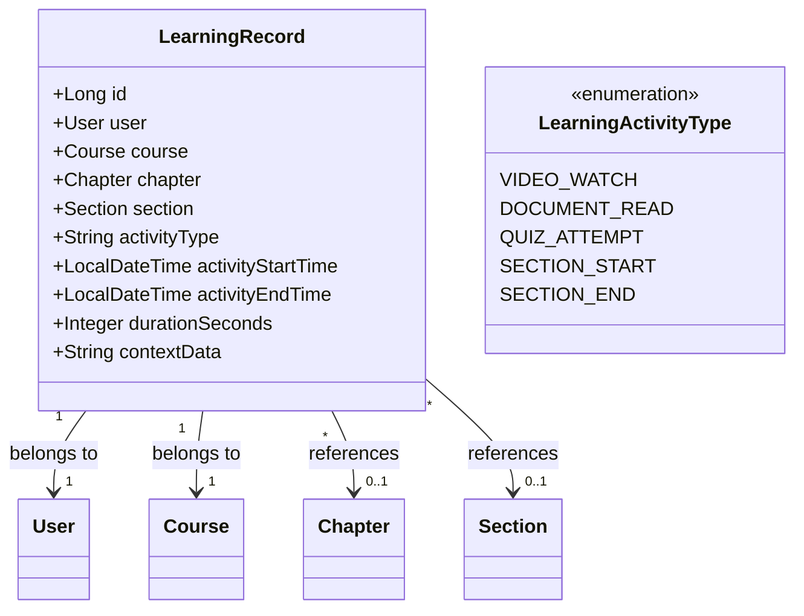
```mermaid
classDiagram
    LearningRecord "1" --> "1" User : belongs to
    LearningRecord "1" --> "1" Course : belongs to
    LearningRecord "*" --> "0..1" Chapter : references
    LearningRecord "*" --> "0..1" Section : references

    class LearningRecord {
        +Long id
        +User user
        +Course course
        +Chapter chapter
        +Section section
        +String activityType
        +LocalDateTime activityStartTime
        +LocalDateTime activityEndTime
        +Integer durationSeconds
        +String contextData
    }

    class LearningActivityType {
        <<enumeration>>
        VIDEO_WATCH
        DOCUMENT_READ
        QUIZ_ATTEMPT
        SECTION_START
        SECTION_END
    }
```

学习记录实体(`LearningRecord`)包含以下关键信息：
- 用户、课程、章节、小节的关联
- 活动类型（视频观看、文档阅读、测验尝试等）
- 活动开始和结束时间
- 持续时间（秒）
- 上下文数据（JSON格式，存储活动相关的额外信息）

#### 6.1.2 Redis缓存设计

系统使用Redis作为学习记录的临时存储，减轻数据库压力：

```java
public void updateLearningRecord(Long userId, Long courseId, Long chapterId, Long sectionId,
                                String activityType, int durationSeconds, String contextData) {
    // 生成当前日期字符串
    String dateStr = LocalDate.now().format(DateTimeFormatter.ISO_DATE);

    // 构建Redis键
    String redisKey = buildRedisKey(dateStr, userId, courseId, activityType);

    // 使用Hash结构存储数据
    redisTemplate.opsForHash().increment(redisKey, "totalDuration", durationSeconds);
    redisTemplate.opsForHash().put(redisKey, "lastUpdate", System.currentTimeMillis());

    // 更新章节和小节信息
    if (chapterId != null) {
        redisTemplate.opsForHash().put(redisKey, "chapterId", chapterId.toString());
    }

    if (sectionId != null) {
        redisTemplate.opsForHash().put(redisKey, "sectionId", sectionId.toString());
    }

    // 更新上下文数据（可选）
    if (contextData != null) {
        redisTemplate.opsForHash().put(redisKey, "contextData", contextData);
    }

    // 设置过期时间
    redisTemplate.expire(redisKey, RECORD_EXPIRATION_DAYS, TimeUnit.DAYS);
}
```

Redis键的设计格式为：`learning:record:{日期}:{用户ID}:{课程ID}:{活动类型}`，确保每个用户每天每个课程每种活动类型只有一条记录。

#### 6.1.3 定时同步机制

系统通过定时任务将Redis中的学习记录同步到数据库：

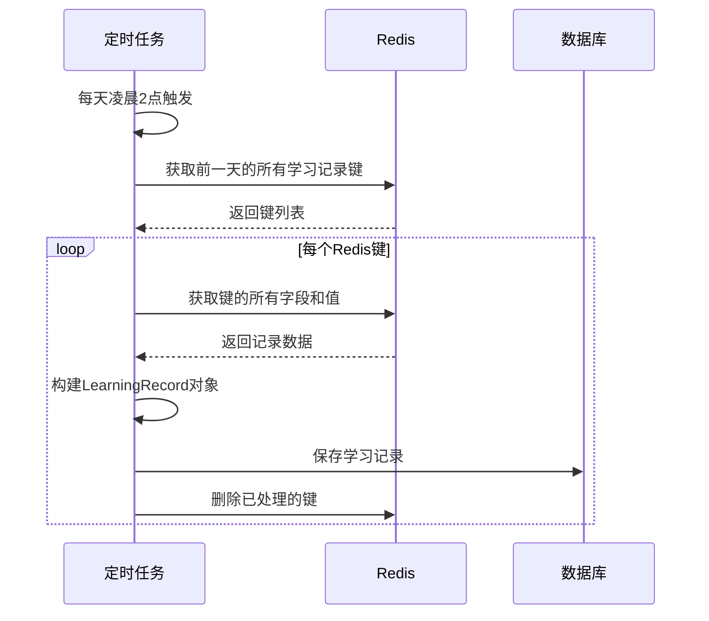
```mermaid
sequenceDiagram
    participant 定时任务
    participant Redis
    participant 数据库

    定时任务->>定时任务: 每天凌晨2点触发
    定时任务->>Redis: 获取前一天的所有学习记录键
    Redis-->>定时任务: 返回键列表

    loop 每个Redis键
        定时任务->>Redis: 获取键的所有字段和值
        Redis-->>定时任务: 返回记录数据
        定时任务->>定时任务: 构建LearningRecord对象
        定时任务->>数据库: 保存学习记录
        定时任务->>Redis: 删除已处理的键
    end
```

定时任务实现：

```java
@Scheduled(cron = "0 0 2 * * ?")
@Transactional
public void aggregateLearningRecords() {
    log.info("开始聚合学习记录...");

    // 获取昨天的日期
    LocalDate yesterday = LocalDate.now().minusDays(1);

    // 聚合指定日期的学习记录
    aggregateLearningRecordsForDate(yesterday);
}
```

系统还提供了手动触发同步的功能，方便演示和测试：

```java
@PostMapping("/aggregate")
@ResponseStatus(HttpStatus.OK)
@PreAuthorize("hasRole('ADMIN')")
@Operation(summary = "手动触发学习记录聚合", description = "管理员手动触发将Redis中的学习记录聚合到数据库的任务")
public Result<Void> triggerLearningRecordAggregation() {
    String username = SecurityUtil.getCurrentUsername();
    log.info("管理员手动触发学习记录聚合, 用户名: {}", username);

    try {
        // 执行聚合任务，处理当天和昨天的记录
        learningRecordAggregationTask.aggregateAllLearningRecords();
        return Result.success();
    } catch (Exception e) {
        log.error("手动触发学习记录聚合失败", e);
        return Result.fail(HttpStatus.INTERNAL_SERVER_ERROR.value(), "聚合任务执行失败: " + e.getMessage());
    }
}
```

### 6.2 学习进度管理设计

系统通过`UserCourse`实体管理用户的课程学习进度，实现了灵活的进度跟踪和更新机制。

#### 6.2.1 用户课程关系模型

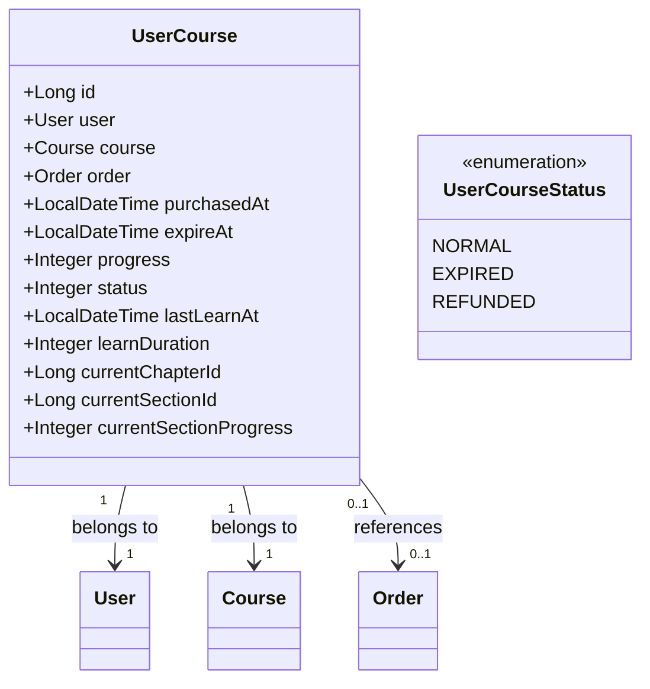
```mermaid
classDiagram
    UserCourse "1" --> "1" User : belongs to
    UserCourse "1" --> "1" Course : belongs to
    UserCourse "0..1" --> "0..1" Order : references

    class UserCourse {
        +Long id
        +User user
        +Course course
        +Order order
        +LocalDateTime purchasedAt
        +LocalDateTime expireAt
        +Integer progress
        +Integer status
        +LocalDateTime lastLearnAt
        +Integer learnDuration
        +Long currentChapterId
        +Long currentSectionId
        +Integer currentSectionProgress
    }

    class UserCourseStatus {
        <<enumeration>>
        NORMAL
        EXPIRED
        REFUNDED
    }
```

`UserCourse`实体包含以下关键信息：
- 用户和课程的关联
- 购买信息（购买时间、关联订单、过期时间）
- 学习进度（总进度、当前位置、小节进度）
- 学习状态（正常、已过期、已退款）
- 学习统计（累计学习时长、最后学习时间）

#### 6.2.2 进度更新机制

系统实现了智能的进度更新机制，考虑了复习模式和预估时长：

```java
@Override
@Transactional
public UserCourseVO updateLearningProgress(Long userId, Long courseId, LearningProgressUpdateDTO dto) {
    // 验证进度范围
    if (dto.getSectionProgress() < 0 || dto.getSectionProgress() > 100) {
        throw new BusinessException(400, "学习进度必须在0-100之间");
    }

    // 查询用户课程记录
    UserCourse userCourse = userCourseRepository.findByUser_IdAndCourse_Id(userId, courseId)
            .orElseThrow(() -> new ResourceNotFoundException("未找到学习记录，请先购买课程"));

    // 更新当前学习位置
    userCourse.setCurrentChapterId(dto.getChapterId());
    userCourse.setCurrentSectionId(dto.getSectionId());
    userCourse.setCurrentSectionProgress(dto.getSectionProgress());

    // 检查是否是复习模式（往回学习）
    boolean isReviewing = dto.getIsReviewing() != null && dto.getIsReviewing();

    // 检查是否超过预设时长
    boolean exceedsEstimatedTime = false;
    // 获取小节的预设时长并检查...

    // 只有在非复习模式、未超过预设时长、且小节进度为100%时，才更新总体进度
    if (!isReviewing && !exceedsEstimatedTime && dto.getSectionProgress() >= 100) {
        // 计算课程总进度
        Course course = userCourse.getCourse();
        int totalSections = getTotalSections(course);
        int currentSectionIndex = getSectionIndex(course, dto.getChapterId(), dto.getSectionId());
        int newProgress = Math.min(100, (int)((currentSectionIndex * 100.0) / totalSections));

        // 只有当新进度大于原进度时才更新总体进度
        if (newProgress > userCourse.getProgress()) {
            userCourse.setProgress(newProgress);
        }
    }

    // 更新最后学习时间
    userCourse.setLastLearnAt(LocalDateTime.now());
    userCourseRepository.save(userCourse);

    return UserCourseVO.fromEntity(userCourse);
}
```

关键设计点：
1. **复习模式识别**：系统能够识别用户是否在复习之前的内容
2. **单向进度更新**：总进度只会增加不会减少，确保进度条始终向前
3. **小节索引计算**：通过计算小节在整个课程中的位置确定总进度
4. **进度保护**：只有在非复习模式且小节完成时才更新总进度

#### 6.2.3 前端学习时间记录

前端通过多种方式记录用户的学习时间：

```typescript
// 视频观看时间记录
useEffect(() => {
  if (playing) {
    // 播放开始后立即记录学习活动开始
    const startTimer = setTimeout(() => {
      startLearningActivity();
      lastRecordTimeRef.current = Date.now();
    }, 500);

    // 每15秒记录一次学习时长
    progressIntervalId.current = setInterval(() => {
      // 获取当前累计的学习时间
      const currentLearningTime = learningTimeRef.current;

      // 只要有播放就记录
      if (playing && currentLearningTime > 0) {
        recordCompletedActivity(currentLearningTime);
        lastRecordTimeRef.current = Date.now();
      }
    }, 15000);

    return () => {
      clearTimeout(startTimer);
      if (progressIntervalId.current) {
        clearInterval(progressIntervalId.current);
      }
    };
  }
}, [playing]);
```

关键设计点：
1. **多种活动类型**：系统定义了多种学习活动类型（视频观看、文档阅读、测验尝试等）
2. **定期记录**：前端每15秒记录一次学习时间，减轻服务器压力
3. **组件卸载记录**：在组件卸载时记录最后的学习时间，确保数据完整性
4. **上下文数据**：记录活动的详细上下文，便于后续分析

### 6.3 学习数据分析设计

系统基于收集的学习数据，提供了丰富的数据分析功能：

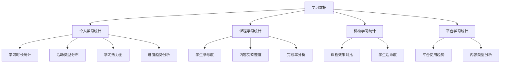
```mermaid
graph TD
    A[学习数据] --> B[个人学习统计]
    A --> C[课程学习统计]
    A --> D[机构学习统计]
    A --> E[平台学习统计]

    B --> B1[学习时长统计]
    B --> B2[活动类型分布]
    B --> B3[学习热力图]
    B --> B4[进度趋势分析]

    C --> C1[学生参与度]
    C --> C2[内容受欢迎度]
    C --> C3[完成率分析]

    D --> D1[课程效果对比]
    D --> D2[学生活跃度]

    E --> E1[平台使用趋势]
    E --> E2[内容类型分析]
```

系统实现了多层次的学习数据分析：
1. **个人学习统计**：帮助学生了解自己的学习情况
2. **课程学习统计**：帮助教师评估课程效果
3. **机构学习统计**：帮助机构管理者了解整体教学情况
4. **平台学习统计**：帮助平台管理员了解系统使用情况

### 6.4 设计优势

这种学习统计与进度管理设计具有以下优势：

1. **高效数据收集**：
   - Redis缓存减轻数据库压力
   - 前端定期记录减少请求次数
   - 定时聚合优化数据存储

2. **智能进度管理**：
   - 复习模式识别确保进度准确性
   - 单向进度更新提供良好用户体验
   - 小节索引计算实现精确进度跟踪

3. **丰富数据分析**：
   - 多维度学习数据分析
   - 可视化展示学习情况
   - 支持教学决策和学习改进

4. **系统性能优化**：
   - 减少数据库写入频率
   - 批量处理提高效率
   - 缓存策略优化查询性能

## 7. 总结

系统设计充分考虑了教育场景的特殊需求，通过灵活的数据结构和处理机制，实现了高效的内容管理和学习体验。

题目管理模块采用了灵活的异构设计，支持多种题型，特别是不定项选择题。通过将题目基本信息与选项信息分离，实现了统一的数据结构和处理逻辑。

课程管理模块采用了三级层级结构和工作区/发布版本分离设计，实现了灵活的内容组织和版本管理。这种设计既满足了内容创作的灵活性需求，又保证了学习体验的稳定性。

认证与权限管理模块采用了基于JWT的无状态认证机制和基于角色的访问控制模型，实现了安全、高效的用户认证和权限控制。通过在JWT令牌中嵌入机构ID，优雅地实现了多租户数据隔离。

媒体存储模块采用了双重存储策略和分片上传机制，实现了对多媒体资源的高效管理和大文件上传。通过直接从前端上传到MinIO的设计，优化了服务器资源使用，提高了系统整体性能。

学习统计与进度管理模块采用了Redis与数据库结合的方式，实现了高效的学习数据收集和分析。通过智能的进度更新机制和丰富的数据分析功能，为用户提供了全面的学习支持。

系统通过多线程并发处理实现高效的批量操作，每个题目使用独立事务处理，确保了批量操作的稳定性和可靠性。这种设计既满足了业务需求的多样性，又保证了系统在大数据量处理时的性能。
