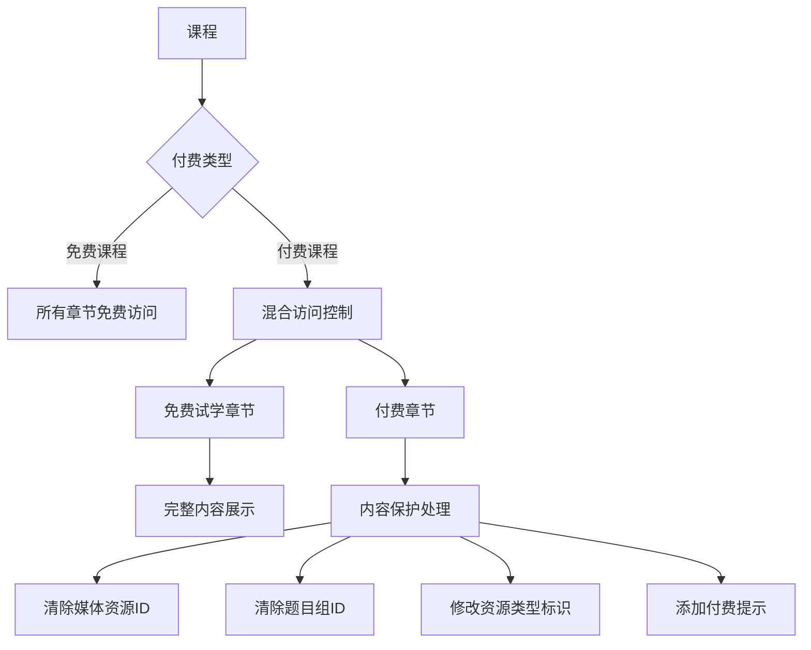
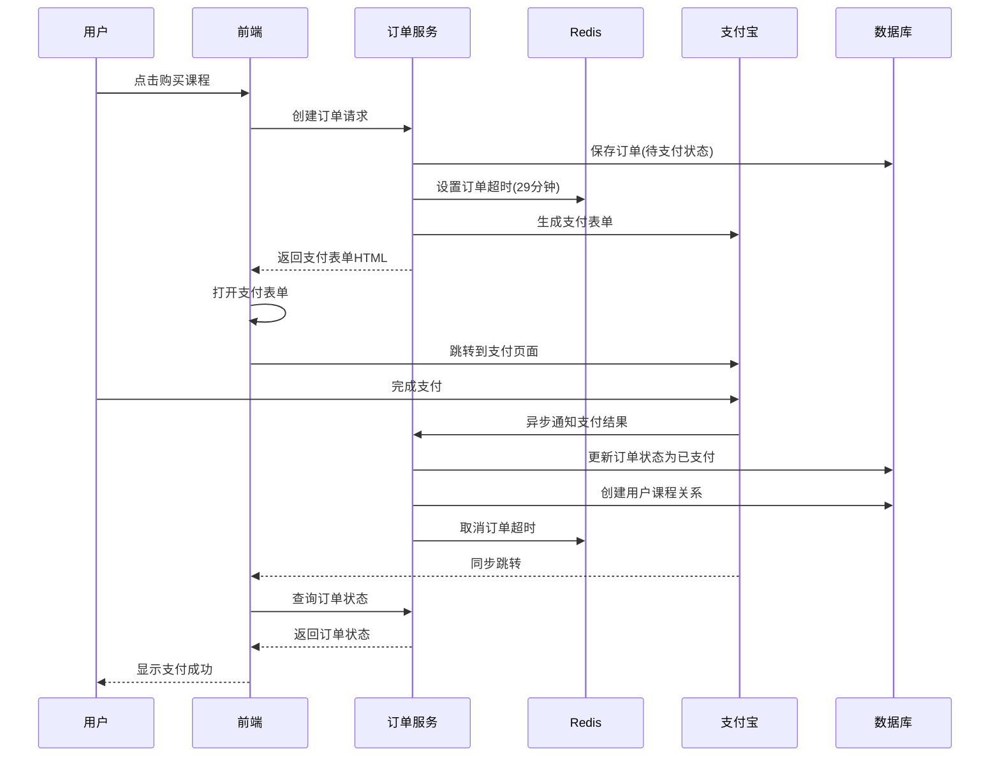
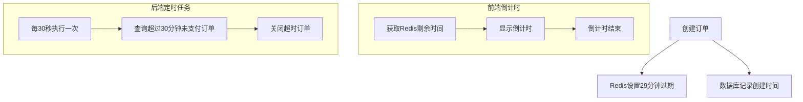
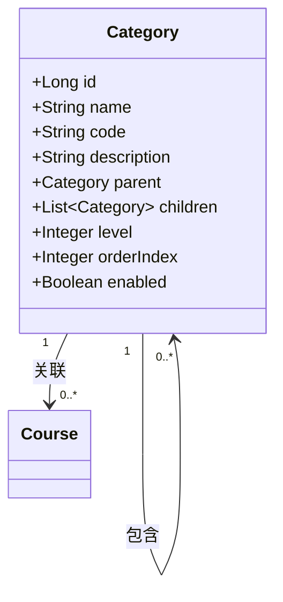
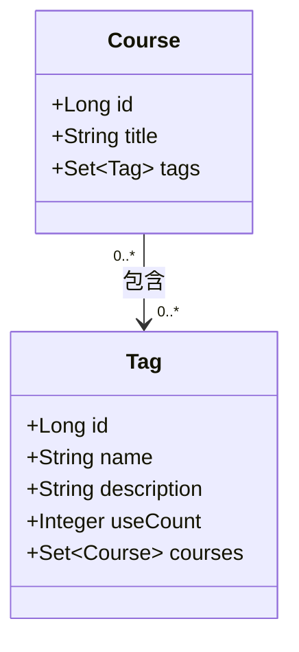

# 系统设计文档（续）

## 8. 课程试看功能设计

系统实现了灵活的课程试看功能，允许用户在购买前预览部分课程内容，同时保护付费内容的安全。

### 8.1 试看机制设计

系统通过章节级别的访问控制实现了课程试看功能，使课程创建者可以精确控制哪些内容可以免费试看：



#### 8.1.1 章节访问类型设计

系统定义了两种章节访问类型，实现了灵活的试看控制：

| 类型值 | 类型名称 | 说明 |
|-------|---------|------|
| 0 | FREE_TRIAL | 免费试学章节，无需购买即可访问 |
| 1 | PAID_ONLY | 付费章节，需要购买课程后才能访问 |

在创建或编辑章节时，系统会根据课程的付费类型自动处理章节的访问类型：

```java
// 设置访问类型
Integer accessType = dto.getAccessType();
if (course.getPaymentType().equals(CoursePaymentType.FREE.getValue())) {
    // 如果课程是免费的，章节必须是免费的
    accessType = ChapterAccessType.FREE_TRIAL.getValue();
} else {
    // 如果课程是付费的，默认章节为付费，但允许设置为免费试看
    if (accessType == null) {
        accessType = ChapterAccessType.PAID_ONLY.getValue();
    } else if (!accessType.equals(ChapterAccessType.FREE_TRIAL.getValue()) &&
               !accessType.equals(ChapterAccessType.PAID_ONLY.getValue())) {
        throw new BusinessException(400, "无效的访问类型");
    }
}
```

这种设计确保了：
- 免费课程的所有章节都是免费访问的
- 付费课程可以灵活设置哪些章节免费试看，哪些章节需要付费
- 课程创建者可以通过设置部分精选内容为免费试看，吸引用户购买完整课程

#### 8.1.2 内容保护机制

系统在返回课程结构时，对付费章节的内容进行了保护处理，确保付费内容不被未授权访问：

```java
// 对于付费课程且用户未注册/购买，处理章节和小节的展示
structureVO.getChapters().forEach(chapterVO -> {
    if (ChapterAccessType.PAID_ONLY.getValue().equals(chapterVO.getAccessType())) {
        // 对于付费章节，保留小节但清除敏感资源信息
        chapterVO.getSections().forEach(sectionVO -> {
            // 清除媒体资源ID
            sectionVO.setMediaId(null);
            // 清除题目组ID
            sectionVO.setQuestionGroupId(null);
            // 清除资源类型鉴别器，避免前端误判有资源
            sectionVO.setResourceTypeDiscriminator("NONE");
            // 其他可能的资源相关字段也需要清除
            sectionVO.setMediaResourceType(null);

            // 添加付费标记或提示信息
            if (sectionVO.getDescription() == null) {
                sectionVO.setDescription("这是付费内容，购买课程后可查看");
            } else if (!sectionVO.getDescription().contains("付费内容")) {
                sectionVO.setDescription(sectionVO.getDescription() + " (付费内容，购买后可查看)");
            }
        });
    }
    // 免费试学章节保持不变
});
```

这种设计实现了多层次的内容保护：
1. 保留课程的完整结构，让用户可以看到所有章节和小节的标题
2. 对于免费试学章节，完整展示其内容，包括视频、文档或题目
3. 对于付费章节，清除所有资源ID和类型标识，防止资源泄露
4. 添加明确的付费标记，引导用户购买完整课程

#### 8.1.3 资源访问控制

系统在用户请求访问具体资源（如视频、文档或题目）时，会进行严格的权限检查：

```java
// 检查用户是否已购买课程
boolean hasPurchased = userCourseService.hasPurchasedCourse(userId, courseId);
if (!hasPurchased) {
    throw new BusinessException(403, "请先购买课程再访问资源");
}

// 检查小节资源类型
if (!"MEDIA".equals(section.getResourceTypeDiscriminator())) {
    throw new ResourceNotFoundException("该小节不是媒体类型资源");
}

Long mediaId = section.getMediaId();
if (mediaId == null) {
    throw new ResourceNotFoundException("小节未关联媒体资源");
}

// 获取媒体资源（包含临时访问URL）
MediaVO mediaVO = mediaService.getMediaByIdForPreview(mediaId);
```

这种设计确保了：
- 用户必须购买课程才能访问付费内容
- 即使用户知道资源ID，也无法绕过权限检查直接访问
- 系统会验证资源类型和关联关系，防止非法访问

### 8.2 前端试看体验设计

系统在前端实现了流畅的试看体验，清晰区分免费试看内容和付费内容：

```tsx
export function CourseContentPlayer({ section }: CourseContentPlayerProps) {
  const [loading, setLoading] = useState(true);
  const [error, setError] = useState<string | null>(null);
  const [media, setMedia] = useState<MediaVO | null>(null);
  const [questionGroup, setQuestionGroup] = useState<QuestionGroup | null>(null);

  // 加载小节资源
  useEffect(() => {
    async function loadSectionResources() {
      try {
        setLoading(true);
        setError(null);

        // 重置资源状态
        setMedia(null);
        setQuestionGroup(null);

        // 根据资源类型加载对应资源
        if (section.resourceTypeDiscriminator === 'MEDIA' && section.mediaId) {
          const mediaData = await mediaService.getMediaInfo(section.mediaId);
          if (mediaData && mediaData.data) {
            setMedia(mediaData.data);
            // 获取媒体访问URL
            await fetchMediaAccessUrl(mediaData.data.id);
          }
        } else if (section.resourceTypeDiscriminator === 'QUESTION_GROUP' && section.questionGroupId) {
          const groupData = await questionGroupService.getQuestionGroupById(section.questionGroupId);
          if (groupData) {
            setQuestionGroup(groupData);
          }
        }
      } catch (err) {
        // 处理错误，包括未购买课程的情况
        setError(err.message || '加载资源失败');
      } finally {
        setLoading(false);
      }
    }

    if (section) {
      loadSectionResources();
    }
  }, [section]);
}
```

前端会根据章节的访问类型和资源加载状态，显示不同的内容：
- 对于免费试看章节，显示完整的视频播放器、文档阅读器或题目组
- 对于付费章节，显示购买提示和课程介绍
- 加载失败时（如未购买课程），显示友好的错误提示和购买按钮

### 8.3 设计优势

课程试看功能的设计具有以下优势：

1. **精确的访问控制**：在章节级别设置访问权限，课程创建者可以精确控制试看内容
2. **多层次内容保护**：通过清除资源ID、修改资源类型和严格的权限检查，确保付费内容安全
3. **完整的课程结构展示**：用户可以看到完整的课程大纲，了解课程全貌
4. **清晰的付费标记**：系统自动为付费内容添加明确标记，引导用户购买
5. **流畅的试看体验**：前端实现了流畅的试看体验，包括视频播放、文档阅读和题目练习
6. **灵活的商业模式支持**：支持"部分免费试看+付费解锁全部"的商业模式，提高课程转化率

## 9. 支付系统设计

系统实现了完整的支付流程，集成了支付宝支付接口，并通过Redis实现了高效的订单超时处理机制。

### 9.1 支付流程设计

系统的支付流程如下图所示：



### 9.2 订单超时处理设计

系统实现了两种机制来处理订单超时：



1. **Redis倒计时**：
   - 创建订单时在Redis中设置29分钟的过期时间
   - 前端可以查询剩余支付时间并显示倒计时
   - 设计为29分钟，比定时任务的30分钟稍短

2. **定时任务检查**：
   - 每30秒运行一次定时任务
   - 检查数据库中超过30分钟未支付的订单
   - 将这些订单状态更新为已关闭

3. **双重保障**：
   - Redis提供实时的倒计时显示
   - 定时任务确保即使Redis出现问题，订单也能正确关闭
   - 两种机制互为补充，提高系统可靠性

### 9.3 Redis订单超时实现

Redis订单超时服务的核心实现：

```java
/**
 * 设置订单超时计时
 * @param orderNo 订单号
 * @param userId 用户ID
 * @param orderId 订单ID
 */
public void setOrderTimeout(String orderNo, Long userId, Long orderId) {
    String key = ORDER_TIMEOUT_PREFIX + orderNo;
    log.info("设置订单超时计时，订单号：{}，用户ID：{}，超时时间：29分钟", orderNo, userId);

    // 存储订单ID和用户ID，用于查询
    OrderTimeoutInfo timeoutInfo = new OrderTimeoutInfo(orderId, userId, orderNo);

    // 设置29分钟超时（比定时任务的30分钟稍短，确保在定时任务检查前Redis已过期）
    redisTemplate.opsForValue().set(key, timeoutInfo, 29, TimeUnit.MINUTES);
}

/**
 * 获取订单剩余支付时间（秒）
 * @param orderNo 订单号
 * @return 剩余秒数，如果不存在则返回0
 */
public long getOrderRemainingTime(String orderNo) {
    String key = ORDER_TIMEOUT_PREFIX + orderNo;
    Long remainingTime = redisTemplate.getExpire(key, TimeUnit.SECONDS);
    return remainingTime != null && remainingTime > 0 ? remainingTime : 0;
}
```

### 9.4 定时任务实现

订单超时定时任务的核心实现：

```java
/**
 * 处理超时订单
 * 每隔30秒检查一次，关闭超过30分钟未支付的订单
 */
@Scheduled(fixedRate = 30000) // 30秒执行一次
@Transactional
public void handleTimeoutOrders() {
    log.info("开始处理超时订单...");

    // 查找超过30分钟未支付的订单
    LocalDateTime timeoutThreshold = LocalDateTime.now().minusMinutes(30);
    List<Order> timeoutOrders = orderRepository.findByStatusAndCreatedAtBefore(
            OrderStatus.PENDING.getValue(), timeoutThreshold);

    log.info("发现{}个超时订单需要处理", timeoutOrders.size());

    for (Order order : timeoutOrders) {
        try {
            // 先检查Redis中订单是否真的已超时（双重检查，防止定时任务与Redis的时间差）
            long remainingTime = redisOrderService.getOrderRemainingTime(order.getOrderNo());

            // 如果Redis中显示已经超时或者Redis中已没有这个订单记录
            if (remainingTime <= 0) {
                // 通过OrderService关闭订单，保证业务逻辑统一
                orderService.cancelOrder(order.getId(), order.getUser().getId());
                log.info("成功关闭超时订单：{}，订单号：{}", order.getId(), order.getOrderNo());
            }
        } catch (Exception e) {
            log.error("关闭超时订单失败：{}，订单号：{}", order.getId(), order.getOrderNo(), e);
        }
    }
}
```

### 9.5 设计优势

支付系统设计具有以下优势：

1. **集成主流支付平台**：支持支付宝支付，便于用户完成支付
2. **双重订单超时机制**：Redis倒计时和定时任务相结合，确保订单状态一致性
3. **实时倒计时显示**：前端可以实时显示订单剩余支付时间，提升用户体验
4. **高可靠性**：即使Redis服务异常，定时任务也能确保订单正确关闭
5. **完整的支付流程**：支持订单创建、支付、查询、取消等完整流程
6. **异步通知处理**：支持支付宝的异步通知，确保支付结果可靠处理

## 10. 课程分类与标签设计

系统实现了灵活的课程分类和标签管理功能，支持多层级分类结构和多对多的标签关联。

### 10.1 课程分类设计

系统采用树形结构设计课程分类，支持多级分类：



分类实体的核心设计：

```java
@Entity
@Table(name = "categories")
public class Category extends BaseEntity {
    @Column(nullable = false, length = 100)
    private String name;

    @Column(nullable = false, unique = true, length = 50)
    private String code;

    @Column(length = 500)
    private String description;

    @ManyToOne(fetch = FetchType.LAZY)
    @JoinColumn(name = "parent_id")
    private Category parent;

    @OneToMany(mappedBy = "parent", cascade = CascadeType.ALL)
    private List<Category> children = new ArrayList<>();

    private Integer level;

    private Integer orderIndex;

    private Boolean enabled;
}
```

### 10.2 课程标签设计

系统采用多对多关系设计课程标签：



标签实体的核心设计：

```java
@Entity
@Table(name = "tags")
public class Tag extends BaseEntity {
    @Column(nullable = false, unique = true, length = 50)
    private String name;

    @Column(length = 255)
    private String description;

    @Builder.Default
    private Integer useCount = 0;

    @ManyToMany(mappedBy = "tags")
    @JsonIgnore
    private Set<Course> courses = new HashSet<>();

    public void incrementUseCount() {
        if (this.useCount == null) {
            this.useCount = 1;
        } else {
            this.useCount++;
        }
    }

    public void decrementUseCount() {
        if (this.useCount != null && this.useCount > 0) {
            this.useCount--;
        }
    }
}
```

课程与标签的关联设计：

```java
@Entity
@Table(name = "courses")
public class Course extends BaseEntity {
    // 其他字段...

    @ManyToMany
    @JoinTable(
        name = "course_tags",
        joinColumns = @JoinColumn(name = "course_id"),
        inverseJoinColumns = @JoinColumn(name = "tag_id")
    )
    private Set<Tag> tags = new HashSet<>();

    @ManyToOne(fetch = FetchType.LAZY)
    @JoinColumn(name = "category_id")
    private Category category;

    // 其他字段和方法...
}
```

### 10.3 课程分类和标签查询设计

系统实现了高效的分类和标签查询功能：

```java
@Override
@Transactional(readOnly = true)
public Page<CourseVO> getCoursesByCategoryId(Long categoryId, Boolean publishedOnly, Pageable pageable) {
    // 验证分类是否存在
    Category category = categoryRepository.findById(categoryId)
            .orElseThrow(() -> new ResourceNotFoundException("分类不存在，ID: " + categoryId));

    // 使用Specification构建查询条件
    Specification<Course> spec = (root, query, cb) -> {
        List<Predicate> predicates = new ArrayList<>();

        // 添加分类ID条件
        predicates.add(cb.equal(root.get("category").get("id"), categoryId));

        // 如果只返回发布版本，添加发布版本条件
        if (Boolean.TRUE.equals(publishedOnly)) {
            predicates.add(cb.equal(root.get("isPublishedVersion"), true));
        }

        return cb.and(predicates.toArray(new Predicate[0]));
    };

    // 执行查询
    Page<Course> coursePage = courseRepository.findAll(spec, pageable);

    // 转换为VO并返回
    return coursePage.map(CourseVO::fromEntity);
}
```

### 10.4 设计优势

课程分类与标签设计具有以下优势：

1. **灵活的分类结构**：支持多级分类，满足复杂的课程组织需求
2. **多对多标签关联**：一个课程可以有多个标签，一个标签可以关联多个课程
3. **使用计数跟踪**：标签自动跟踪使用次数，便于统计和排序
4. **高效查询支持**：使用JPA Specification实现灵活的条件查询
5. **发布版本过滤**：支持只返回已发布课程的查询，提高数据质量
6. **分页查询优化**：所有查询都支持分页，提高大数据量下的性能
