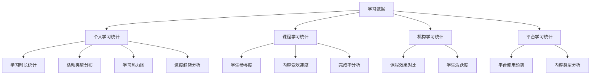

# 系统设计文档（续2）

## 11. 可视化图表与缓存设计

系统实现了丰富的数据可视化功能，并通过Redis缓存优化了图表数据的加载性能。

### 11.1 学习数据可视化设计

系统基于收集的学习数据，提供了多种可视化图表：



#### 11.1.1 学习热力图设计

学习热力图是系统的核心可视化功能之一，用于展示用户学习活动的时间分布：

```java
/**
 * 学习热力图视图对象
 * 用于展示按星期几和小时分组的学习时长统计
 */
@Data
@Builder
@NoArgsConstructor
@AllArgsConstructor
public class LearningHeatmapVO {
    /**
     * 课程ID
     */
    private Long courseId;

    /**
     * 热力图数据
     * 按小时和星期几分组的学习时长统计
     */
    private Map<Integer, Map<Integer, Integer>> heatmapData; // 外层Map: 星期几(1-7) -> 内层Map: 小时(0-23) -> 学习时长(秒)

    /**
     * 最大学习时长(秒)
     * 用于前端计算热度颜色
     */
    private Integer maxActivityCount;
}
```

#### 11.1.2 学习进度趋势设计

学习进度趋势图用于展示用户学习进度的变化情况：

```java
/**
 * 学习进度趋势视图对象
 * 用于展示用户学习进度随时间的变化
 */
@Data
@Builder
@NoArgsConstructor
@AllArgsConstructor
public class LearningProgressTrendVO {
    /**
     * 课程ID
     */
    private Long courseId;

    /**
     * 用户ID
     */
    private Long userId;

    /**
     * 趋势数据
     * 键: 日期字符串 (yyyy-MM-dd格式)
     * 值: 该日期的学习进度(百分比)
     */
    private Map<String, Integer> trendData;
}
```

### 11.2 缓存设计

系统使用Redis实现了多层次的缓存策略，优化图表数据的加载性能。

#### 11.2.1 缓存配置设计

系统定义了多种缓存类型，针对不同的数据设置不同的过期时间：

```java
// 缓存名称常量
public static final String USER_CACHE = "userCache";
public static final String PERMISSION_CACHE = "permissions";
public static final String ROLE_CACHE = "roles";
public static final String QUOTA_STATS_CACHE = "quotaStats_v2";
public static final String MEDIA_ACTIVITY_CACHE = "mediaActivity";
public static final String MEDIA_STATS_CACHE = "mediaStats";
public static final String USER_STATS_CACHE = "userStats";
public static final String INSTITUTION_STATS_CACHE = "institutionStats";
public static final String COURSE_STATS_CACHE = "courseStats";
public static final String ADMIN_STATS_CACHE = "adminStats";

// 缓存时间常量（分钟）
private static final long DEFAULT_EXPIRE_MINUTES = 30;
private static final long USER_EXPIRE_MINUTES = 60;
private static final long PERMISSION_EXPIRE_MINUTES = 120;
private static final long ROLE_EXPIRE_MINUTES = 120;
private static final long QUOTA_STATS_EXPIRE_MINUTES = 15;
private static final long MEDIA_ACTIVITY_EXPIRE_MINUTES = 30;
private static final long MEDIA_STATS_EXPIRE_MINUTES = 15;
private static final long USER_STATS_EXPIRE_MINUTES = 15;
private static final long INSTITUTION_STATS_EXPIRE_MINUTES = 15;
private static final long COURSE_STATS_EXPIRE_MINUTES = 15;
private static final long ADMIN_STATS_EXPIRE_MINUTES = 15;
```

#### 11.2.2 缓存注解应用

系统使用Spring Cache注解实现了声明式缓存：

```java
@Override
@Transactional(readOnly = true)
@Cacheable(value = CacheConfig.ADMIN_STATS_CACHE, 
          key = "'course_heatmap_' + #courseId + '_' + #startDate + '_' + #endDate")
public LearningHeatmapVO getCourseLearningHeatmap(Long courseId, LocalDate startDate, LocalDate endDate) {
    log.info("获取课程学习热力图数据, 课程ID: {}, 开始日期: {}, 结束日期: {}",
            courseId, startDate, endDate);

    // 验证课程存在
    courseRepository.findById(courseId)
            .orElseThrow(() -> new ResourceNotFoundException("课程不存在"));

    LocalDateTime startDateTime = startDate.atStartOfDay();
    LocalDateTime endDateTime = endDate.atTime(LocalTime.MAX);

    // 查询热力图数据
    List<Object[]> results = learningRecordRepository.findLearningHeatmapDataByCourse(
            courseId, startDateTime, endDateTime);
            
    // 处理数据并返回...
}
```

#### 11.2.3 缓存清除设计

系统实现了手动缓存清除功能，便于演示和测试：

```java
/**
 * 缓存管理控制器
 */
@Slf4j
@RestController
@RequestMapping("/api/admin/cache")
@RequiredArgsConstructor
@PreAuthorize("hasRole('ADMIN')")
public class AdminCacheController {

    private final CacheManager cacheManager;

    /**
     * 清除所有缓存
     *
     * @return 清除的缓存名称列表
     */
    @PostMapping("/clear-all")
    @ResponseStatus(HttpStatus.OK)
    public Result<List<String>> clearAllCaches() {
        log.info("管理员请求清除所有缓存");
        
        List<String> clearedCaches = new ArrayList<>();
        
        // 清除所有已知的缓存
        clearCache(CacheConfig.USER_CACHE, clearedCaches);
        clearCache(CacheConfig.PERMISSION_CACHE, clearedCaches);
        clearCache(CacheConfig.ROLE_CACHE, clearedCaches);
        clearCache(CacheConfig.QUOTA_STATS_CACHE, clearedCaches);
        clearCache(CacheConfig.MEDIA_ACTIVITY_CACHE, clearedCaches);
        clearCache(CacheConfig.MEDIA_STATS_CACHE, clearedCaches);
        clearCache(CacheConfig.USER_STATS_CACHE, clearedCaches);
        clearCache(CacheConfig.INSTITUTION_STATS_CACHE, clearedCaches);
        clearCache(CacheConfig.COURSE_STATS_CACHE, clearedCaches);
        clearCache(CacheConfig.ADMIN_STATS_CACHE, clearedCaches);
        
        log.info("成功清除 {} 个缓存", clearedCaches.size());
        return Result.success(clearedCaches);
    }
    
    /**
     * 清除指定名称的缓存
     */
    private void clearCache(String cacheName, List<String> clearedCaches) {
        try {
            if (cacheManager.getCache(cacheName) != null) {
                cacheManager.getCache(cacheName).clear();
                clearedCaches.add(cacheName);
                log.info("已清除缓存: {}", cacheName);
            }
        } catch (Exception e) {
            log.error("清除缓存 {} 时发生错误: {}", cacheName, e.getMessage());
        }
    }
}
```

前端也实现了缓存清除按钮组件：

```tsx
/**
 * 清除缓存按钮组件
 * 用于管理员清除系统缓存
 */
export function ClearCacheButton() {
  const [isClearing, setIsClearing] = useState(false);
  const { toast } = useToast();

  const handleClearCache = async () => {
    setIsClearing(true);
    try {
      const clearedCaches = await adminCacheService.clearAllCaches();
      toast({
        title: '缓存清除成功',
        description: `已清除 ${clearedCaches.length} 个缓存: ${clearedCaches.join(', ')}`,
        variant: 'default',
      });
    } catch (error) {
      console.error('清除缓存失败:', error);
      toast({
        title: '清除缓存失败',
        description: '请稍后重试或联系系统管理员',
        variant: 'destructive',
      });
    } finally {
      setIsClearing(false);
    }
  };
  
  // 渲染按钮...
}
```

### 11.3 前端缓存设计

前端也实现了简单的缓存机制，减少对后端的请求：

```typescript
// 缓存最长有效期（毫秒）：5分钟
export const MAX_CACHE_AGE = 5 * 60 * 1000;

// 缓存时间戳记录
const cacheTimestamps: Record<string, number> = {};

/**
 * 判断缓存是否已过期
 * @param key 缓存键
 * @param maxAge 最大有效期（毫秒），默认为 MAX_CACHE_AGE
 * @returns 是否已过期
 */
export function isCacheExpired(key: string, maxAge: number = MAX_CACHE_AGE): boolean {
  const timestamp = cacheTimestamps[key];
  if (!timestamp) return true;
  
  const now = Date.now();
  return now - timestamp > maxAge;
}

/**
 * 设置缓存并记录时间戳
 * @param key 缓存键
 * @param data 要缓存的数据
 * @returns 原始数据（方便链式调用）
 */
export function setCache<T>(key: string, data: T): T {
  cacheTimestamps[key] = Date.now();
  return data;
}

/**
 * 清除指定键的缓存
 * @param key 缓存键
 */
export function clearCache(key: string): void {
  delete cacheTimestamps[key];
}

/**
 * 清除所有缓存
 */
export function clearAllCache(): void {
  Object.keys(cacheTimestamps).forEach(key => {
    delete cacheTimestamps[key];
  });
}
```

### 11.4 设计优势

可视化图表与缓存设计具有以下优势：

1. **丰富的可视化类型**：支持热力图、趋势图、统计图等多种可视化方式
2. **多层次数据分析**：从个人、课程、机构到平台级别的全方位数据分析
3. **高效的缓存策略**：使用Redis实现服务端缓存，减轻数据库压力
4. **差异化缓存过期**：不同类型的数据设置不同的缓存过期时间
5. **手动缓存清除**：提供管理员手动清除缓存的功能，便于演示和测试
6. **前端缓存优化**：前端实现简单缓存机制，减少对后端的请求次数
7. **声明式缓存**：使用Spring Cache注解实现声明式缓存，代码简洁易维护

## 12. 总结

本文档续写了系统的几个重要模块设计，包括课程试看功能、支付系统、课程分类与标签以及可视化图表与缓存设计。

课程试看功能通过章节级别的访问控制，实现了灵活的内容保护和预览机制，既保护了付费内容，又提供了良好的试看体验。

支付系统集成了支付宝支付接口，并通过Redis实现了高效的订单超时处理机制，确保了支付流程的完整性和可靠性。

课程分类与标签设计支持多层级分类结构和多对多的标签关联，满足了复杂的课程组织和检索需求。

可视化图表与缓存设计提供了丰富的数据可视化功能，并通过多层次的缓存策略优化了系统性能，同时支持手动缓存清除，便于演示和测试。

这些模块的设计充分考虑了在线教育平台的特殊需求，通过灵活的数据结构和处理机制，实现了高效的内容管理和学习体验。系统的整体设计注重用户体验、性能优化和安全性，为用户提供了全面的在线学习支持。
