# 系统设计文档（续3）

## 13. 机构管理设计

系统实现了完整的机构管理功能，包括机构申请、审核、用户管理等，支持多机构并行运营的在线教育平台模式。

### 13.1 机构实体设计

机构是系统中的核心实体之一，拥有自己的用户、课程、题库等资源：

```mermaid
classDiagram
    Institution "1" --> "*" User : 包含
    Institution "1" --> "*" Course : 拥有
    Institution "1" --> "*" Question : 拥有
    Institution "1" --> "*" Media : 存储
    Institution "1" --> "*" StorageQuota : 配置
    Institution "1" --> "*" Order : 关联
    
    class Institution {
        +Long id
        +String name
        +String logo
        +String description
        +Integer status
        +String registerCode
        +String contactPerson
        +String contactPhone
        +String contactEmail
        +String address
    }
```



机构实体的核心设计：

```java
@Entity
@Table(name = "institutions")
public class Institution extends BaseEntity {
    @Column(nullable = false, length = 100)
    private String name;
    
    private String logo;
    
    @Column(length = 500)
    private String description;
    
    @Builder.Default
    private Integer status = 0; // 0-待审核，1-正常，2-禁用
    
    @Column(unique = true, length = 20)
    private String registerCode; // 机构注册码
    
    private String contactPerson;
    private String contactPhone;
    private String contactEmail;
    private String address;
    
    // 关联实体
    @OneToMany(mappedBy = "institution", cascade = CascadeType.ALL)
    private List<Media> mediaList = new ArrayList<>();
    
    @OneToMany(mappedBy = "institution", cascade = CascadeType.ALL)
    private List<StorageQuota> quotas = new ArrayList<>();
    
    @OneToMany(mappedBy = "institution", cascade = CascadeType.ALL)
    private List<Course> courses = new ArrayList<>();
    
    @OneToMany(mappedBy = "institution", cascade = CascadeType.ALL)
    private Set<User> users = new HashSet<>();
    
    @OneToMany(mappedBy = "institution", cascade = CascadeType.ALL)
    private Set<Question> questions = new HashSet<>();
    
    @OneToMany(mappedBy = "institution", cascade = CascadeType.ALL)
    private List<Order> orders = new ArrayList<>();
}
```

### 13.2 机构申请与审核流程

系统实现了完整的机构申请和审核流程：


机构申请实体设计：

```java
@Entity
@Table(name = "institution_applications")
public class InstitutionApplication extends BaseEntity {
    @Column(unique = true, length = 20)
    private String applicationId; // 申请ID（业务编号）
    
    @Column(nullable = false, length = 100)
    private String name; // 机构名称
    
    private String logo; // 机构Logo
    
    @Column(length = 500)
    private String description; // 机构描述
    
    private String contactPerson; // 联系人
    private String contactPhone; // 联系电话
    private String contactEmail; // 联系邮箱
    private String address; // 地址
    
    private Integer status = 0; // 0-待审核，1-已通过，2-已拒绝
    
    private String reviewComment; // 审核结果备注
    private Long reviewerId; // 审核人ID
    private LocalDateTime reviewedAt; // 审核时间
    private Long institutionId; // 关联的机构ID
}
```

### 13.3 机构注册码机制

系统通过注册码实现机构用户的注册和管理：


注册码生成和验证的核心实现：

```java
// 生成唯一的机构注册码
private String generateInstitutionCode() {
    String code;
    boolean exists;

    do {
        // 生成8位随机字母数字组合
        code = RandomStringUtils.randomAlphanumeric(8).toUpperCase();
        exists = institutionRepository.existsByRegisterCode(code);
    } while (exists);

    return code;
}

// 验证机构注册码
@Override
@Transactional
public void registerWithInstitutionCode(InstitutionRegisterDTO registerDTO) {
    // 验证机构注册码
    Institution institution = institutionRepository.findByRegisterCode(registerDTO.getInstitutionCode())
            .orElseThrow(() -> new BusinessException("机构注册码无效"));
    
    if (institution.getStatus() != 1) {
        throw new BusinessException("机构状态异常，无法注册");
    }
    
    // 检查机构成员数量是否已达上限
    long memberCount = userRepository.countByInstitutionId(institution.getId());
    if (memberCount >= MAX_INSTITUTION_MEMBERS) {
        throw new BusinessException("该机构成员数量已达上限，无法注册新成员");
    }
    
    // 创建用户并关联到机构
    User user = User.builder()
            .username(registerDTO.getUsername())
            .password(passwordEncoder.encode(registerDTO.getPassword()))
            .email(registerDTO.getEmail())
            .phone(registerDTO.getPhone())
            .institutionId(institution.getId())
            .status(1)
            .roles(new HashSet<>())
            .build();
    
    // 获取机构角色
    Role institutionRole = roleRepository.findByCode(RoleEnum.INSTITUTION.getCode())
            .orElseThrow(() -> new BusinessException("机构角色不存在"));
    
    // 设置角色
    user.getRoles().add(institutionRole);
    userRepository.save(user);
}
```

### 13.4 机构管理员设计

系统通过邮箱匹配实现机构管理员的识别：


机构管理员判断的核心实现：

```java
/**
 * 检查用户是否为机构管理员
 * @param username 用户名
 * @param institutionId 机构ID
 * @return 是否为机构管理员
 */
@Override
@Transactional(readOnly = true)
public boolean isInstitutionAdmin(String username, Long institutionId) {
    // 查找用户
    User user = userRepository.findByUsername(username)
            .orElseThrow(() -> new BusinessException("用户不存在"));

    // 检查用户是否属于该机构
    if (user.getInstitutionId() == null || !user.getInstitutionId().equals(institutionId)) {
        return false;
    }

    // 获取用户邮箱
    String userEmail = user.getEmail();
    if (userEmail == null || userEmail.isEmpty()) {
        return false;
    }

    // 查找机构
    Institution institution = institutionRepository.findById(institutionId)
            .orElseThrow(() -> new BusinessException("机构不存在"));

    // 获取机构联系邮箱
    String institutionEmail = institution.getContactEmail();
    if (institutionEmail == null || institutionEmail.isEmpty()) {
        return false;
    }

    // 比较邮箱是否匹配
    return userEmail.equalsIgnoreCase(institutionEmail);
}
```

在安全工具类中的应用：

```java
/**
 * 检查当前用户是否是机构管理员
 * 通过比较用户邮箱和机构联系邮箱判断
 */
public static boolean isInstitutionAdmin() {
    // 首先检查是否为机构用户
    if (!hasRole("INSTITUTION")) {
        return false;
    }
    
    try {
        // 获取当前用户名和机构ID
        String username = getCurrentUsername();
        Long institutionId = getCurrentInstitutionId();
        
        // 如果无法获取机构ID，则不是机构管理员
        if (institutionId == null || institutionId == 0L) {
            return false;
        }
        
        // 使用机构服务判断用户是否为机构管理员
        return institutionService.isInstitutionAdmin(username, institutionId);
    } catch (Exception e) {
        return false;
    }
}
```

### 13.5 设计优势

机构管理设计具有以下优势：

1. **完整的申请审核流程**：支持机构申请、审核、通知的完整流程
2. **注册码机制**：通过唯一注册码控制机构用户注册，确保安全性
3. **机构管理员识别**：基于邮箱匹配的简单有效的管理员识别机制
4. **资源隔离**：每个机构拥有独立的用户、课程、题库等资源
5. **多租户支持**：系统设计支持多机构并行运营，实现多租户架构
6. **邮件通知集成**：关键流程节点自动发送邮件通知，提升用户体验

## 14. 用户注册与验证码设计

系统实现了安全可靠的用户注册流程，结合了图形验证码和邮箱验证码的双重验证机制。

### 14.1 验证码机制设计

系统实现了两种验证码机制：图形验证码和邮箱验证码：


#### 14.1.1 图形验证码设计

系统使用Kaptcha库生成图形验证码，并通过Redis存储验证码信息：

```java
/**
 * 验证码配置
 */
@Configuration
public class KaptchaConfig {
    @Bean
    public DefaultKaptcha captchaProducer() {
        DefaultKaptcha defaultKaptcha = new DefaultKaptcha();
        Properties properties = new Properties();
        // 图片宽度
        properties.setProperty("kaptcha.image.width", "150");
        // 图片高度
        properties.setProperty("kaptcha.image.height", "50");
        // 字体大小
        properties.setProperty("kaptcha.textproducer.font.size", "38");
        // 字体颜色
        properties.setProperty("kaptcha.textproducer.font.color", "0,0,0");
        // 字体
        properties.setProperty("kaptcha.textproducer.font.names", "Arial,Courier");
        // 字符间距
        properties.setProperty("kaptcha.textproducer.char.space", "5");
        // 验证码长度
        properties.setProperty("kaptcha.textproducer.char.length", "4");
        // 干扰线颜色
        properties.setProperty("kaptcha.noise.color", "blue");
        // 图片边框
        properties.setProperty("kaptcha.border", "no");
        
        Config config = new Config(properties);
        defaultKaptcha.setConfig(config);
        return defaultKaptcha;
    }
}
```

图形验证码生成和验证的核心实现：

```java
/**
 * 生成验证码
 * @param captchaKey 验证码标识
 * @return 验证码图片
 */
@Override
public BufferedImage generateCaptcha(String captchaKey) {
    // 生成验证码文本
    String captchaText = captchaProducer.createText();
    
    // 保存验证码到Redis
    String redisKey = CAPTCHA_PREFIX + captchaKey;
    redisTemplate.opsForValue().set(redisKey, captchaText, CAPTCHA_EXPIRATION, TimeUnit.SECONDS);
    
    // 生成验证码图片
    return captchaProducer.createImage(captchaText);
}

/**
 * 验证验证码
 * @param captchaKey 验证码标识
 * @param captchaCode 验证码
 * @return 是否验证成功
 */
@Override
public boolean validateCaptcha(String captchaKey, String captchaCode) {
    if (!StringUtils.hasText(captchaKey) || !StringUtils.hasText(captchaCode)) {
        return false;
    }
    
    // 从Redis获取验证码
    String redisKey = CAPTCHA_PREFIX + captchaKey;
    Object value = redisTemplate.opsForValue().get(redisKey);
    
    if (value == null) {
        return false;
    }
    
    // 验证后删除验证码
    redisTemplate.delete(redisKey);
    
    // 忽略大小写比较
    return captchaCode.equalsIgnoreCase(value.toString());
}
```

#### 14.1.2 邮箱验证码设计

系统实现了邮箱验证码机制，用于用户注册、邮箱更新和密码重置：

```java
/**
 * 生成验证码
 * @return 6位数字验证码
 */
@Override
public String generateVerificationCode() {
    Random random = new Random();
    // 生成6位数字验证码
    return String.format("%06d", random.nextInt(1000000));
}

/**
 * 保存验证码到Redis
 * @param email 邮箱
 * @param code 验证码
 */
@Override
public void saveVerificationCode(String email, String code) {
    String key = verificationCodePrefix + email;
    redisTemplate.opsForValue().set(key, code, verificationCodeExpiration, TimeUnit.MINUTES);
}

/**
 * 验证验证码
 * @param email 邮箱
 * @param code 验证码
 * @return 是否验证成功
 */
@Override
public boolean validateVerificationCode(String email, String code) {
    String key = verificationCodePrefix + email;
    String savedCode = redisTemplate.opsForValue().get(key);
    if (savedCode != null && savedCode.equals(code)) {
        // 验证成功后删除验证码
        redisTemplate.delete(key);
        return true;
    }
    return false;
}
```

### 14.2 邮件服务设计

系统集成了Spring Email实现邮件发送功能，支持多种邮件模板：

```java
/**
 * 发送验证码邮件
 * @param to 收件人邮箱
 * @param code 验证码
 */
@Override
public void sendVerificationCode(String to, String code) {
    try {
        MimeMessage message = mailSender.createMimeMessage();
        MimeMessageHelper helper = new MimeMessageHelper(message, true);
        helper.setFrom(emailFrom);
        helper.setTo(to);
        helper.setSubject("在线课程平台 - 邮箱验证码");
        
        // 使用Thymeleaf模板引擎渲染邮件内容
        Context context = new Context();
        context.setVariable("code", code);
        context.setVariable("expirationMinutes", verificationCodeExpiration);
        String content = templateEngine.process("email/verification-code", context);
        
        helper.setText(content, true);
        mailSender.send(message);
    } catch (MessagingException e) {
        throw new RuntimeException("验证码邮件发送失败", e);
    }
}
```

### 14.3 用户注册流程设计

系统实现了完整的用户注册流程，包括普通用户注册和机构用户注册：


### 14.4 密码重置设计

系统实现了基于邮箱验证的密码重置功能：

```java
/**
 * 重置密码
 * @param resetDTO 重置密码请求
 */
@Override
@Transactional
public void resetPassword(PasswordResetDTO resetDTO) {
    // 验证邮箱验证码
    if (!emailService.validateVerificationCode(resetDTO.getEmail(), resetDTO.getEmailCode())) {
        throw new BusinessException("邮箱验证码错误或已过期");
    }
    
    // 查找用户
    User user = userRepository.findByEmail(resetDTO.getEmail())
            .orElseThrow(() -> new BusinessException("用户不存在"));
    
    // 生成临时密码
    String tempPassword = emailService.generateTempPassword();
    
    // 更新用户密码
    user.setPassword(passwordEncoder.encode(tempPassword));
    user.setUpdatedAt(LocalDateTime.now());
    userRepository.save(user);
    
    // 发送临时密码邮件
    emailService.sendPasswordResetEmail(resetDTO.getEmail(), tempPassword);
}
```

### 14.5 设计优势

用户注册与验证码设计具有以下优势：

1. **双重验证机制**：结合图形验证码和邮箱验证码，提高安全性
2. **Redis存储验证码**：使用Redis存储验证码，支持过期时间设置和分布式部署
3. **邮件模板支持**：使用Thymeleaf模板引擎渲染邮件内容，提升用户体验
4. **多种验证场景**：支持用户注册、邮箱更新、密码重置等多种验证场景
5. **一次性验证码**：验证成功后立即删除验证码，确保安全性
6. **临时密码机制**：密码重置使用临时密码，用户首次登录后需要修改密码
