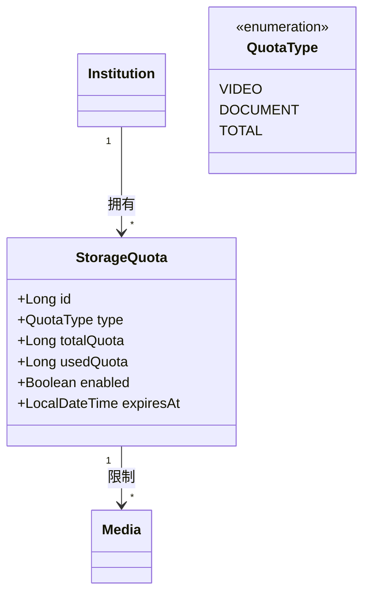
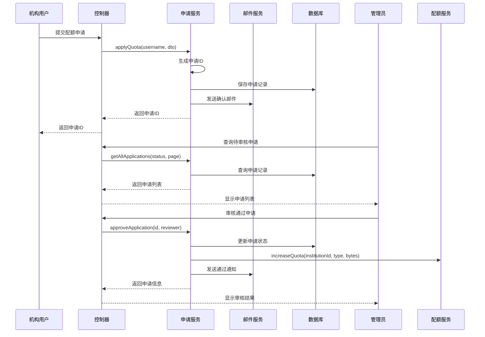

# 系统设计文档（续4）

## 15. 资源管理与配额限制设计

系统实现了完整的资源管理和配额限制功能，确保机构用户在使用系统资源时受到合理的限制和管理。

### 15.1 存储配额设计

系统通过存储配额机制控制机构用户的资源使用：



#### 15.1.1 配额实体设计

系统定义了存储配额实体，用于跟踪和管理机构的资源使用：

```java
/**
 * 存储配额实体
 */
@Entity
@Table(name = "storage_quota")
public class StorageQuota {
    @Id
    @GeneratedValue(strategy = GenerationType.IDENTITY)
    private Long id;
    
    /**
     * 配额类型
     */
    @Enumerated(EnumType.STRING)
    private QuotaType type;
    
    /**
     * 总配额(字节)
     */
    private Long totalQuota;
    
    /**
     * 已使用配额(字节)
     */
    private Long usedQuota;
    
    /**
     * 存储空间是否启用
     */
    private Boolean enabled;
    
    /**
     * 所属机构
     */
    @ManyToOne(fetch = FetchType.LAZY)
    @JoinColumn(name = "institution_id", nullable = false)
    private Institution institution;
    
    /**
     * 过期时间(可选)
     */
    private LocalDateTime expiresAt;
}
```

系统支持多种配额类型，满足不同资源的管理需求：

```java
/**
 * 配额类型枚举
 */
public enum QuotaType {
    /**
     * 视频配额
     */
    VIDEO,
    
    /**
     * 文档配额
     */
    DOCUMENT,
    
    /**
     * 总配额
     */
    TOTAL
}
```

#### 15.1.2 配额检查机制

系统在资源上传前进行配额检查，确保机构不会超出配额限制：

```java
@Override
@Transactional(readOnly = true)
public boolean hasEnoughQuota(Long institutionId, QuotaType quotaType, Long requiredSize) {
    StorageQuota quota = findQuotaByType(institutionId, quotaType);
    
    // 如果剩余配额大于等于所需大小，则有足够配额
    return (quota.getTotalQuota() - quota.getUsedQuota()) >= requiredSize;
}
```

在媒体上传时的配额检查应用：

```java
@Override
@Transactional
public UploadInitiationVO initiateUpload(MediaUploadInitDTO dto, Long institutionId, Long uploaderId) {
    // 验证机构是否存在
    Institution institution = institutionRepository.findById(institutionId)
            .orElseThrow(() -> new ResourceNotFoundException("机构不存在，ID: " + institutionId));

    // 验证文件类型
    MediaType mediaType = determineMediaType(dto.getContentType(), dto.getFilename());

    // 验证配额并更新使用的配额
    QuotaType quotaType = mediaTypeToQuotaType(mediaType);
    boolean hasQuota = storageQuotaService.hasEnoughQuota(institutionId, quotaType, dto.getFileSize());
    if (!hasQuota) {
        throw new BusinessException(400, "存储配额不足，无法上传文件");
    } else {
        // 预分配配额
        storageQuotaService.updateUsedQuota(institutionId, quotaType, dto.getFileSize());
    }
    
    // 继续处理上传...
}
```

#### 15.1.3 配额更新机制

系统实现了配额使用情况的动态更新：

```java
@Override
@Transactional
@CacheEvict(value = CacheConfig.QUOTA_STATS_CACHE, key = "#institutionId")
public void updateUsedQuota(Long institutionId, QuotaType type, Long sizeDelta) {
    // 验证机构存在
    Institution institution = institutionRepository.findById(institutionId)
            .orElseThrow(() -> new ResourceNotFoundException("机构不存在，ID: " + institutionId));
    
    StorageQuota quota = quotaRepository.findByInstitutionAndType(institution, type)
            .orElseGet(() -> {
                List<StorageQuota> quotas = initializeQuotas(institution);
                return quotas.stream()
                        .filter(q -> q.getType() == type)
                        .findFirst()
                        .orElseThrow(() -> new BusinessException(500, "初始化配额失败"));
            });

    // 计算新的已用配额
    long newUsedQuota = quota.getUsedQuota() + sizeDelta;

    // 已用配额不能小于0
    if (newUsedQuota < 0) {
        newUsedQuota = 0;
    }

    // 已用配额不能超过总配额
    if (newUsedQuota > quota.getTotalQuota()) {
        throw new BusinessException(400, "存储配额不足，无法分配空间");
    }

    // 更新已用配额
    quota.setUsedQuota(newUsedQuota);
    quotaRepository.save(quota);
    
    // 如果更新的是特定类型，也要更新TOTAL类型
    if (type != QuotaType.TOTAL) {
        updateUsedQuota(institutionId, QuotaType.TOTAL, sizeDelta);
    }
}
```

### 15.2 配额申请与审批流程

系统实现了完整的配额申请和审批流程，允许机构用户申请增加存储配额：



#### 15.2.1 配额申请实体设计

系统定义了配额申请实体，用于跟踪和管理配额申请流程：

```java
/**
 * 存储配额申请实体
 */
@Entity
@Table(name = "quota_applications")
public class QuotaApplication {
    @Id
    @GeneratedValue(strategy = GenerationType.IDENTITY)
    private Long id;
    
    @Column(nullable = false)
    private String applicationId;
    
    @Column(nullable = false)
    private Long institutionId;
    
    @Column(nullable = false)
    private Long applicantId;
    
    @Column(nullable = false)
    @Enumerated(EnumType.STRING)
    private QuotaType quotaType;
    
    @Column(nullable = false)
    private Long requestedBytes;
    
    @Column(nullable = false, length = 500)
    private String reason;
    
    @Column(nullable = false)
    private Integer status; // 0-待审核, 1-已通过, 2-已拒绝
    
    private Long reviewerId;
    
    private LocalDateTime reviewedAt;
    
    @Column(length = 500)
    private String reviewComment;
}
```

#### 15.2.2 配额申请提交流程

系统实现了配额申请的提交流程：

```java
@Override
@Transactional
public String applyQuota(String username, QuotaApplicationDTO dto) {
    log.info("申请增加存储配额: username={}, quotaType={}", username, dto.getQuotaType());
    
    // 查找用户
    User user = userRepository.findByUsername(username)
            .orElseThrow(() -> new BusinessException("用户不存在"));
    
    // 检查用户是否属于机构
    if (user.getInstitutionId() == null) {
        throw new BusinessException("只有机构用户可以申请存储配额");
    }
    
    // 生成申请ID
    String applicationId = generateApplicationId();
    
    // 创建申请记录
    QuotaApplication application = QuotaApplicationConverter.toEntity(dto, applicationId, user);
    quotaApplicationRepository.save(application);
    
    // 发送确认邮件给申请人
    emailService.sendVerificationCode(
            user.getEmail(),
            "存储配额申请（申请编号：" + applicationId + "）已提交，请等待管理员审核。"
    );
    
    return applicationId;
}
```

#### 15.2.3 配额申请审批流程

系统实现了配额申请的审批流程：

```java
@Override
@Transactional
public QuotaApplicationVO approveApplication(Long id, String reviewerUsername) {
    log.info("审核通过申请: id={}, reviewer={}", id, reviewerUsername);
    
    // 查找申请
    QuotaApplication application = quotaApplicationRepository.findById(id)
            .orElseThrow(() -> new BusinessException("申请不存在"));
    
    if (application.getStatus() != 0) {
        throw new BusinessException("申请状态不是待审核");
    }
    
    // 查找审核人
    User reviewer = userRepository.findByUsername(reviewerUsername)
            .orElseThrow(() -> new BusinessException("审核人不存在"));
    
    // 查找机构
    Institution institution = institutionRepository.findById(application.getInstitutionId())
            .orElseThrow(() -> new BusinessException("机构不存在"));
    
    // 增加存储配额
    storageQuotaService.increaseQuota(
            application.getInstitutionId(),
            application.getQuotaType(),
            application.getRequestedBytes()
    );
    
    // 更新申请状态
    application.setStatus(1); // 已通过
    application.setReviewerId(reviewer.getId());
    application.setReviewedAt(LocalDateTime.now());
    quotaApplicationRepository.save(application);
    
    // 发送通知邮件给申请人
    User applicant = userRepository.findById(application.getApplicantId())
            .orElseThrow(() -> new BusinessException("申请人不存在"));
    
    emailService.sendApplicationApprovedEmail(
            applicant.getEmail(),
            "存储配额申请已通过",
            "您的存储配额申请（申请编号：" + application.getApplicationId() + "）已通过审核。"
    );
    
    return QuotaApplicationConverter.toVO(application, institution, applicant, reviewer);
}
```

### 15.3 配额统计与可视化

系统实现了配额使用情况的统计和可视化功能：

```java
@Override
@Transactional(readOnly = true)
@Cacheable(value = CacheConfig.QUOTA_STATS_CACHE, key = "#institutionId")
public QuotaStatsVO getQuotaStats(Long institutionId) {
    log.info("获取机构配额统计: {}", institutionId);
    
    // 获取所有类型的配额信息
    List<QuotaInfoVO> typeQuotas = getAllQuotas(institutionId);
    
    // 获取总配额信息
    QuotaInfoVO totalQuota = getQuotaInfo(institutionId);
    
    // 计算配额分布
    List<QuotaDistributionVO> distribution = calculateQuotaDistribution(typeQuotas);
    
    // 构建并返回统计VO
    QuotaStatsVO statsVO = QuotaStatsVO.builder()
            .totalQuota(totalQuota)
            .typeQuotas(typeQuotas)
            .distribution(distribution)
            .build();
            
    return statsVO;
}
```

### 15.4 设计优势

资源管理与配额限制设计具有以下优势：

1. **精细的资源控制**：按资源类型（视频、文档等）分别设置和管理配额，实现精细化控制
2. **动态配额调整**：支持动态增加或减少配额，满足机构不同阶段的需求
3. **完整的申请审批流程**：实现了配额申请、审核、通知的完整流程
4. **实时配额检查**：在资源上传前进行配额检查，防止超额使用
5. **配额使用可视化**：提供配额使用情况的统计和可视化，便于机构了解资源使用情况
6. **缓存优化**：使用Redis缓存配额统计信息，提高查询性能
7. **邮件通知集成**：关键流程节点自动发送邮件通知，提升用户体验
