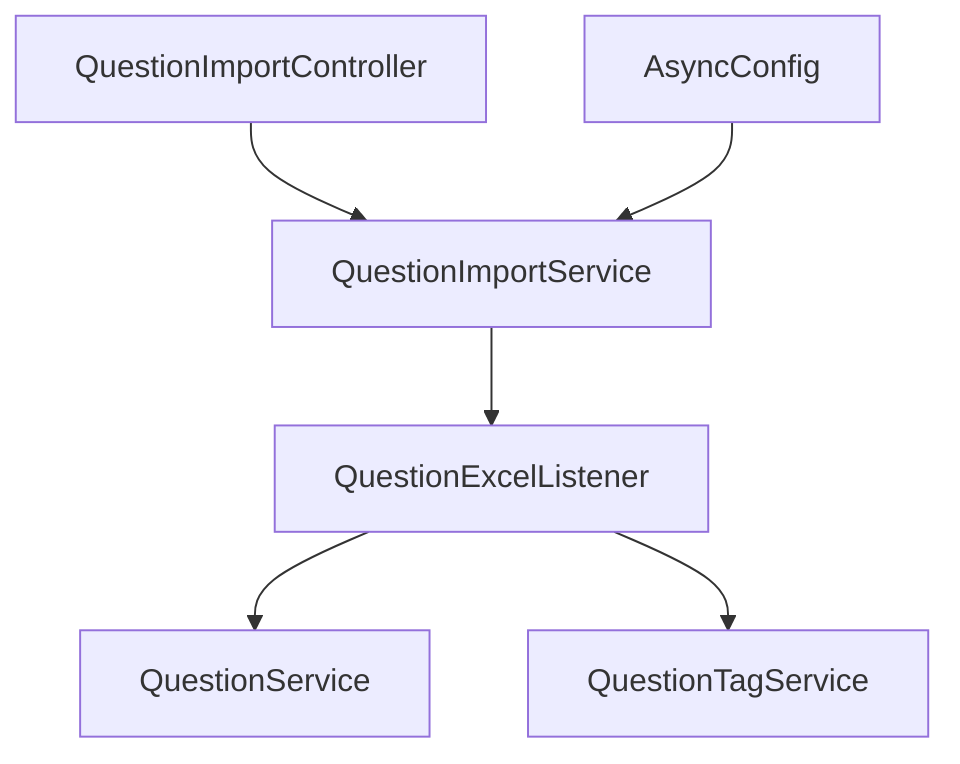
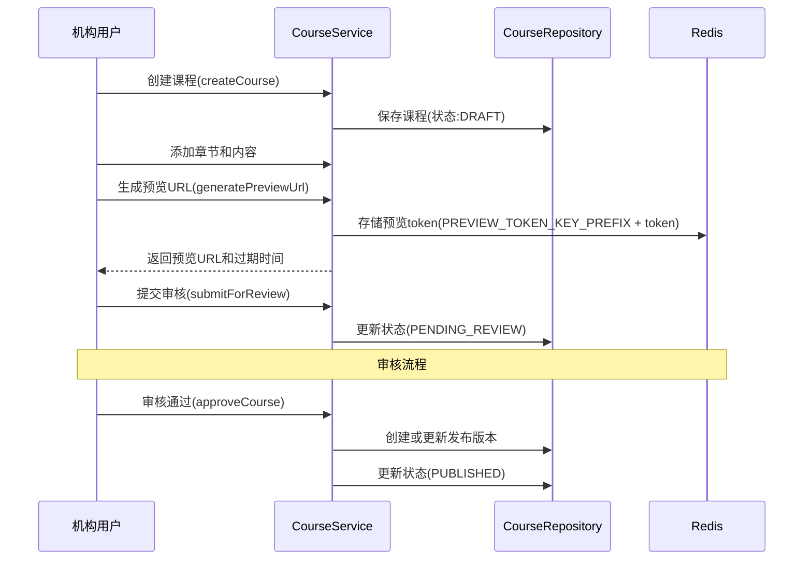

# 项目结构说明

本项目采用分层架构，遵循最佳实践进行组织：

```
src/main/java/com/zhangziqi/online_course_mine
├── config                 # 配置类
│   ├── security          # 安全相关配置
│   ├── redis            # Redis相关配置
│   ├── minio            # MinIO相关配置
│   ├── s3               # S3 API相关配置
├── constant               # 常量定义
├── controller             # 控制器层
│   ├── AuthController           # 认证控制器
│   ├── UserController           # 用户管理控制器
│   ├── RoleController           # 角色管理控制器
│   ├── PermissionController     # 权限管理控制器
│   ├── InstitutionController    # 机构申请控制器
│   ├── InstitutionAuthController # 机构用户注册控制器
│   ├── InstitutionMemberController # 机构成员管理控制器
│   ├── ReviewerInstitutionController # 机构审核控制器
│   ├── StorageQuotaController   # 存储配额控制器
│   ├── MediaController          # 媒体资源控制器
│   ├── QuestionController       # 题目管理控制器
│   ├── QuestionGroupController  # 题目组管理控制器
│   ├── QuestionTagController    # 题目标签管理控制器
│   ├── CourseController         # 课程管理控制器
│   ├── ChapterController        # 章节管理控制器
│   └── SectionController        # 小节管理控制器
├── exception              # 自定义异常
├── model                  # 数据模型
│   ├── entity           # 实体类
│   │   ├── User.java           # 用户实体
│   │   ├── Role.java           # 角色实体
│   │   ├── Permission.java     # 权限实体
│   │   ├── Institution.java    # 机构实体
│   │   ├── StorageQuota.java   # 存储配额实体
│   │   ├── Media.java          # 媒体资源实体
│   │   └── InstitutionApplication.java # 机构申请实体
│   │   ├── Question.java       # 题目实体
│   │   ├── QuestionOption.java # 题目选项实体
│   │   ├── QuestionGroup.java  # 题目组实体
│   │   ├── QuestionGroupItem.java # 题目组项实体
│   │   ├── QuestionTag.java    # 题目标签实体
│   │   ├── QuestionTagMapping.java # 题目标签映射实体
│   │   ├── Course.java         # 课程实体
│   │   ├── Chapter.java        # 章节实体
│   │   ├── Section.java        # 小节实体
│   │   ├── SectionResource.java # 小节资源实体
│   │   ├── SectionQuestionGroup.java # 小节题目组实体
│   │   ├── Category.java       # 课程分类实体
│   │   └── Tag.java            # 课程标签实体
│   ├── dto              # 数据传输对象
│   │   ├── auth              # 认证相关DTO
│   │   ├── user              # 用户相关DTO
│   │   ├── institution       # 机构相关DTO
│   │   ├── media             # 媒体相关DTO
│   │   ├── question          # 题目相关DTO
│   │   ├── group             # 题目组相关DTO
│   │   ├── questionTag       # 题目标签相关DTO
│   │   ├── course            # 课程相关DTO
│   │   ├── chapter           # 章节相关DTO
│   │   └── section           # 小节相关DTO
│   ├── vo               # 视图对象
│   │   ├── auth              # 认证相关VO
│   │   ├── user              # 用户相关VO
│   │   ├── institution       # 机构相关VO
│   │   ├── quota             # 配额相关VO
│   │   ├── media             # 媒体相关VO
│   │   ├── question          # 题目相关VO
│   │   ├── group             # 题目组相关VO
│   │   ├── questionTag       # 题目标签相关VO
│   │   └── PreviewUrlVO.java # 课程预览URL视图对象
│   ├── enums            # 枚举类型
│   │   ├── RoleEnum.java       # 角色枚举
│   │   ├── QuotaType.java      # 配额类型枚举
│   │   ├── MediaType.java      # 媒体类型枚举
│   │   ├── MediaStatus.java    # 媒体状态枚举
│   │   ├── QuestionType.java   # 题目类型枚举
│   │   ├── CourseStatus.java   # 课程状态枚举
│   │   ├── CourseVersion.java  # 课程版本类型枚举
│   │   ├── CoursePaymentType.java # 课程付费类型枚举
│   │   ├── ChapterAccessType.java # 章节访问类型枚举
│   │   └── QuestionType.java   # 题目类型枚举
├── repository             # 数据访问层
│   ├── UserRepository         # 用户数据访问
│   ├── RoleRepository         # 角色数据访问
│   ├── PermissionRepository   # 权限数据访问
│   ├── StorageQuotaRepository # 存储配额数据访问
│   ├── MediaRepository        # 媒体资源数据访问
│   ├── InstitutionRepository  # 机构数据访问
│   ├── QuestionRepository     # 题目数据访问
│   ├── QuestionOptionRepository # 题目选项数据访问
│   ├── QuestionGroupRepository # 题目组数据访问
│   ├── QuestionGroupItemRepository # 题目组项数据访问
│   ├── QuestionTagRepository  # 题目标签数据访问
│   ├── QuestionTagMappingRepository # 题目标签映射数据访问
│   ├── CourseRepository       # 课程数据访问
│   ├── ChapterRepository      # 章节数据访问
│   ├── SectionRepository      # 小节数据访问
│   ├── SectionResourceRepository # 小节资源数据访问
│   ├── SectionQuestionGroupRepository # 小节题目组数据访问
│   ├── CategoryRepository     # 课程分类数据访问
│   └── TagRepository          # 课程标签数据访问
├── security               # 安全相关组件
│   ├── jwt              # JWT相关
├── service                # 服务层
│   ├── impl             # 服务实现
│   │   ├── AuthServiceImpl         # 认证服务实现
│   │   ├── UserServiceImpl         # 用户服务实现
│   │   ├── RoleServiceImpl         # 角色服务实现
│   │   ├── StorageQuotaServiceImpl # 存储配额服务实现
│   │   ├── MediaServiceImpl        # 媒体服务实现
│   │   ├── S3MultipartUploadManager # S3分片上传管理器
│   │   ├── UploadStatusService     # 上传状态服务
│   │   ├── InstitutionServiceImpl  # 机构服务实现
│   │   ├── InstitutionAuthServiceImpl # 机构认证服务实现
│   │   ├── QuestionServiceImpl     # 题目服务实现
│   │   ├── QuestionGroupServiceImpl # 题目组服务实现
│   │   ├── QuestionTagServiceImpl  # 题目标签服务实现
│   │   ├── QuestionTagMappingServiceImpl # 题目标签映射服务实现
│   │   ├── CourseServiceImpl       # 课程服务实现
│   │   ├── ChapterServiceImpl      # 章节服务实现
│   │   └── SectionServiceImpl      # 小节服务实现
├── excel                  # Excel相关组件
│   ├── QuestionExcelData.java    # Excel数据模型
│   └── QuestionExcelListener.java # Excel解析监听器
├── util                   # 工具类
```

## 分层职责

1. **Controller层**：负责处理HTTP请求，参数验证，返回响应
   - 仅负责接收请求和返回响应，不包含业务逻辑
   - 参数验证和基本的请求合法性检查
   - 调用Service层处理业务，不直接操作Repository
   - 统一的响应格式封装
   - 不应该直接依赖基础设施服务（如MinIO、Redis等）

2. **Service层**：实现业务逻辑
   - 封装所有业务规则和流程
   - 事务管理
   - 数据校验和业务规则验证
   - 可以调用其他Service和Repository
   - 负责与基础设施服务交互（如文件存储、缓存、邮件等）
   - 异常处理和业务错误转换

3. **Repository层**：数据访问操作
   - 提供数据访问接口
   - 不包含业务逻辑
   - 专注于数据CRUD操作

4. **Model层**：数据结构定义
   - Entity: JPA实体类
   - DTO: 数据传输对象，用于服务层之间的数据传递
   - VO: 视图对象，用于前端展示

5. **Config层**：应用配置

6. **Security层**：安全相关组件

7. **Util层**：通用工具类

## 架构设计原则

1. **关注点分离**：每一层只关注自己的职责
2. **依赖方向**：上层依赖下层，下层不依赖上层
3. **接口隔离**：通过接口定义服务边界
4. **单一职责**：每个类只负责一项功能
5. **最小知识原则**：一个对象应当对其他对象有最少的了解

## 权限控制设计

当前系统使用基于角色的访问控制(RBAC):
- Controller方法使用`@PreAuthorize("hasRole('XXX')")`注解控制访问
- JWT令牌中只包含角色信息，不包含详细权限
- 简化的权限模型，提高开发效率和系统性能

未来计划:
- 在业务功能稳定后，逐步实现基于权限的细粒度控制
- 动态权限验证机制
- 数据级权限控制

## 示例：用户头像上传

**不推荐的方式**（在Controller中处理业务逻辑）：
```java
@PostMapping("/avatar")
public Result<Map<String, String>> uploadAvatar(MultipartFile file) {
    // 验证文件类型和大小（业务逻辑）
    // 生成文件名（业务逻辑）
    // 直接调用MinioService上传文件（直接依赖基础设施）
    // 调用UserService更新用户头像
    // 返回URL
}
```

**推荐的方式**（职责分离）：
```java
@PostMapping("/avatar")
public Result<Map<String, String>> uploadAvatar(MultipartFile file) {
    // 从安全上下文获取用户名
    String username = getCurrentUsername();
    // 调用Service处理所有业务逻辑
    Map<String, String> result = userService.uploadAndUpdateAvatar(username, file);
    // 返回结果
    return Result.success(result);
}
```

Service层封装所有业务逻辑：
```java
@Service
public class UserServiceImpl implements UserService {
    // 注入所需依赖
    private final MinioService minioService;
    
    @Override
    public Map<String, String> uploadAndUpdateAvatar(String username, MultipartFile file) {
        // 验证文件类型和大小
        // 生成文件名
        // 上传文件
        // 删除旧头像
        // 更新用户头像
        // 返回结果
    }
}
```

通过这种方式，实现了关注点分离，提高了代码的可维护性和可测试性。

## 命名规范

- **Controller**: 以Controller结尾（如UserController）
- **Service**: 接口以Service结尾，实现类以ServiceImpl结尾
- **Repository**: 以Repository结尾
- **Entity**: 实体类名与表名对应
- **DTO**: 以DTO结尾
- **VO**: 以VO结尾

## 代码规范

- 使用Lombok简化代码
- 使用统一的返回格式
- 异常统一处理
- 注释完善
- 单元测试覆盖关键逻辑

## 测试结构

本项目采用多层次测试策略，确保代码质量和功能稳定性：

```
src/test/java/com/zhangziqi/online_course_mine
├── config                 # 测试配置类
│   └── TestSecurityConfig # 测试安全配置
├── controller             # 控制器测试
│   ├── AuthControllerTest
│   ├── UserControllerTest
│   ├── PermissionControllerTest  # 权限控制器测试
│   ├── InstitutionControllerTest # 机构申请控制器测试
│   ├── InstitutionAuthControllerTest # 机构用户注册控制器测试
│   └── ReviewerInstitutionControllerTest # 机构审核控制器测试
├── integration            # 集成测试
│   ├── AuthControllerIntegrationTest
│   ├── PermissionControllerIntegrationTest  # 权限管理集成测试
│   └── InstitutionControllerIntegrationTest # 机构管理集成测试
├── repository             # 数据访问层测试
│   └── ...
├── security               # 安全组件测试
│   └── TestUserDetailsService  # 测试用户详情服务
├── service                # 服务层测试
│   ├── AuthServiceTest
│   ├── UserServiceTest
│   ├── PermissionServiceTest  # 权限服务测试
│   ├── InstitutionServiceTest # 机构服务测试
│   └── InstitutionAuthServiceTest # 机构认证服务测试
└── util                   # 工具类测试
    └── ...
```

### 测试层次

1. **单元测试**：测试单个组件的功能，隔离于其他组件
   - `@ExtendWith(MockitoExtension.class)`
   - 通过`@Mock`模拟所有依赖
   - 如：`PermissionServiceTest`、`AuthServiceTest`等

2. **控制器测试**：测试API接口的参数验证和响应格式
   - `@SpringBootTest`加载上下文
   - `@AutoConfigureMockMvc(addFilters = false)`禁用安全过滤器
   - 如：`PermissionControllerTest`、`UserControllerTest`等

3. **集成测试**：测试多个组件协同工作
   - `@SpringBootTest`加载完整上下文
   - `@Import(TestSecurityConfig.class)`导入测试安全配置
   - 如：`PermissionControllerIntegrationTest`、`AuthControllerIntegrationTest`等

### 权限管理测试

权限管理模块的测试采用多层次策略：

1. **权限服务测试 (PermissionServiceTest)** 
   - 单元测试权限服务的业务逻辑
   - 模拟Repository层依赖
   - 测试异常处理和边界情况
   - 验证权限CRUD操作的正确性

2. **权限控制器测试 (PermissionControllerTest)**
   - 测试API参数验证和响应格式
   - 模拟Service层依赖
   - 验证HTTP状态码和响应结构
   - 不涉及实际权限验证

3. **权限集成测试 (PermissionControllerIntegrationTest)**
   - 测试完整请求处理流程
   - 包含实际的权限和角色验证
   - 使用`@WithUserDetails`注解模拟不同角色用户
   - 验证基于角色的访问控制
   - 测试资源依赖管理（如解除权限与角色的关联）

### 机构管理测试

机构管理模块的测试同样采用多层次策略：

1. **机构服务测试**
   - `InstitutionServiceTest`: 测试机构申请和审核流程
   - `InstitutionAuthServiceTest`: 测试机构用户注册流程
   - 模拟Repository层和外部服务依赖
   - 验证业务规则和异常处理

2. **机构控制器测试**
   - `InstitutionControllerTest`: 测试机构申请API
   - `ReviewerInstitutionControllerTest`: 测试机构审核API
   - `InstitutionAuthControllerTest`: 测试机构用户注册API
   - 验证参数校验和响应格式

3. **机构集成测试**
   - 测试完整的机构申请、审核和注册流程
   - 验证角色权限控制
   - 测试邮件通知功能
   - 验证数据一致性

### 测试优化

1. **Bean冲突解决**
   - 使用`spring.main.allow-bean-definition-overriding=true`
   - 通过`@Primary`注解指定测试Bean的优先级

2. **资源依赖管理**
   - 先解除资源依赖再进行删除测试
   - 测试完成后清理所有测试数据

3. **命名约定**
   - 测试方法名遵循行为_条件_结果模式
   - 如：`deletePermissionShouldSucceedWhenUserIsAdmin`

4. **测试数据隔离**
   - 每个测试方法使用独立的测试数据
   - 使用`@BeforeEach`和`@AfterEach`管理测试数据生命周期 

### 媒体资源管理测试

媒体资源管理模块的测试覆盖了多个相关组件：

1. **媒体服务测试 (MediaServiceTest)**
   - 测试媒体资源生命周期（创建、查询、访问）
   - 测试分片上传流程（初始化、状态追踪、完成）
   - 测试配额集成（上传前检查配额、完成后更新配额）
   - 测试断点续传功能

2. **S3分片上传管理器测试 (S3MultipartUploadManagerTest)**
   - 测试与S3存储服务的交互
   - 测试预签名URL生成
   - 测试分片列表查询
   - 测试分片合并功能

3. **上传状态服务测试 (UploadStatusServiceTest)**
   - 测试Redis状态存储和管理
   - 测试状态更新和转换
   - 测试状态过期设置

4. **存储配额服务测试 (StorageQuotaServiceTest)**
   - 测试配额检查功能
   - 测试配额更新逻辑
   - 测试多类型配额管理

这些测试确保了媒体资源管理功能的各个组件能够正确协作，支持大文件上传、断点续传和配额管理。

### 媒体上传流程

当前系统实现的媒体上传流程如下：

1. **初始化上传**：客户端调用`/api/media/initiate-upload`
   - 后端验证文件类型和大小
   - 检查存储配额是否足够
   - 创建媒体记录（状态为UPLOADING）
   - 初始化S3分片上传任务并返回uploadId
   - 生成所有分片的预签名URL
   - 在Redis中保存上传状态信息（仅用于内部跟踪）

2. **分片上传**：客户端使用预签名URL直接上传分片到S3
   - 客户端负责跟踪上传进度和分片状态
   - 前端自行管理分片上传状态

3. **完成上传**：所有分片上传完成后，客户端调用`/api/media/{mediaId}/complete`
   - 客户端提供所有分片的信息（编号和ETag）
   - 服务端调用S3 API完成分片合并
   - 更新媒体状态为COMPLETED
   - 更新存储配额使用量
   - 返回媒体访问信息

4. **取消上传**：客户端可以调用`/api/media/{mediaId}/cancel`取消上传
   - 服务端调用S3 API取消分片上传任务
   - 更新媒体状态为CANCELLED
   - 删除Redis中的上传状态信息
   - 释放预占用的存储配额

## 前端接入指南

### 分片上传实现

前端实现分片上传需要以下步骤：

1. **文件分片**：使用File API将文件分割成多个片段
   ```javascript
   const chunkSize = 10 * 1024 * 1024; // 10MB
   const chunks = [];
   
   for (let start = 0; start < file.size; start += chunkSize) {
     const end = Math.min(start + chunkSize, file.size);
     chunks.push(file.slice(start, end));
   }
   ```

2. **初始化上传**：调用后端初始化接口
   ```javascript
   const response = await axios.post('/api/media/initiate-upload', {
     filename: file.name,
     contentType: file.type,
     fileSize: file.size,
     title: 'My Video',
     description: 'Video description',
     chunkSize: 10 * 1024 * 1024 // 可选参数，指定分片大小
   });
   
   const { mediaId, uploadId, totalParts, presignedUrls } = response.data.data;
   ```

3. **上传分片**：使用预签名URL上传分片并跟踪进度
   ```javascript
   // 记录已完成的分片
   const completedParts = [];
   
   // 上传所有分片
   for (let i = 0; i < totalParts; i++) {
     const partNumber = i + 1;
     const url = presignedUrls[i].url;
     const chunk = chunks[i];
     
     try {
       const response = await axios.put(url, chunk, {
         headers: { 'Content-Type': 'application/octet-stream' },
         onUploadProgress: (progressEvent) => {
           // 计算当前分片的进度
           const partProgress = progressEvent.loaded / progressEvent.total;
           // 更新UI显示进度
         }
       });
       
       // 获取ETag并保存
       const etag = response.headers['etag'];
       completedParts.push({
         partNumber: partNumber,
         eTag: etag
       });
     } catch (error) {
       // 处理上传错误，可以实现重试逻辑
       console.error(`分片 ${partNumber} 上传失败:`, error);
     }
   }
   ```

4. **完成上传**：所有分片上传完成后
   ```javascript
   await axios.post(`/api/media/${mediaId}/complete`, {
     uploadId: uploadId,
     completedParts: completedParts
   });
   ```

5. **取消上传**：用户取消上传或发生致命错误时
   ```javascript
   await axios.delete(`/api/media/${mediaId}/cancel`);
   ```

### 存储配额管理

前端可以通过以下接口展示机构的存储配额信息：

1. **获取总配额**：
   ```javascript
   const quotaResponse = await axios.get(`/api/storage/quota/${institutionId}`);
   const { totalQuota, usedQuota, availableQuota } = quotaResponse.data.data;
   ```

2. **获取详细配额**：
   ```javascript
   const detailsResponse = await axios.get(`/api/storage/quota/${institutionId}/details`);
   const quotaDetails = detailsResponse.data.data;
   
   // 遍历不同类型的配额
   quotaDetails.forEach(quota => {
     console.log(`${quota.typeName}: ${quota.usedQuota}/${quota.totalQuota}`);
   });
   ```

3. **配额可视化**：使用图表库如ECharts展示配额使用情况
   ```javascript
   const option = {
     series: [{
       type: 'pie',
       data: [
         { name: '已用', value: usedQuota },
         { name: '可用', value: availableQuota }
       ]
     }]
   };
   ``` 

## 新增：题目管理系统设计

### 题目管理设计

题目管理系统实现了完整的题目创建、组织和标签化功能：

1. **核心功能**：
   - 题目CRUD操作（创建、读取、更新、删除）
   - 题目分组管理（题目组）
   - 题目标签管理
   - 题目与课程章节关联

2. **实体关系**：
   - 题目(Question) ←→ 题目选项(QuestionOption)：一对多关系
   - 题目组(QuestionGroup) ←→ 题目(Question)：通过题目组项(QuestionGroupItem)实现多对多关系
   - 题目(Question) ←→ 题目标签(QuestionTag)：通过题目标签映射(QuestionTagMapping)实现多对多关系
   - 题目组(QuestionGroup) ←→ 课程章节(Section)：多对多关系

3. **题目类型系统**：
   - 支持单选题、多选题
   - 统一的选项管理和验证规则
   - 业务规则验证（如单选题只能有一个正确答案）

4. **测试覆盖**：
   - 全面覆盖核心业务逻辑
   - 覆盖异常处理和边界情况
   - 机构级资源隔离测试

### 题目标签系统设计

标签系统允许对题目进行灵活分类和检索：

1. **标签结构**：
   - 机构隔离的标签体系
   - 标签与题目的多对多关联
   - 标签关联计数追踪

2. **功能实现**：
   - 标签创建、更新和删除
   - 标签与题目的关联和解除关联
   - 基于标签的题目查询

### 题目组系统设计

题目组系统允许将题目组织成有意义的集合：

1. **题目组结构**：
   - 题目组基本信息（名称、描述等）
   - 题目组项管理（包括排序、难度覆盖等）
   - 与课程章节的关联

2. **功能实现**：
   - 题目组的创建、更新和删除
   - 题目组项管理（添加、移除、更新、排序）
   - 题目组与章节的关联和解除关联

### 系统特点

1. **资源隔离**：所有题目、题目组和标签都与特定机构关联，确保数据安全
2. **灵活组织**：支持同一题目属于多个题目组和多个标签
3. **扩展性设计**：系统架构允许未来增加更多题目类型
4. **测试驱动开发**：所有核心功能都有对应的单元测试

### 测试策略

题目管理系统采用全面的测试策略，确保系统稳定性和正确性：

1. **单元测试**：
   - 题目服务测试（QuestionServiceTest）
   - 题目组服务测试（QuestionGroupServiceTest）
   - 题目标签服务测试（QuestionTagServiceTest）

2. **测试内容**：
   - 基本CRUD操作
   - 复杂业务规则验证
   - 异常处理和边界情况
   - 资源关联和解除关联
   - 权限和资源隔离

3. **测试覆盖率**：
   - 服务层行覆盖率：≥85%
   - 业务逻辑分支覆盖率：≥90% 

## Excel导入功能结构

### 组件说明

1. **Excel数据模型**：
   - `QuestionExcelData`: 定义Excel数据结构，包含题目所有字段
   - 使用EasyExcel注解配置Excel列映射和样式

2. **Excel监听器**：
   - `QuestionExcelListener`: 实现EasyExcel的AnalysisEventListener
   - 处理Excel数据解析和验证
   - 管理批量处理和错误记录

3. **导入服务**：
   - `QuestionImportService`: 定义导入服务接口
   - `QuestionImportServiceImpl`: 实现导入服务逻辑
   - 处理文件上传和模板生成

4. **导入控制器**：
   - `QuestionImportController`: 提供REST API接口
   - 处理文件上传和模板下载请求

5. **异步配置**：
   - `AsyncConfig`: 配置导入任务线程池
   - 定义异步任务执行策略

### 文件组织

```
src/main/java/com/zhangziqi/online_course_mine/
├── config
│   └── AsyncConfig.java              # 异步任务配置
├── controller
│   └── QuestionImportController.java # 导入控制器
├── model
│   ├── excel
│   │   └── QuestionExcelData.java   # Excel数据模型
│   └── vo
│       └── QuestionImportResultVO.java # 导入结果模型
├── excel
│   └── QuestionExcelListener.java    # Excel解析监听器
└── service
    ├── QuestionImportService.java    # 导入服务接口
    └── impl
        └── QuestionImportServiceImpl.java # 导入服务实现
```

### 依赖关系



## 课程管理架构设计

课程管理系统是本平台的核心功能之一，它采用了以下设计：

1. **多层次课程结构**
   - 课程(Course) → 章节(Chapter) → 小节(Section) → 资源(SectionResource)/题目组(SectionQuestionGroup)
   - 每层次都有独立的管理和访问控制

2. **版本控制系统**
   - 工作副本和发布版本分离
   - 通过`isPublishedVersion`和`publishedVersionId`属性关联
   - 审核通过时自动创建或更新发布版本

3. **状态管理**
   - 课程生命周期：草稿(DRAFT) → 待审核(PENDING_REVIEW) → 审核中(REVIEWING) → 已发布(PUBLISHED)/已拒绝(REJECTED)
   - 支持下线(UNPUBLISHED)和重新上线操作

4. **访问控制**
   - 章节访问类型：免费(FREE)和付费(PAID_ONLY)
   - 预览功能：通过Redis存储临时token实现安全预览

### 课程管理数据流

课程创建和发布流程：



## 测试结构

为课程管理系统添加测试架构：

```
src/test/java/com/zhangziqi/online_course_mine
├── controller
│   ├── CourseControllerTest
│   ├── ChapterControllerTest
│   └── SectionControllerTest
├── service
│   ├── CourseServiceTest
│   ├── ChapterServiceTest
│   └── SectionServiceTest
``` 